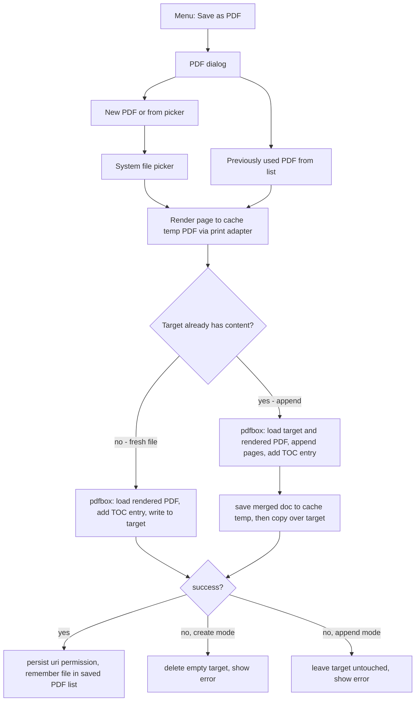

2026-07-05

# EinkBro: Save-to-PDF with TOC entries and append-to-existing, via pdfbox-android

EinkBro's "Save as PDF" used to do one thing: render the current page through the
WebView print pipeline straight into a freshly created file. This change turns it into
a collection workflow modeled on the existing EPUB feature: the menu item now opens a
dialog offering "New PDF or from picker" plus a list of previously used PDFs. Saving
into a file that already has content appends the new pages to it, and every saved page
gets a PDF outline (TOC) entry titled with the page title. On e-ink readers that
surface PDF outlines as a table of contents — notably the Supernote — a user can now
accumulate articles into one PDF and navigate them by title.

The whole feature costs about **336 KB** of APK. Getting there was most of the work,
because the obvious integration costs 6.2 MB.

## The size study

The only maintained, Maven-Central PDF library for Android that can merge documents is
`com.tom-roush:pdfbox-android` (2.0.27.0, a port of Apache PDFBox 2.0.27). Its
`PDFMergerUtility` / `PDFCloneUtility` operate at the COS object level — they clone
page trees and renumber objects, and never touch fonts or rasterization. That fact
drives everything below: for merging and outline editing, most of what the library
ships is dead weight.

All numbers are the signed arm64 release APK, measured by building each variant:

| Variant | APK size | Delta |
|---|---|---|
| Baseline (v15.15.0) | 6,446,635 B | — |
| pdfbox-android, naive dependency | 12,629,865 B | +6.18 MB |
| pdfbox-android, optimized config | 6,788,937 B | +334 KB |
| "Perfect fork" ceiling (bare classes.jar, no consumer rules) | 6,772,553 B | +318 KB |
| pdfbox-android-lite 1.8.9.2 (2015 fork) | 6,631,812 B | +181 KB |
| **Shipped** (optimized config, create + append wired, TOC) | **6,791,017 B** | **+336 KB** |

The naive +6.18 MB decomposes into three parts, two of them removable:

1. **BouncyCastle, ~4.2 MB.** The POM pulls in bcprov/bcpkix/bcutil as compile-scope
   dependencies, needed only for encrypted PDFs. R8 strips the unused *classes*, but it
   cannot strip Java *resources* — and BouncyCastle ships post-quantum crypto data files
   (`lowmc.properties` alone is 1.5 MB, the SIKE `p*.properties` another 2.5 MB) that
   survive shrinking. Fix: `exclude(group = "org.bouncycastle")` on the dependency plus
   `-dontwarn org.bouncycastle.**`. Merging unencrypted PDFs never loads those classes;
   password-protected targets now fail with an error toast instead.
2. **Bundled font/CMap/AFM assets, 4.6 MB.** LiberationSans, CJK CMaps, glyph lists —
   used only for text extraction and rendering, never by COS-level merging. All of them
   live under a single asset directory, so one addition to `androidResources.
   ignoreAssetsPattern` (`!tom_roush`) drops them at asset-merge time.
3. **Reachable dex, ~330 KB.** The parser, COS model and writer that the feature
   actually uses. This is the real cost.

One more `-dontwarn com.gemalto.jp2.**` is required regardless: pdfbox-android
references an optional JPEG2000 decoder it does not bundle.

## Options considered and rejected

**pdfbox-android-lite** (a 2015 community fork that stripped encryption and resources
at the source level) measures +181 KB — about 155 KB less than the chosen setup. It was
rejected because it is a frozen PDFBox 2.0-SNAPSHOT from 2015, unmaintained since 2018,
predating a decade of parser robustness work and several parser DoS CVE fixes
(CVE-2021-27807/27906/31811/31812, among others). This feature feeds arbitrary user
PDFs into the parser; parser vintage is exactly where it would corrupt or fail.
Its headline "7.4 MB to 1.1 MB" comparison is pre-shrink library size — R8 plus the
config excludes already perform the same trimming on the maintained library at build
time.

**Forking lite and rebasing onto 2.0.27** was measured rather than argued: consuming
the bare 2.0.27 `classes.jar` (which is exactly what a perfect source fork would
deliver — no consumer proguard keep rules, no assets) lands at +318 KB. A fork's total
achievable saving over the config approach is therefore **~16 KB**: the AAR's consumer
rules force-keep the `documentinterchange` package and `SecurityHandler` subclasses,
and after dex compression that force-kept code costs almost nothing. Owning a
crypto-adjacent PDF-parser fork indefinitely for 16 KB is a bad trade. (If those 16 KB
ever matter, AGP's incubating `optimization.keepRules.ignoreFrom()` should recover them
without forking.)

**Everything else** fell out qualitatively: iText is AGPL and OpenPDF depends on
`java.awt`; native options (qpdf, mupdf) cost multiple MB per ABI; a hand-rolled
incremental-update merger would need a real xref/object-stream parser to survive
arbitrary user files (Supernote-annotated PDFs included) and is a correctness liability
to save ~300 KB; rasterizing through `PdfRenderer` destroys text.

A pleasant surprise closed the study: **TOC support costs zero additional bytes.**
`PDFMergerUtility` already references the outline classes (it merges source outlines
during append), so R8 keeps `PDDocumentOutline`/`PDOutlineItem` either way — using them
explicitly added nothing to the APK.

## UX: the EPUB pattern, not a new menu item

The first draft added a separate "Append to PDF" menu action. That was scrapped in
favor of mirroring the existing EPUB save flow, which already solves the same problem:
one menu item, then a dialog listing "new file via picker" plus previously used
targets. This keeps the menu uncluttered, behaves the way EinkBro users already
understand from EPUB, and required only one new string (`new_pdf_or_from_picker`,
derived per-locale from each language's existing EPUB variant across all 31 locale
files) instead of a new menu item name.

Append-vs-create is decided the same way the EPUB flow does it implicitly: by whether
the chosen target already has content. That means even the system picker path can
append — picking an existing PDF in the create-document picker appends to it, exactly
like picking an existing EPUB does.

## Implementation notes

- `PdfMergeUtil` (new) holds the two pdfbox operations. `savePdfWithToc` loads the
  rendered temp PDF, adds an outline item (`PDPageFitWidthDestination` at page 1), and
  writes to the target. `appendPdfToExisting` loads the target, remembers its page
  count, `appendDocument`s the rendered pages, and adds the outline item pointing at
  the first appended page — `appendDocument` (not `mergeDocuments`) precisely because
  it gives a control point between merging and saving. Both use
  `MemoryUsageSetting.setupTempFileOnly()` so scratch data stays on disk, keeping peak
  RAM low on e-ink hardware.
- **The user's file can never be corrupted.** Appending writes the merged document to
  a cache temp file first and only then copies it over the target; a failed merge (or
  an encrypted/invalid target) leaves the original untouched and shows an error. The
  raw-copy fallback (used when the pdfbox pass fails on a fresh save) deliberately does
  not exist in append mode, since it would clobber the target with just the new pages.
  Failure cleanup deletes the target only in create mode, where it is a just-created
  empty document.
- Remembered targets get `takePersistableUriPermission` (read+write) and are stored
  under a new `K_SAVED_PDFS` preference key using the same `(title, uri)` data model
  and dialog row composable as saved EPUBs, reused rather than duplicated. Since the
  class is now shared by both features, it was renamed from `EpubFileInfo` to
  `SavedFileInfo` (and moved to the `preference` package) in a follow-up commit.
- Two runtime gotchas were found the hard way on-device, both now encoded in the code:
  WebView getters (`webView.title`) are main-thread-only, so the TOC title is captured
  before hopping to the IO coroutine (the first test build crashed on exactly this);
  and release builds strip `Log.i` via `-assumenosideeffects`, so runtime verification
  must inspect file artifacts, not logcat.
- Verified end-to-end on an emulator by driving the real UI on the R8-minified release
  configuration: create produced a one-page PDF with one outline entry; reopening the
  dialog listed the file with its size; appending through the list produced a valid
  two-page PDF with an outline count of 2. The outline survives the load/save
  round-trip, covering both "create outline from scratch" and "append to existing
  outline". The signed release with the original application id was then installed
  in-place on a Supernote Nomad.
