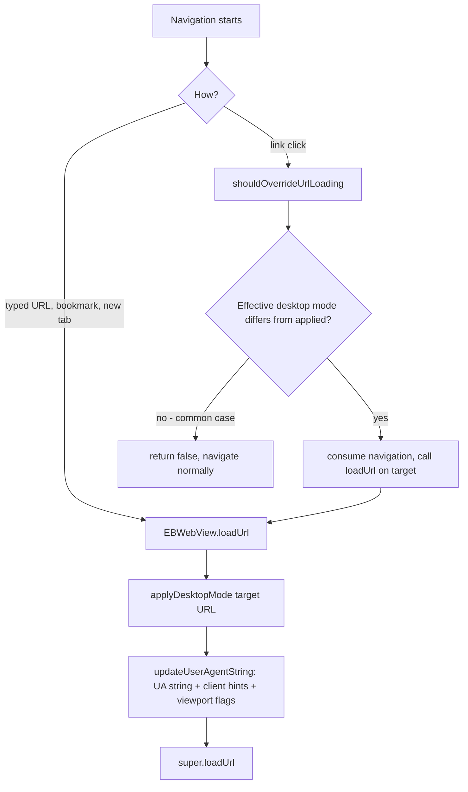

2026-07-14

# EinkBro: wire up the per-site Desktop Mode override

The Desktop Mode toggle in the Site Settings dialog looked functional but did nothing. The per-site value was saved to `DomainConfigurationData.desktopMode` and `ConfigManager.getDesktopMode(url)` existed to read it back — but nothing ever called it. `WebViewConfigApplier.updateUserAgentString()` read only the global `config.browser.desktop`, so the override had no runtime effect. It had been dead since the Site Settings dialog was introduced, the same gap as the per-site JavaScript override fixed in the previous commit (`cf010ac69`).

## Fix

`updateUserAgentString()` now takes a URL (defaulting to the currently loaded page) and resolves the *effective* desktop mode — per-site override first, falling back to the global setting. Everything desktop mode controls is applied together in that one place: the UA string, the user-agent client-hints metadata (from the earlier desktop-fingerprint work, so `navigator.userAgentData.mobile` flips consistently with the UA string), and the `useWideViewPort` / `loadWithOverviewMode` flags. The applier remembers the last mode it applied so cheap "did anything change?" checks are possible per navigation.

From there, three call paths cover every way a page can load:

- `EBWebView.loadUrl` (both overloads) calls `applyDesktopMode(url)` before loading, next to the existing per-site JavaScript/cookie lines — covers typed URLs, bookmarks, and new tabs.
- Saving from the Site Settings dialog already goes through `initPreferences()` + reload, and `initPreferences` calls `updateUserAgentString()`, which now picks up the current page's effective mode.
- Link clicks are the interesting case — see below.

`WebContentPostProcessor`'s viewport-width JS injection also switched from the global flag to `getDesktopMode(url)`.

## The link-click race

Link clicks navigate inside the WebView without going through `loadUrl`, so a per-site override would leak to the next site: navigate from an overridden-desktop site to a normal one and the desktop UA follows you.

The obvious fix — swap the UA inside `shouldOverrideUrlLoading` and return `false` to let the navigation proceed — turned out to be unreliable, and testing showed why: **Chromium schedules a reload of the *current* page whenever the UA string changes.** That implicit reload races the in-flight link navigation. In one direction the navigation won (looked correct); in the other the reload won, cancelling the link click and leaving the user on the old page rendered with the new UA.

So instead the navigation is taken over: when the target URL's effective desktop mode differs from what is currently applied, `shouldOverrideUrlLoading` consumes the navigation and re-issues it through `ebWebView.loadUrl(url)`, which sets the UA first and then loads. Key properties:

- The common case (mode unchanged, i.e. nearly every navigation) returns `false` and proceeds untouched — no behavior change, no extra work beyond one map lookup.
- No loop risk: `loadUrl`-initiated navigations don't re-enter `shouldOverrideUrlLoading`, and even a redirect chain converges because the first takeover updates the applied mode.
- POST submissions are unaffected — `shouldOverrideUrlLoading` is not called for them.

## Verification

A new fixture, `test_server/ua_check.html`, renders `navigator.userAgent`, the current host, and cross-links between `http://localhost:8000` and `http://127.0.0.1:8000` — two distinct hosts backed by the same server, so one can carry a per-site override while the other uses the global setting. Verified on the emulator: fresh loads with an override, save-and-auto-reload in both directions, cross-host link clicks both ways (correct target host *and* correct UA every time), same-host links proceeding untouched, and reset-to-global.
