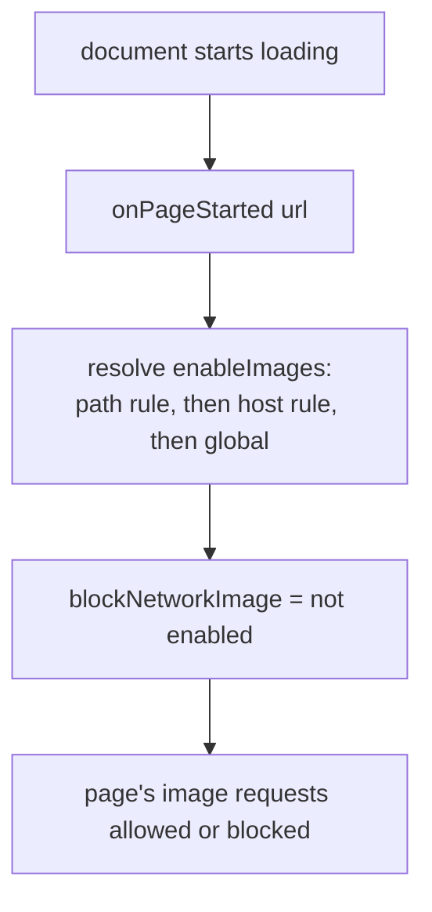

2026-08-31

# EinkBro: per-site Images switch in Site Settings

Issue #634 asked for image loading to be configurable per site: the global
Images setting is all-or-nothing, but users want images off on a few heavy
sites while keeping them everywhere else.

## What it does

Site Settings gains an **Images** row next to JavaScript / AdBlock / Cookies.
It is a nullable per-site override resolved through the existing site-rule
chain — path rule first, then host rule, then the global setting — with the
same inheritance hints ("inherited from ...") and inclusion in the rule's
override count and the rule-list summary. No new strings were needed; the row
reuses the global setting's `setting_title_images` label, which is already
translated in every locale.

The stored form is one more nullable field (`enableImages`) in the
JSON-serialized `DomainConfigurationData`. Old rows decode with the field
null (default), and older app versions reading a newer backup ignore the
unknown key, so the change is compatible in both directions.

## Where the policy is applied

WebView exposes the knob as `WebSettings.blockNetworkImage`. Setting it only
in the `loadUrl` paths is not enough — the first implementation did that, and
an emulator check showed a plain reload (and by extension link taps within a
site) never re-applied the policy after the user changed the setting. The
final apply point is `onPageStarted`: every document start sets
`blockNetworkImage` from the effective config of the started URL, so reloads,
in-page navigations, and redirects all honor the switch, and crossing to a
different host restores that host's policy.

## Verification

A unit test covers the cascade (global off, host on, path off, unrelated host
falls back to global). On an emulator: toggling Images off for the test host
made the page reload with placeholder alt text and no image request, while a
different host kept loading images; the rule row persisted with only
`enableImages` set.
