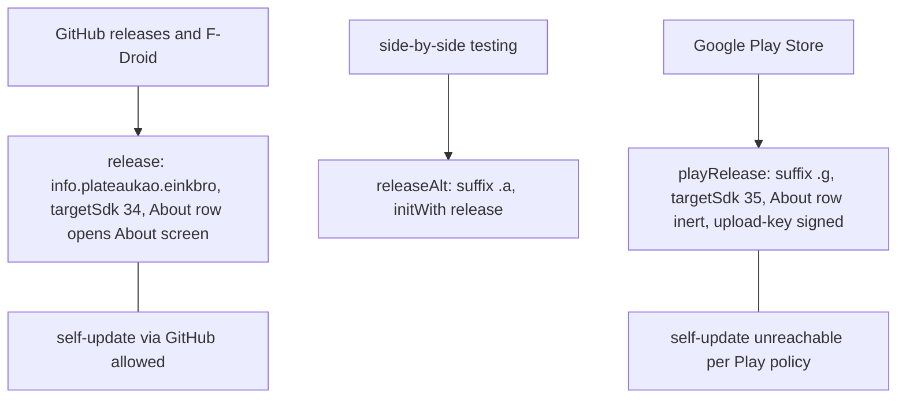
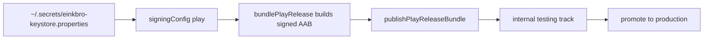

2026-08-01

# EinkBro: playRelease build type for Google Play Store distribution

EinkBro has so far shipped through GitHub releases (with an in-app self-update
flow that downloads the APK from GitHub) and F-Droid. This change adds a third
distribution channel: a Google Play Store listing, built as its own
`playRelease` build type with applicationId `info.plateaukao.einkbro.g` so it
installs alongside the sideloaded app and never collides with it.

## Play-policy differences, compiled in

Two Play requirements shape the variant, both applied only to `playRelease` so
the GitHub/F-Droid builds keep their tested behavior:

- **No self-updating.** The About screen hosts the GitHub-release update
  feature, which both violates Play policy and simply doesn't work for a
  Play-installed app. Rather than branching inside the About screen, a
  `enableAboutClick` BuildConfig flag (true everywhere else, false for
  `playRelease`) makes the About row in the first Settings screen render its
  version text but ignore taps. Since the flag is a compile-time constant, R8
  strips the whole navigation path from the Play APK.
- **Target API 35.** Play requires targeting API 35+, but raising targetSdk
  changes runtime behavior (e.g. edge-to-edge enforcement on Android 15), so it
  is raised per-variant via `androidComponents.beforeVariants` instead of
  globally. Every other variant stays on targetSdk 34.

## Signing and publishing

The variant is signed with a dedicated Play upload key (shared with
calliplus_android, whose setup this mirrors). One deliberate deviation from
calliplus: no signing secrets live in the repo, not even gitignored — the
keystore and a properties file (storeFile/storePassword/keyAlias/keyPassword,
plus `playCredentials` for the publisher) live under `~/.secrets/`, read by the
build with a `-Peinkbro.keystoreProperties` override hook. `.gitignore` still
gets `keystore.properties` / `*.keystore` entries as a safety net.

Publishing uses the Gradle Play Publisher plugin, defaulting to app bundles on
the internal track; production releases pass `--track production` explicitly.
Aggregate publish tasks are scoped with `playConfigs` so only `playRelease` is
ever uploaded — the other variants' applicationIds have no Play listing.

## Constraints discovered during implementation

- **The build type cannot be called `releasePlay`.** Gradle Play Publisher
  registers a `generate<Variant>PlayResources` task per variant; for the
  `release` variant that name is `generateReleasePlayResources` — exactly the
  anchor task AGP registers for a variant literally named `releasePlay`. The
  duplicate-task collision is unavoidable by configuration, hence the name
  `playRelease`.
- **ABI splits break AAB packaging.** With splits enabled, R8 emits per-ABI
  shrunk-resource files and the bundle task refuses to proceed. Splits are now
  disabled automatically whenever a `bundle*` task is in the invocation;
  APK builds keep all four splits, and bundletool re-splits per-ABI on Play's
  side anyway.

## Why the .g applicationId is safe

The suffix was audited against everything package-derived, largely riding on
groundwork the `.a` side-by-side variant already forced:

- FileProvider authority is `${applicationId}.fileprovider` in the manifest and
  `packageName`/`BuildConfig.APPLICATION_ID` in code — unique per variant.
- Backup/restore is package-agnostic: archives are written from
  `context.dataDir`, and on restore the default prefs file
  (`<package>_preferences.xml`) is remapped to the restoring app's package, so
  base, `.a`, and `.g` builds can all restore each other's backups unchanged.
- Google Drive sync uses the same OAuth client id in every variant, and the
  OAuth redirect is intercepted inside the app's own WebView tab (no exported
  intent filter), so co-installed variants cannot capture each other's sign-in.
  All variants therefore share one Drive appDataFolder and one remote backup
  zip — cross-variant restore via Drive works with the same prefs remapping,
  with the known last-write-wins semantics that phase-2 merge sync will address.
