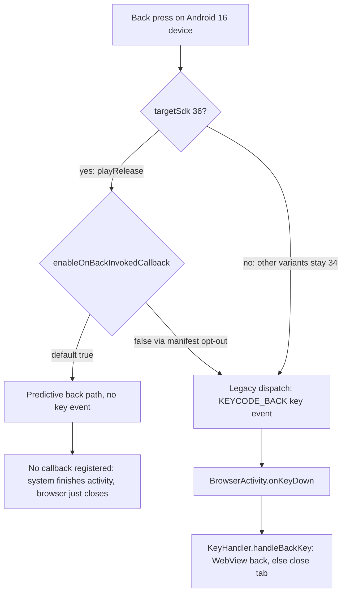

2026-08-04

# EinkBro: target API 36 for the Play build, opt out of predictive back

Google Play now requires apps to target an API level within one year of the
latest Android release; from Aug 31, 2026 that means Android 16 (API 36), or
updates to the app can no longer be published. EinkBro already isolates Play
policy requirements to the `playRelease` build type (which had targetSdk 35
while every other variant keeps the tested targetSdk 34), so this change
follows the same pattern: the `androidComponents.beforeVariants` override for
`playRelease` now sets `targetSdk = 36`. Sideloaded GitHub builds, F-Droid,
and debug are untouched. `compileSdk` was already 36, so no toolchain change
was needed.

## The one real behavior change: predictive back

Bumping the number is trivial; the trap is that targeting SDK 36 flips
Android 16's predictive back on by default (`enableOnBackInvokedCallback`
defaults to `true`). Under predictive back the system stops dispatching
`KEYCODE_BACK` key events entirely — and EinkBro's entire custom back
behavior (WebView go-back, then close tab) hangs off exactly that path:
`BrowserActivity.onKeyDown` routes `KEYCODE_BACK` into
`KeyHandler.handleBackKey()`. With no `OnBackInvokedCallback` registered, a
back gesture on an Android 16 device would simply finish the activity —
closing the whole browser instead of navigating back.

The fix is `android:enableOnBackInvokedCallback="false"` on the
`<application>` element, which keeps the legacy key-event dispatch. Opting
out rather than migrating to `OnBackPressedDispatcher` is deliberate: the
payoff of predictive back is its preview animation, which is worthless on
E-ink displays, while the key-event path is also what unifies back handling
with the volume-key double-click-back feature in `KeyHandler`. The attribute
is safe to set unconditionally — `false` is already the default for every
variant targeting below 36, so only the Play build's behavior changes (to
stay the same as before).

## Other API 36 behavior changes checked

- Edge-to-edge opt-out removal: not applicable — the app never used
  `windowOptOutEdgeToEdgeEnforcement` and has lived with enforcement since
  the Play build moved to targetSdk 35.
- Large-screen orientation/resizability restrictions ignored: not applicable
  — no `screenOrientation` locks in the manifest.

## Verification

`./gradlew bundlePlayRelease` builds clean; the merged Play manifest shows
`targetSdkVersion="36"` with `enableOnBackInvokedCallback="false"`, while
debug and release merged manifests still show `targetSdkVersion="34"`. The
policy deadline needs a new version published to production before
Aug 31, 2026 — the next regular release via `publishPlayReleaseBundle` will
carry this. Back-button behavior should get a quick pass on an Android 16
emulator with the Play build before that production rollout.
