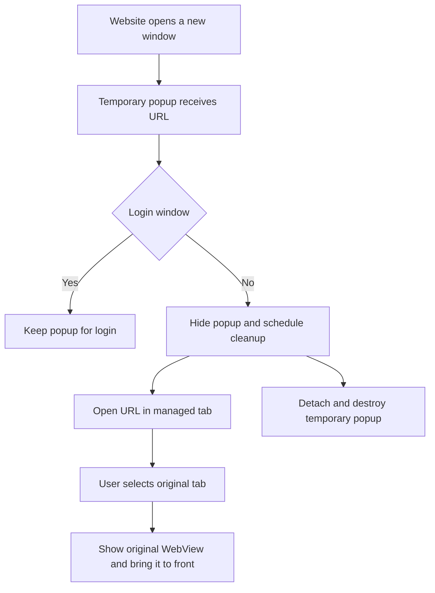

2026-09-21

# Restore access to original tabs after website popups

Opening a website link in a new tab could leave the original page inaccessible even though it remained in the tab preview. Selecting it changed the selected-tab counter, but the child page stayed visible and intercepted touches. This was reproduced on the Pixel 7 API 36 emulator before the fix.

The September 3 optimization in commit `6f859dd39` switched tabs by visibility without restoring their stacking order. Its assumption that every sibling was hidden overlooked temporary WebViews inserted by `EBWebChromeClient.onCreateWindow`. For ordinary links, those popup WebViews forwarded their URL to a managed tab but also kept loading the same page and remained attached above the original tab. The subsequent tab-removal fixes did not cover this path.

`TabManager.showAlbum` now brings the selected WebView to the front without detaching and reattaching it. The popup callback hides temporary popups immediately, consumes the forwarded navigation, and schedules detachment and destruction after handing the URL to a managed tab. Cleanup is guarded against duplicate calls and shared with popup close and renderer-loss callbacks. The parent is captured per popup instead of stored in a shared field. Blob download popups also receive cleanup; the existing login URL handling remains in place. The single spare preloaded WebView is retained.

Verification used the sim-use skill with a local two-page fixture. Before the change, the screenshot showed the child page while the counter selected the original tab, and the accessibility tree contained overlapping original and child WebViews. After the change, both a target-blank link and JavaScript window.open allowed returning to the original page. Its button responded to taps, its updated page state survived tab switching, and closing the active child tab returned to the original page. Authentication and blob download flows were not exercised in this verification.

The debug APK built successfully and all 289 app unit tests passed with no failures or skips. The fixed APK was installed on the emulator only.

Implementation: [cb0794ef6](https://github.com/plateaukao/einkbro/commit/cb0794ef6).
