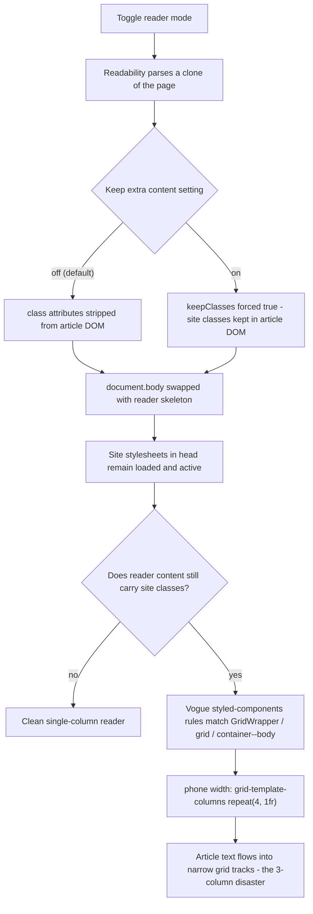

2026-07-19

# EinkBro reader mode: disable site stylesheets while the reader is showing

Reader mode on vogue.com.tw was a disaster on iPhone: article text rendered in three narrow columns, a few characters per line. The same page was equally broken in the Android app. Both apps share the reader pipeline, and the bug is a structural property of how that pipeline works.

## Root cause

EinkBro's reader mode is an in-place body swap: Readability parses a clone of the page, then `document.body.outerHTML` is replaced with a reader skeleton holding the extracted article. Only `<body>` is replaced — every stylesheet the site loaded into `<head>` stays active and keeps styling whatever markup is now in the body.

Normally that is harmless, because Readability strips `class` attributes from the extracted article, so the site's class-based rules have nothing to match. But the **"keep extra content"** reader setting (`sp_reader_keep_extra_content`) flips Readability's `keepClasses` on — that is how syntax-highlighting classes survive for code blocks on tech articles.

Vogue Taiwan runs Condé Nast's Verso platform, which chunks the article body into CSS-grid wrappers (`GridWrapper-*`, `grid grid-margins`, `ArticlePageChunks*`, `container--body`). With classes kept and the site's styled-components CSS still loaded, those wrappers lay out as grids inside the reader: `grid-template-columns: repeat(12, 1fr)` at desktop width, `repeat(4, 1fr)` under 768px. On a phone the article text lands in individual ~90px tracks — the "3 columns" the reader showed. A live-page probe found 68 grid-laid-out elements inside the reader content in this mode, and zero with the setting off.

## Fix

Disable the page's own stylesheets for the duration of reader mode, and restore them on exit. Two helpers were added to the shared `MozReadability.js` (kept byte-identical between the two repos so the files stay diffable):

- `disableSiteStyleSheets()` — iterates `document.styleSheets` (and `document.adoptedStyleSheets`), sets `disabled = true` on every sheet that is not one of EinkBro's own CSS slots (id prefix `einkbro-css-`), and marks the owner node with `data-einkbro-disabled` so the exit path knows exactly what to restore.
- `enableSiteStyleSheets()` — re-enables only the marked sheets and the recorded adopted sheets.

Call sites:

- iOS: `replace_reader_body.js` calls `disableSiteStyleSheets()` right after the body swap; `disable_reader_mode.js` calls `enableSiteStyleSheets()` (typeof-guarded) before restoring the cached body.
- Android: the same two calls in the inline JS templates in `WebViewJsBridge.kt` (`replaceWithReaderModeBodyJs`, `disableReaderMode`).

This is aligned with the feature's own design intent: `inlineCodeStyles()` already inlines computed code-block styling *before* the swap precisely so the reader does not depend on site CSS — the site sheets were never supposed to be load-bearing inside the reader.

The fix applies in both reader variants (default and keep-extra) — beyond the grid collapse, it also stops any site element-selector rules from leaking into the reader, so reader typography is now fully owned by EinkBro's own CSS slots.

## Verification

- Chrome harness against the live article, running the exact app pipeline (`MozReadability.js` + `jsonld_article.js` + swap): with keep-extra on, grid-laid-out elements inside the reader went from 68 to 0; site sheets disabled: 9; EinkBro's reader slot stayed active. Exit path re-enabled all 11 sheets, restored the site's grid layout, and left no marker attributes behind.
- Real iOS app in the simulator (fresh build): keep-extra ON on the Vogue article now renders a clean single-column reader; before the fix the same flow reproduced the 3-column collapse.
- Android: `compileDebugKotlin` passes; the changed JS is byte-identical to the iOS copy verified above.

Commits: einkbro-ios `f00e653`, einkbro `3a8e2cdc3`.
