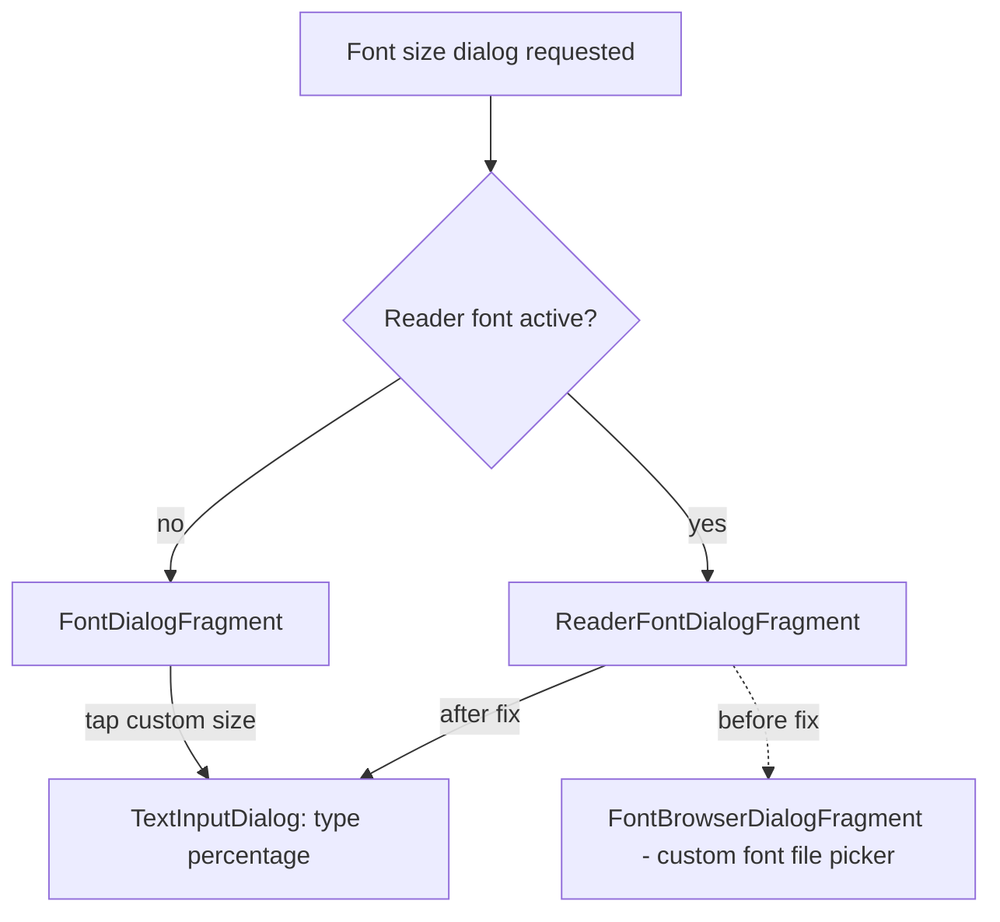

2026-08-11

# EinkBro: Custom font size opened the font picker in the reader font dialog

## What was broken

Issue #631: tapping the custom font size option (the chip past 200%) in the
font size dialog opened the custom **font file picker** instead of the dialog
for typing a size percentage. The reporter hit it on an Onyx Boox and noted it
had been broken "for a little while" — and indeed the regression shipped back
in v15.10.0.

## Root cause

The shared `MainFontDialog` composable is hosted by two fragments, and only one
of them wired the custom-size chip correctly:

- `FontDialogFragment` (normal browsing) opened a `TextInputDialog` asking for
  a percentage — correct.
- `ReaderFontDialogFragment` — shown when reader mode is on, when the page is
  translated, or from Settings → Reader mode settings — passed its existing
  font-picker callback for **both** new parameters when the custom-size feature
  was added (commit `7843faafb`, feature #530):

```kotlin
onFontTypeChanged = onFontCustomizeClick,
onCustomFontSizeClick = onFontCustomizeClick,   // wrong: opens the font picker
```

Both variants render identically, so from the screenshots alone the two paths
are indistinguishable — but the misbehavior (font browser opening) can only
come from the reader variant, which every e-reader user in reader mode gets.



## The fix

`ReaderFontDialogFragment` now mirrors the normal-mode flow: the custom-size
chip opens the same `TextInputDialog`, the entered value is written to
`readerFontSize` and `customFontSize`, and the selected size is backed by a
Compose `mutableIntStateOf` so the chip label refreshes immediately after
input (previously the value was read once at composition).

Normal-mode `fontSize` is untouched by the reader dialog, keeping the two
modes' sizes independent as designed.

## Verification

Driven on the emulator through the Settings → Reader mode settings path:
tapping the custom chip now opens the percentage input; a value typed through
the real soft keyboard updated the chip label live and persisted to
`sp_reader_fontSize` / `sp_customFontSize`, with normal-mode `sp_fontSize`
unchanged.

Commit: `27b7b91c5`.
