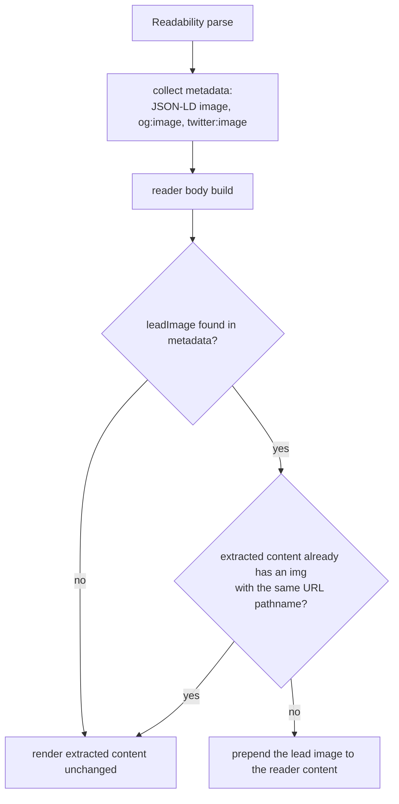

2026-09-02

# Reader mode restores the lead image dropped by Readability

## What was broken

Issue #635: opening reader mode on many news articles showed no image at all, even though the article had a prominent hero photograph. The reporting site's pages — and a lot of news CMSes generally — place the lead photograph in a sibling branch of the DOM, next to (not inside) the container that holds the article text:

```
div.hero-section
├── div.hero-media          ← the photo lives here
│   └── img
└── div.hero-text-wrap
    └── div.article-text    ← Readability's top candidate
        ├── h1
        └── p, p, p ...
```

## Root cause

Readability's candidate algorithm scores text-dense containers and extracts the winner. When the article text alone clears the score threshold, the extraction is exactly `div.article-text` — and the hero image, sitting in a sibling branch, is simply never part of the output. Nothing is wrong with the scoring; the image is structurally outside everything the extractor considers article content.

## The fix

The page itself almost always declares the hero in metadata. So `MozReadability.js` now:

1. **Collects a `leadImage` during metadata extraction** — from JSON-LD (`image` as a string, an array, or an ImageObject with a `url`), `og:image`, or `twitter:image`, in that priority order, HTML-entity-unescaped like the other metadata fields.
2. **Prepends it at reader-body build time when the extracted content lost it.** Duplicate detection compares URL *pathnames* (resolved against the page base), so a hero that did survive extraction is not doubled just because its `src` carries different query parameters than the metadata URL.



Everything is wrapped in try/catch: an unparsable metadata URL or content quirk falls back to rendering the extraction unchanged, never to breaking reader mode.

## The bug hiding inside the fix

The first draft added `image` to Readability's meta-tag property pattern. That pattern is unanchored, and real news pages ship the Open Graph sub-properties right after the image tag:

```html
<meta property="og:image"        content="https://cdn.example.com/hero.jpg">
<meta property="og:image:width"  content="1200">
<meta property="og:image:height" content="630">
```

`og:image:width` also matches the pattern as `og:image`, so its content — the bare number `1200` — overwrote the stored image URL. On precisely the sites this fix targets, reader mode would have prepended a broken ``. The meta scan now checks the character following the matched token and skips sub-properties (anything continuing with `:`), so `og:image:width`, `:height`, `:alt`, and `:secure_url` no longer clobber the base value.

## Verification

A fixture replicating the sibling-branch structure (including the width/height sub-property tags) was added as `test_server/hero_outside_article.html`. Verified three ways:

- Node harness on the meta-scan loop: the image URL survives the sub-property tags; title and published time unaffected.
- CDP against the live WebView: the patched library parsed the fixture with the correct `leadImage`, produced exactly one image in the reader body, left content unchanged when the hero was already present (dedupe) and when no metadata existed.
- On-device: toggling reader mode in the app showed the hero image, loaded, once.

## iOS port

`einkbro-ios` evaluates the same `MozReadability.js` and calls `createHtmlBodyWithUrl` identically (`replace_reader_body.js`), so the patched file was copied over unchanged — no Kotlin changes on either platform.
