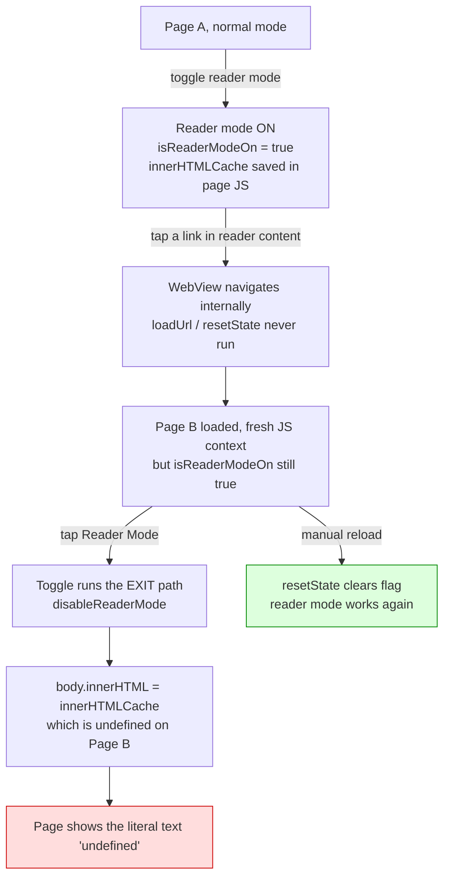

2026-07-31

# Reader mode broke on pages opened from links inside reader mode

GitHub issue #309: enter reader mode, tap a link in the article, then try to
enter reader mode on the destination page — the page blanks to the literal
string `undefined`, with no recovery except a manual reload. Reported against
11.0.0 but present ever since; the `undefined` text was the give-away.

## Root cause

Reader mode lives in two places that age differently:

- **In the page**: entering reader mode saves the original markup as a JS
  expando (`document.innerHTMLCache`) and replaces the body with the
  Readability output. This state belongs to that one document and vanishes the
  moment the WebView commits a new one.
- **In Kotlin**: `isReaderModeOn` on the WebView, used to decide whether the
  next toggle enters or exits reader mode.

The Kotlin flag was only cleared by `loadUrl()`, `reload()`, and `goBack()`.
A link tap is none of those — `shouldOverrideUrlLoading` returns `false` for
ordinary http links, so the WebView navigates internally and the flag leaks
across the document boundary. On the new page the app still believed reader
mode was on, so the user's "enter reader mode" tap actually ran the *exit*
path, whose JS did `document.body.innerHTML = document.innerHTMLCache` — and
on a document that never entered reader mode that cache is `undefined`,
turning the whole body into that one word. A second tap then ran Readability
over the word "undefined", so the page was unrecoverable without a reload
(which happens to reset the flag, matching the reporter's workaround).

## Fix

Two layers, both in the direction of "page-scoped state must die with the
page":

1. **Reset on document commit.** `onPageStarted` now calls a new
   `EBWebView.resetReaderModeForNewPage()`, which drops the reader and
   vertical-read flags and restores the normal-mode `textZoom`. This covers
   link taps and JS-driven navigations; loads that already went through
   `resetState()` make it a no-op. `onPageStarted` was chosen over
   `doUpdateVisitedHistory` deliberately: same-document fragment jumps fire
   only the latter, so tapping an in-article anchor (a table of contents
   entry, say) keeps reader mode as it should. A full `resetState()` there
   would have been wrong — it also clears `isTranslatePage`, which is set
   *after* `loadUrl()` and would be wiped by its own page's `onPageStarted`.

2. **Guard the restore script.** The exit-path JS moved out of inline Kotlin
   into `assets/disable_reader_mode.js` (house rule: injected JS lives in
   assets) and now only assigns `innerHTMLCache` back when it is actually a
   string, so no future stale-flag path can blank a page again.

A test-server fixture (an article page linking to another article) was added
so the scenario — reader mode, follow link, reader mode again on the
destination — can be replayed on the emulator; both the enter and the
restore-on-exit paths were verified there against the fixed build.
