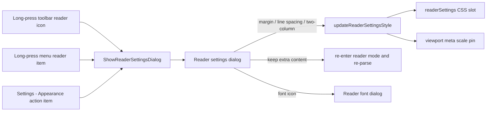

2026-07-12

# EinkBro: Reader Mode Settings Dialog (page margin, line spacing, two-column landscape)

Reader mode's layout knobs were scattered and thin: page padding hid in Settings > Appearance as a raw number field, "keep extra content" hid in Settings > Misc, line spacing wasn't adjustable at all, and landscape reading meant one uncomfortably wide column. This change gives reader mode its own settings dialog, opened by long-pressing the reader mode icon (toolbar or menu dialog) — the natural place to reach for while actually reading — with everything applied to the current page live.

Commits: `49bda444d` (dialog + layout engine), `9adfc0dfc` (settings consolidation).

## What the dialog offers

- **Page margin** slider (0–100px, 5px steps) — same preference the old Appearance number field wrote
- **Line spacing** slider (1.0–2.5, 0.1 steps) — new; overrides readerview.css's fixed 1.5
- **Two columns in landscape** switch — new paged book-spread layout (below)
- **Keep extra content** switch — moved here from Settings > Misc
- A font icon linking to the existing reader font dialog (size / font type)



Style changes land in a dedicated `readerSettings` CSS slot (the managed-slot mechanism from the earlier font work), recomputed by `WebViewReaderHelper.updateReaderSettingsStyle()`. Its selectors are written more specific than readerview.css's rules so it wins regardless of slot insertion order, and the slot plus viewport meta are fully restored when reader mode exits — no reload needed at any point.

"Keep extra content" is different in kind: it changes what Readability extracts, not how it's styled. Toggling it while reader mode is active re-enters reader mode (off/on), which restores the cached original body and re-parses with the new scope — so it too applies immediately.

## Two-column landscape: paged, not scrolled

A naive `column-count: 2` on a scrolling page balances the article into two full-height columns — the reader would scroll to the bottom of column one, then back up for column two. Useless. Instead the reader body becomes a paged medium in landscape:

```css
body.mozac-readerview-body {
  margin: 0; height: 100vh;
  column-count: 2; column-fill: auto;
  column-gap: /* 2 x page margin */;
  overflow-x: auto;
}
```

Content flows into viewport-height columns extending horizontally; each pair of columns is exactly one viewport wide (outer margins = padding, inner gap = 2 x padding), so a page turn is a horizontal jump of exactly `webView.width`. `WebViewNavigationHelper` gained two-column branches for page up/down, jump to top/bottom, and page-count info — mirroring the existing vertical-read (CJK) horizontal paging, but left-to-right.

Two constraints surfaced only by driving the real WebView:

1. **WebView zooms out to fit wide content on rotation.** The column strip makes the document ~N viewports wide; rotating to landscape dropped the visual scale to 0.25, showing nine tiny columns. Fix: while two-column is enabled, the viewport meta is pinned to `width=device-width, initial-scale=1.0, minimum-scale=1.0` (via a new `set_viewport_content.js` asset), and restored on exit.
2. **The UA stylesheet's `body { margin: 8px }` breaks page tiling.** Each spread tiled 16px narrower than the viewport, drifting one clipped glyph further per page turn. Fix: `margin: 0` in the two-column rule, plus page turns anchor with `scrollTo(page * width)` instead of accumulating `scrollBy`, so sub-pixel layout rounding can never build up either.

## Settings consolidation

With the dialog as the single home for reader layout, the second commit rewires Settings:

- Settings > Appearance: the "Padding for reader mode" value field became a "Reader mode settings" action item opening the same dialog (no live webview there, so changes simply apply on the next reader mode entry).
- Settings > Misc: the "Keep Extra Content" toggle was removed.
- The `keep_extra_content` dialog label was derived per locale by stripping the old setting title's "Reader Mode:" prefix, preserving all 30 existing translations; the four orphaned settings strings were deleted everywhere.

All flows were verified on the emulator end-to-end (both long-press entry points, live CDP-verified style application, exact page-turn boundaries across spreads, full style/meta cleanup on exit, and the settings entry point).
