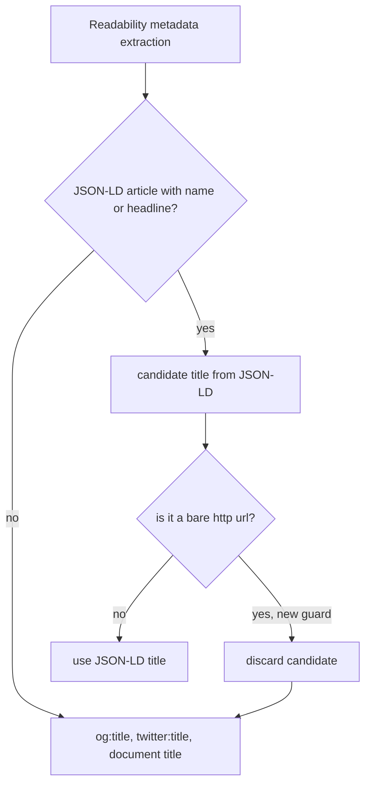

2026-08-08

# Reader mode: URL rendered as the article title

## What was broken

Reader mode suddenly showed the page's bare URL as the first line — in
title-sized `<h3>` text. Because a URL is one unbreakable string, it
stretched the reader body wider than the viewport and broke the layout of
the whole article.

## Root cause

The site's own structured data was wrong: its JSON-LD `NewsArticle` block
carried the page **URL** in the `headline` field (seen on itmedia.co.jp):

```json
"@type": "NewsArticle",
"headline": "https://.../news/article/…/"
```

Mozilla Readability prefers the JSON-LD `headline`/`name` over `og:title`
and `document.title` — both of which were correct on the page — so
`article.title` became the URL and the reader template rendered it as the
`<h3>` heading. Nothing had changed in the app; the site's data broke, and
the extractor trusted it blindly.

## Fix

Guard the JSON-LD title in `MozReadability.js`: a candidate title that is a
bare `http(s)://` URL is discarded, so metadata extraction falls through to
`og:title` / `twitter:title` / `document.title`. The check is deliberately
narrower than Readability's generic `_isUrl()` (`new URL()` accepts odd but
legitimate titles such as scheme-shaped strings); only an explicit
`/^https?:\/\/\S+$/i` match is dropped.



## While there: original-page link in the reader header

Access to the original URL is still useful, so the reader header now shows
it the way the EPUB/translate extraction path always did — appended to the
estimated reading time as a short link, e.g. `9 分 | link`:

- The in-app reader switched from `createHtmlBody` to
  `createHtmlBodyWithUrl`, whose label was shortened to just `link`.
- The template now takes the URL from `location.href` inside the injected
  page JS instead of threading it through Kotlin via `String.format("%s")`
  — the unused `url` parameter was removed from
  `WebViewJsBridge.replaceWithReaderModeBody`.
- Hardening in `createHtmlBodyWithUrl`: the `href` attribute is now quoted
  and HTML-escaped (it was an unquoted attribute), and a missing URL falls
  back to the plain no-link body.
- `translate_by_paragraph.js` skips elements whose text is `link` (keeping
  the old `original link` match for previously saved EPUBs), so paragraph
  translation leaves the header link alone.

## iOS port

`einkbro-ios` shares the same JS assets and its `MozReadability.js` was
byte-identical, so the fixed file was dropped in as-is;
`replace_reader_body.js` got the same one-line switch to
`createHtmlBodyWithUrl(article, location.href)`. Verified in the iPhone
simulator against the same page: real headline, `9 分 | link` header, no
width overflow — the guard behaves the same under WebKit as under
Chromium.
