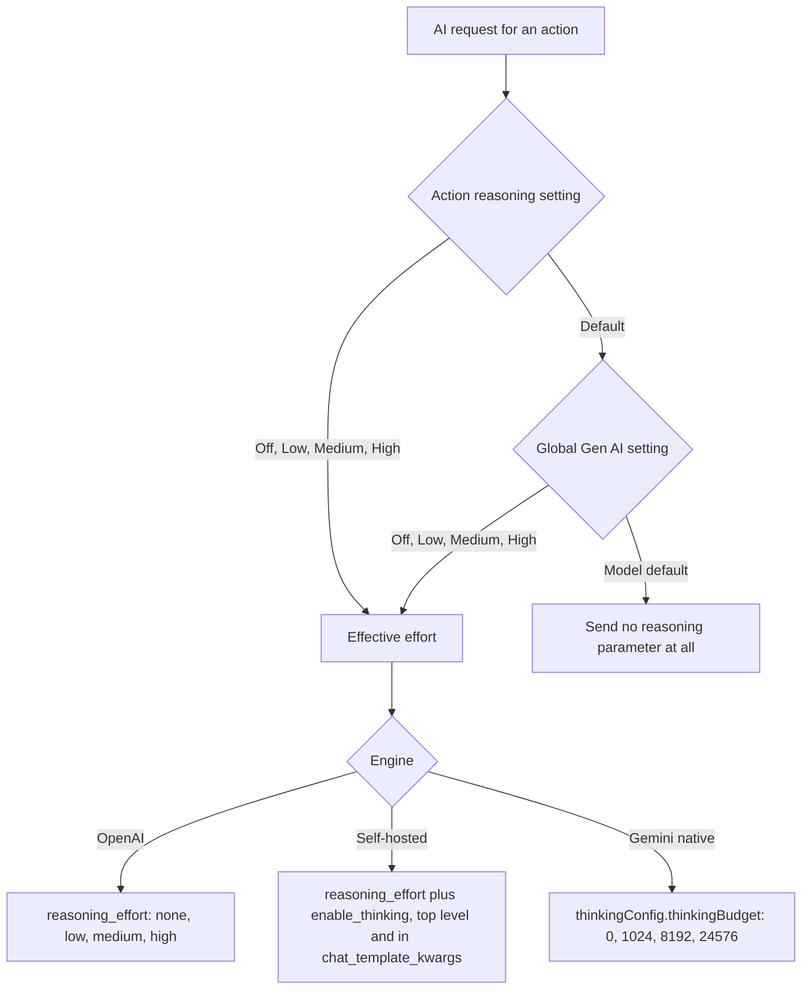

2026-08-04

# EinkBro: Configurable Reasoning/Thinking Effort for AI Requests

A user running a self-hosted Qwen3 model reported (discussion #626) that every AI action was slow because the model always "thinks" before answering, and asked for a way to send `enable_thinking: false`. Rather than a single toggle for one server dialect, EinkBro now has a general reasoning-effort setting that works across all three engines.

## What it does

- **Gen AI settings** gains a global "Reasoning effort" item: Model default / Off / Low / Medium / High. "Model default" is the initial value and sends no reasoning parameter at all — byte-identical requests to what the app sent before, so nobody's setup changes behavior until they opt in.
- **Each AI action's edit dialog** gains a matching chip row where *Default* means "follow the global setting". Synthesized actions (page summary, page chat, external search, the task agent) carry the default, so the global setting governs them automatically.

The effective effort resolves action → global → model default, then maps to whatever the target engine understands:

## How it was built

A single `ReasoningEffort` enum (`Default / Off / Low / Medium / High`) serves both levels: on an action, `Default` chains to the global preference; on the global preference itself it means "model default". `AiConfig.resolveReasoningEffort(action)` implements the chain, and `OpenAiRepository` maps the result onto each request builder (streaming chat, one-shot completion, Gemini native, and the tool-calling agent loop).

Design constraints that shaped the wire format:

- **api.openai.com rejects unknown parameters**, so the `enable_thinking` pair is only attached for self-hosted engines; OpenAI gets only `reasoning_effort`.
- **Self-hosted servers disagree on where the thinking switch lives**: vLLM/SGLang/llama.cpp read `chat_template_kwargs.enable_thinking`, DashScope-style servers read a top-level `enable_thinking`. Both are sent so either dialect picks it up; `reasoning_effort` rides along for servers that honor it.
- **Gemini's OpenAI-compat endpoint** (used by the tool-calling agent path) documents only low/medium/high, so "Off" degrades to model-default there instead of risking a rejected request; the native Gemini path expresses Off as `thinkingBudget: 0`.
- All new request fields default to `null` and are omitted by the serializer, which is what makes the "model default" guarantee hold. Amusingly, both wire formats already contained dormant scaffolding for this feature — a `reasoning: {effort: "none"}` field on `ChatRequest` and a `thinkingBudget = 0` default on Gemini's `RequestData` — that was never serialized because the values always equaled their defaults. Both were replaced by the real implementation.

Persistence is backward- and forward-compatible: old stored actions decode with `reasoning = Default`, and old app versions ignore the new key.

The seven new strings were translated into all 30 locale files (the settings label resolves per locale; the action dialog reuses the same option strings).

New unit tests lock down the wire format — a request without an explicit choice must not mention reasoning at all, and explicit choices must emit exactly the expected keys — plus the resolution precedence in `AiConfig`.

## Settings layout change

"AI action definition" and "AI result history" moved from the bottom of the Gen AI screen to sit directly under the engine items (after Google Gemini), with a divider on each side, so the screen now reads: engines → actions/history → web content processing.
