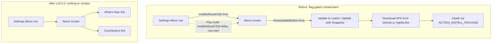

2026-08-03

# EinkBro: Remove All Self-Update Features for Google Play Compliance

EinkBro is back on the Google Play Store. Play policy strictly forbids apps
that update themselves, and until now the app carried a full self-update
mechanism — "Update to Latest" (GitHub releases) and "Update with Snapshot"
(CI artifacts via nightly.link) in the About settings screen — kept out of the
Play build only by a pair of build flags. That containment worked, but it left
a standing risk: one wrong build invocation (`-PshowUpdateButton=true` on a
Play build) or one refactor that dropped a safeguard would put a
policy-violating APK installer into the store listing. With the listing live
again, the decision was to remove the feature entirely rather than keep
guarding it. Version bumped to 16.0.0 to mark the behavior change.

## What was removed

- **`AppUpdater.kt`** — the whole updater: GitHub releases API version check,
  APK download with progress, nightly.link snapshot zip download and
  extraction, and the `ACTION_INSTALL_PACKAGE` install flow. Its forwarding
  functions in `HelperUnit` went with it.
- **Both build flags.** `showUpdateButton` (compiled the update items in for
  GitHub-bound builds) and `enableAboutClick` (made the About row
  non-clickable in the Play build so the About screen was unreachable) are
  gone from `app/build.gradle.kts`, `BuildConfig`, the CI workflow, and the
  `/release` skill. The About row is now always clickable in every build,
  because the screen no longer contains anything policy-sensitive.
- **`ProgressActionSettingItem`** and its Compose UI (the item that showed
  download percentage in place of its label) — the two update items were its
  only users.
- **`REQUEST_INSTALL_PACKAGES`** from the manifest. The deleted install flow
  was its only user, and not requesting the permission at all is itself a
  positive signal for Play review.
- **About screen links** trimmed to just "What's New" (changelog) and
  "Contributors": ProjectSite, LatestRelease, Twitter, and Medium links were
  removed, along with their strings in all 32 locale files.

## Before and after

## Rationale for full removal over containment

The flag approach meant GitHub-release users kept in-app updates, at the cost
of every future build and CI edit having to preserve two safeguards (the
compile-out flag and the unreachable About screen). Since the Play listing is
the asset at risk and GitHub users can update by downloading a release APK the
same way they installed the first one, the trade was no longer worth it. The
project `CLAUDE.md` section that used to document the safeguards now documents
the removal and forbids reintroducing an in-app updater, an APK
download/install flow, or the `REQUEST_INSTALL_PACKAGES` permission.
