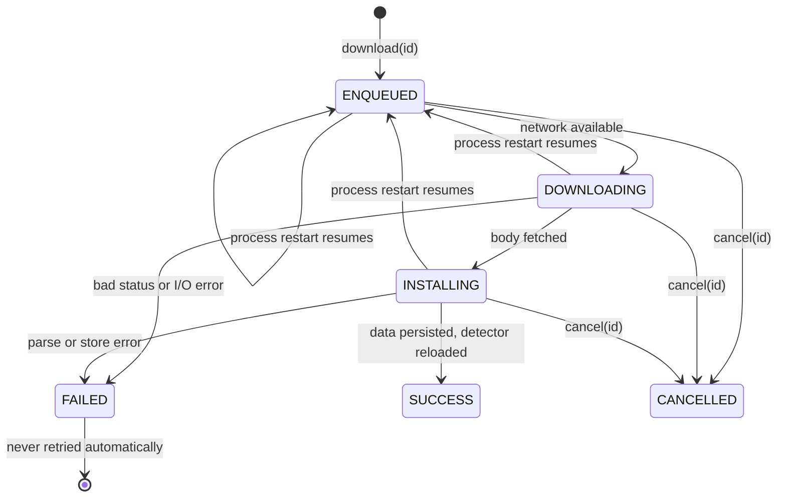

2026-08-23

# EinkBro: replace WorkManager with a coroutine filter updater

Follow-up to the Material Components / locale-filter cut: the next library on
the APK Analyzer list was `androidx.work` at about 160 KB of dex. It was used for
exactly one thing - the two-step chain that downloads an ad-filter list and
compiles it into the native ad-block client - and that chain is now a plain
coroutine pipeline in the `ad-filter` module. The arm64 release APK drops from
4.89 MB to 4.79 MB and `classes.dex` loses about 195 KB.

## What WorkManager was doing

`FilterViewModelImpl.download(id)` built a `DownloadWorker -> InstallationWorker`
chain per filter with a `NetworkType.CONNECTED` constraint and
`ExistingWorkPolicy.KEEP`, then observed `WorkInfo` through a LiveData-to-
StateFlow bridge. `AdFilterImpl` translated `WorkInfo.State` plus worker tags
back into the app's own `DownloadState` enum, and the app's `Application`
watched a "work id -> filter id" map to show a download notification.

Three things were worth keeping from that:

- Waiting for connectivity instead of failing immediately when offline. E-ink
  devices spend a lot of time offline, and the first-launch bootstrap download
  happens whenever the user first opens the app.
- Ignoring a second `download(id)` while one is in flight.
- Surviving process death: WorkManager persisted enqueued work, so "first
  launch offline, app killed, later online" still produced a filter list.

## The replacement

`FilterUpdater` owns a `SupervisorJob + Dispatchers.IO` scope and one `Job` per
filter id. The states it writes are the same `DownloadState` values the
settings screen already renders:

- **Network wait.** `awaitNetwork()` checks `ConnectivityManager.activeNetwork`
  for `NET_CAPABILITY_INTERNET` and otherwise suspends on a
  `registerNetworkCallback` until `onAvailable`. (`registerDefaultNetworkCallback`
  would be simpler but is API 24; `ad-filter` has minSdk 23.) If connectivity
  cannot be queried at all it proceeds and lets the request fail on its own.
- **KEEP semantics.** `download()` is synchronized and returns early when the
  id's job is still active.
- **Process death.** Jobs do not outlive the process, but the `Filter` record
  with its `downloadState` is persisted in SharedPreferences. On construction,
  `FilterViewModelImpl` re-submits every filter whose persisted state is still
  one of the running states: that state can only mean the previous process died
  mid-work, because a real error would have written `FAILED`. Genuine failures
  are left alone - a bad URL is tried exactly once, not on every launch.
- **Notification.** `FilterViewModel` now exposes
  `activeDownloads: StateFlow<Set<String>>` instead of `WorkInfo` lists and the
  work-id map; the `Application` collects that for its "downloading / complete"
  notification.

`Filter` map updates moved from read-modify-write on the `MutableStateFlow` to
`update {}`, since several downloads now finish on IO threads concurrently.

## Permissions

WorkManager's own manifest was the only thing declaring
`ACCESS_NETWORK_STATE`, and the status-bar Wi-Fi indicator (and now
`awaitNetwork`) depends on it, so the app manifest declares it explicitly.
`WAKE_LOCK`, `RECEIVE_BOOT_COMPLETED` and `FOREGROUND_SERVICE` came from the
same place and nothing in the app uses them; they are gone from the merged
manifest.

## Two behaviour fixes that fell out

1. **Installed data is loaded immediately.** The old `updateFilter` set
   `isEnabled = true` on the record after a successful install but never
   loaded the new data into the detector - the `viewModel.enableFilter(filter)`
   call from the upstream library was sitting in a commented-out block - so an
   update only took effect after an app restart or a toggle. `FilterUpdater`
   now calls back into the view model after writing the record, which loads
   the filter (`Detector.addClient` replaces by id) and refreshes the enabled
   count. The enabling rule is the upstream author's: a first download switches
   the filter on, an update keeps whatever the user chose.
2. **Intermediate states no longer clobber the record.** Each `WorkInfo`
   translation rebuilt the `Filter` from scratch, so every ENQUEUED/RUNNING
   event wrote `isEnabled = false, checksum = ""` until the install succeeded.
   The new pipeline only touches `downloadState` until success.

## Verification

`./gradlew test` passes (230 tests). On the emulator, from Settings > Site
Settings > Update AdBlock content: "update" took both subscribed lists through
downloading -> installing -> new timestamp and filter count, with
`DetectorImpl: Client count: 2 (after addClient)` in logcat right after each
install. With Wi-Fi and data disabled both lists sat in "waiting" and
completed on their own when connectivity returned. Starting an update
offline, force-stopping the app, relaunching still offline and then enabling
Wi-Fi ended with both lists in SUCCESS and the detector reloaded, without
touching the UI. The "Download Complete" notification fired in each case.
The cancel path (`removeFilter` mid-download) was reviewed but not driven
from the UI.

## What is left

After this change the dex is dominated by Compose (about 1.3 MB), the app's own
code (about 1 MB), pdfbox + fontbox (350 KB, the Save-as-PDF feature), OkHttp
(120 KB) and AppCompat widgets (110 KB). There are no more single-purpose
libraries to remove; further size work would be feature-level.
