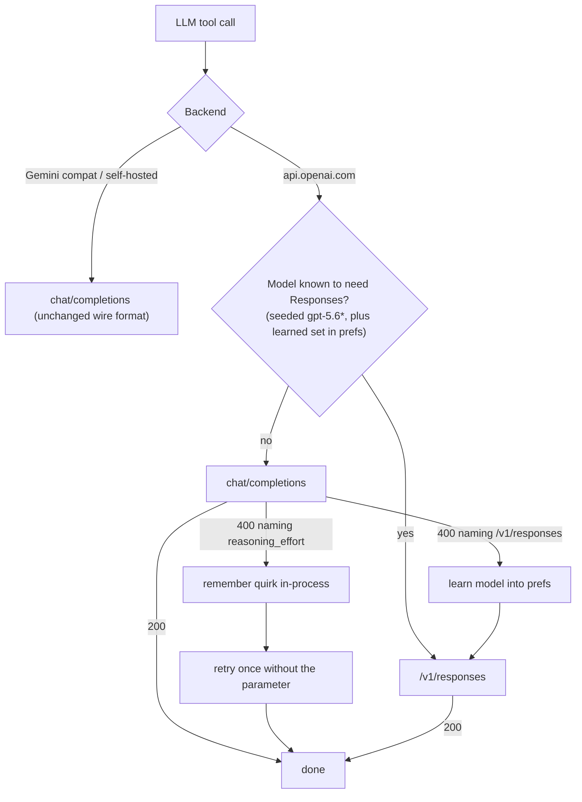

2026-08-14

# Route LLM calls per model to /v1/responses or chat/completions

## What was broken

Every "page AI Task" (the free-form agent in chat-with-web) died immediately with
`LLM call failed on turn 1`, regardless of which model was configured — and the
message gave no hint why, because the repository collapsed every non-200 response
into `null`. Separately, GPT actions built on `gpt-4.1`-class models broke as soon
as a non-default reasoning effort was set globally.

## Root cause

OpenAI has split its models across two APIs, and the split is not discoverable up
front:

- **Reasoning-first models (`gpt-5.6*`)** reject function tools on
  `/v1/chat/completions` outright. The 400 arrives **even when no
  `reasoning_effort` parameter is sent**, because the model's *default* effort
  counts too. The server's own guidance: use `/v1/responses`, or force
  `reasoning_effort: "none"`. So every effort setting except Off was doomed —
  including the pre-existing "send nothing" default.
- **Pre-reasoning models (`gpt-4.1`)** 400 on the `reasoning_effort` argument
  itself ("Unrecognized request argument"), with or without tools.
- `gpt-5.1`-era models accept both, and Gemini's OpenAI-compat layer plus the
  native Gemini `thinkingConfig` path were verified unaffected.

The recently added reasoning-effort setting made the second failure reachable,
but the first one was baked into the server: the agent loop could never work on a
`gpt-5.6*` model through chat/completions.

## The fix

`chatWithTools` became a router that identifies the right API per model and
learns from the server's own 400s instead of hardcoding a model list:

Key pieces:

- **`responsesWithTools()`** speaks the Responses schema — flat tool objects,
  typed input items, `reasoning: {effort}` — and folds the result back into the
  existing `ToolChatCompletion` type, so the agent loop is API-agnostic.
- **Raw item replay.** Responses turns can include `reasoning` items that must be
  echoed back verbatim on later turns. Each assistant turn keeps its raw output
  items in `ToolChatMessage.rawItems` (`@Transient`, so it never leaks into any
  JSON encoding) and the input builder replays them untouched. Assistant turns
  recorded by the chat-completions path are synthesized into `function_call`
  items instead, so a mid-session API switch still yields a valid transcript.
- **Learning is persisted and scoped.** Models taught by a 400 land in a prefs
  string-set, so later sessions route directly; both learned sets are consulted
  only for api.openai.com action types, keeping Gemini-compat and self-hosted
  requests byte-identical to before.
- **The same self-healing covers the non-agent paths**: `chatCompletion` retries
  once without the effort parameter, and `openAiStream` reads the SSE failure
  body and restarts the stream once — previously that path never even read the
  error.
- **Errors are visible now.** The failure bubble shows the API's actual error
  message instead of a bare "LLM call failed", and tool calls get a 180-second
  read timeout so a long reasoning pass isn't killed by the 30-second default.

## Why not migrate everything to /v1/responses

Considered and rejected: chat/completions is the only surface Gemini's
OpenAI-compat layer and the self-hosted ecosystem (Ollama, vLLM, llama.cpp)
expose, so it cannot be dropped; the streaming UI would need a second SSE parser
for the Responses event schema for no user-visible gain; and the gpt-4.1 effort
quirk exists on Responses too, so the retry logic wouldn't disappear. The
adaptive router keeps one wire format per backend and pays at most one failed
probe per newly-split model, ever.
