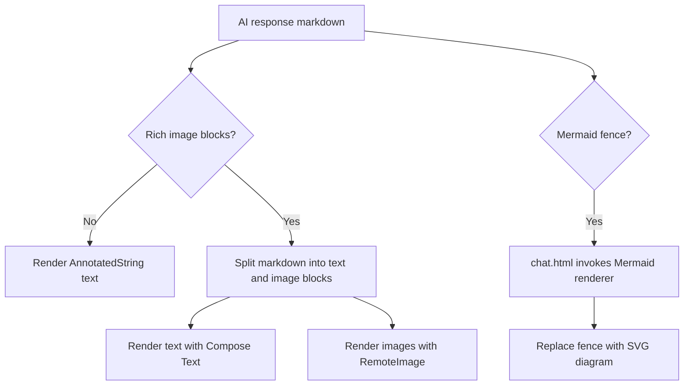

2026-09-04

# EinkBro: render images and Mermaid diagrams in AI responses

AI answers can now include inline Markdown images in the Compose translation
dialog and Mermaid diagrams in the chat page. Previously, both surfaces parsed
the text as Markdown but could only display text: Compose's `AnnotatedString`
cannot embed a remote image, and a Mermaid fence remained a code block.

## Compose image responses

`TranslationViewModel` now retains the raw response Markdown alongside its
existing parsed `AnnotatedString`. The raw form is reset for ordinary
translators and updated for streamed and completed AI responses, so the dialog
can make a rendering decision without changing existing text-only behavior.

`MarkdownBlocks` splits `` constructs into document-ordered text and
image blocks. `RichMarkdownResponse` preserves the existing Markdown parser for
each text run and places a `RemoteImage` at every image position. Remote images
are accepted only from HTTP(S), loaded off the main thread, bounded to a
1600-pixel decoded width to protect memory-constrained e-readers, and fall back
to their alt text or URL if loading fails. Stable keys prevent a streaming
answer from fetching an already displayed image again.

The splitter has unit coverage for text-only Markdown, images at each document
position, optional image titles, blank alt text, and Markdown without an image.

## Chat Mermaid diagrams

The local chat page loads a small renderer helper with the page. It defers the
3.4 MB Mermaid library download until an answer actually contains a Mermaid
fence, shares the in-flight request, and renders with Mermaid's neutral,
strict-security configuration for readable grayscale E-ink output. Once Marked
has generated the message HTML, the helper replaces each Mermaid code block
with its SVG result. A CDN, parser, or rendering failure deliberately leaves the
original code block visible instead of losing the response content.

The response bubble styling constrains diagrams and Markdown images to the
available width and adds lightweight borders and spacing, avoiding horizontal
overflow and making them legible on the e-ink display.
