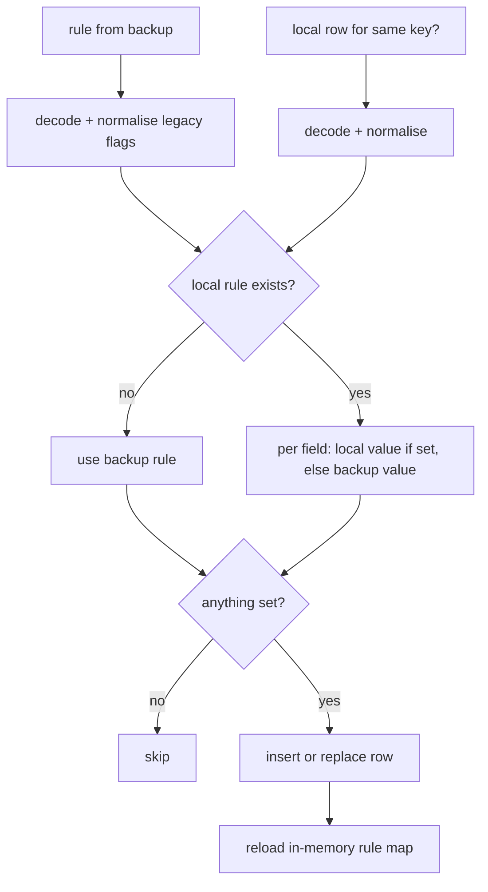

2026-08-23

# Site settings restored from a backup were silently dropped

After restoring app data from Google Drive (or an exported zip), site
settings configured on another device did not show up. The backup did
contain them -- they are part of the "Database" category -- and the restore
code did write to Room. Two things hid the result.

## Root cause

**Restore skipped any host that already had a local row.** The merge policy
was "add only domains with no local configuration", meant to protect
settings tweaked on this device. But the app left an empty
`domain_configuration` row behind for every host where a quick toggle
(white background, invert colours, translate) was ever switched on and back
off, and each of those empty rows counted as "already configured". Any site
ever touched on device B could therefore never receive its rule from
device A. Stale local rules blocked newer ones the same way; with no
timestamp on the row, the merge could only see "exists" or "doesn't".

**The in-memory rule map is loaded once at startup.** `BookmarkManager`
fills `config.domainConfigurationMap` in its init block and nothing else
refreshed it, so even rows that did get written stayed invisible until the
next launch. The restore flow offers a restart, and declining it -- which is
natural when only database data was restored -- left the app running on the
old map.

## Fix

`restoreDatabaseData` now merges field by field through
`DomainConfigurationData.mergedWith`: a value set locally is kept, and the
backup supplies whatever the local rule leaves unset. Both sides are decoded
with the same legacy-flag normalisation the startup load uses, so an empty
leftover row contributes nothing and the backup's rule comes through whole.
Rules that are still empty after merging are not written. Right after the
rows land, `BookmarkManager.reloadDomainConfigurations()` re-reads the table
into the map, so the restored rules are live whether or not the user accepts
the restart prompt.

The decode/encode helpers were pulled out of `BookmarkManager` so the
restore path and the normal save path serialise rules identically.

## What this does not do

"Local wins" means a setting *changed* on device A does not overwrite the
same setting on device B when B already holds its own value; only fields B
never set flow across. That was the chosen behaviour. A newer-wins merge
would need a modification stamp inside the JSON blob (old versions would
ignore it thanks to `ignoreUnknownKeys`), which remains an option.

## Verification

A unit test covers `mergedWith` (local wins, gaps filled, an empty leftover
takes the whole backup rule). On the emulator a crafted backup with one new
host and one host overlapping a local rule was imported through Backup >
Import app data with the restart declined: the new host appeared in the
Configured sites list immediately, and the overlapping host gained the
backup's font size while keeping its local translation mode, confirmed by
reading the row back from the database.
