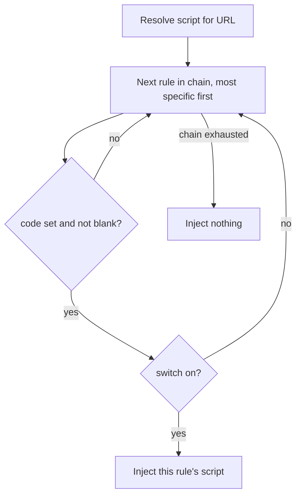

2026-08-29

# EinkBro: on/off switch for per-site custom CSS and post-load JavaScript

Per-site rules in EinkBro can carry a custom CSS blob and a post-load
JavaScript snippet. Until now the only way to stop one from applying was to
delete its code, so a user who wanted to check a page without their script,
or park a half-working script for later, lost the script itself. Each of the
two rows in site settings now has a switch: off keeps the code but the
browser no longer injects it.

## Semantics

A rule's script has three states: unset (no code), on, or off. A script that
is off is treated exactly like an unset one when the rule chain is resolved,
so it falls through to the parent rule's script (a path rule to its host
rule, the host rule to nothing). That keeps the existing "blank means not
set" model: the switch only removes the script from resolution, it never adds
a fourth kind of value that other code has to reason about.

Writing new code turns the switch back on: saving changed text in the site
settings editor, or the AI agent tools `set_domain_javascript` /
`set_domain_css` replacing the script. A freshly written script is meant to
take effect, and silently leaving it disabled would look like the save was
lost. Saving the editor with the text unchanged does not flip the switch,
because that is how a user peeks at the code.

## Data model and compatibility

`DomainConfigurationData` gains `customCssEnabled` and
`postLoadJavascriptEnabled`, both `Boolean = true`. Rows written before the
switches existed decode with the defaults, so nothing is migrated; backups
restored on an older app version ignore the unknown keys. `mergedWith`, used
when a restore meets a rule that already exists locally, carries the switch
along with whichever side supplied the script, so a locally disabled script
stays disabled after a merge. `overrideCount` does not count the switch: a
disabled script still shows as an override, since the rule still holds it.

Resolution goes through two new accessors, `activeCustomCss` and
`activePostLoadJavascript`, used by the merged effective config and by the
per-URL getters that the WebView client and the reader helper call. Nothing
in the injection code changed.

## UI

The row shows a Material `Switch` rather than the checkbox-plus-state-icon
pattern the other rows use. Those rows are nullable overrides with three
states (inherit, on, off), which is what the checkbox expresses; the script
switch is a plain boolean on something that already exists in this rule, and
plain booleans elsewhere in the app (settings screens, the user-script list)
are switches. The switch is always visible so the feature can be discovered,
but disabled until the row has content. The site rules list marks a disabled
script as "Custom CSS (off)" / "Post-Load JavaScript (off)".
