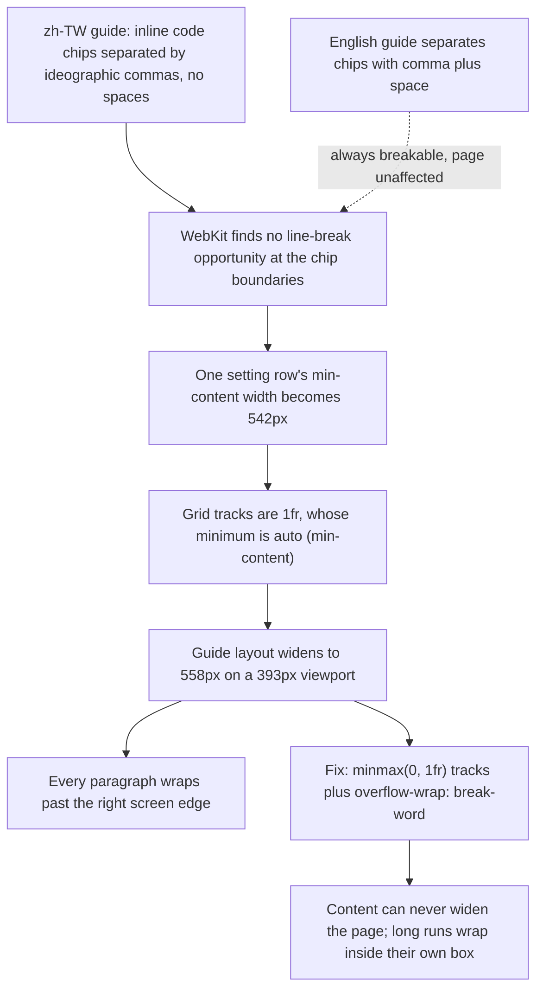

2026-08-04

# EinkBro site: zh-TW guide overflowed on mobile WebKit — root cause and fix

Right after publishing 16.0.0, browsing the docs site on a phone showed the zh-TW user guide badly broken: every paragraph's text ran past the right edge of the screen, and the whole page could be panned sideways. The English guide was fine, and so was every other zh-TW page. Desktop Chrome could not reproduce it at any window width or font size — the bug only appeared on WebKit (mobile Safari and the EinkBro iOS app's WKWebView).

## Root cause

The guide's settings sections list option values as inline `code` chips. The zh-TW translation separates them with the ideographic comma with no surrounding spaces — `Google`、`Bing`、`DuckDuckGo`、… — while the English page uses `", "`.

WebKit computes **no line-break opportunity at the boundary between a styled inline element and an adjacent ideographic comma**, so the whole chip run in the 搜尋引擎 (search engine) row became a single unbreakable 542px-wide line. Chromium happily breaks after 、, which is why desktop testing showed nothing.

That one row then widened the entire page through the grid system: both `.guide-layout` and `.setting-item` used `1fr` tracks, and a `1fr` track's implied minimum is `auto` — i.e. the content's min-content size. The 542px row forced the content column to 542px, the layout to 558px on a 393px viewport, and every other block in that column then wrapped its text at 558px — which is why *all* paragraphs, not just the guilty row, ran off screen.

## How it was found

Desktop tooling was a dead end (Chrome breaks the line correctly), so the hunt ran on the iOS Simulator against a local server. A probe script injected into test copies of the page reported `window.innerWidth` / `scrollWidth` through the accessibility tree, and a self-bisecting variant walked the DOM — hiding children level by level and re-measuring `scrollWidth` — until it isolated first the `#settings-search` section, then the exact `.setting-item__desc` with the search-engine list.

## Fix

CSS-only, in `docs/style.css`, chosen to be structurally immune rather than to fight the engine quirk per-instance:

- `.guide-layout` and `.setting-item` grid tracks changed from `1fr` to `minmax(0, 1fr)` (desktop and mobile variants), so no content min-content size can ever widen the page again.
- `.setting-item__desc` gained `overflow-wrap: break-word`, so a run that still can't break at a nice point wraps inside its own box instead of spilling out.

Verified on the simulator: `scrollWidth` back to exactly the viewport width, and the chip list wraps cleanly between chips.

## Also in this change set

- **16.0.0 changelog + iOS card** (`docs/download.html`, `docs/zh-tw/download.html`): the site changelog — which the app's What's New opens — got its 16.0.0 entry in both languages, plus a new download card with an Apple-logo icon linking to EinkBro for iOS on the App Store.
- **Language switcher in the nav** (`docs/lang-banner.js`): the dedicated "View English version" banner row is gone; EN | 中文 now sits inline in the header — left of the hamburger on mobile, after the links on desktop — with the current language highlighted. The dismiss/localStorage logic went away with the banner.
