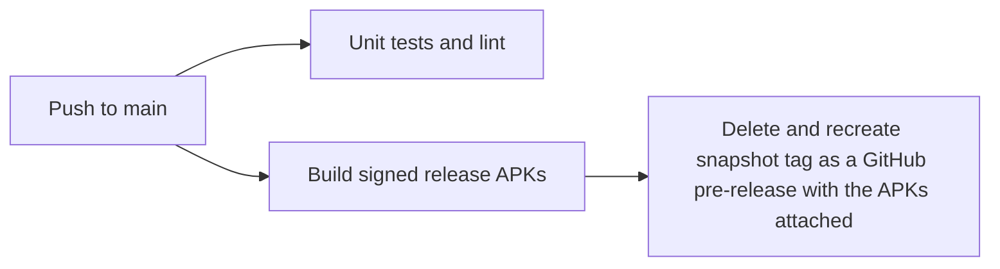

2026-08-04

# EinkBro: Snapshot Builds as GitHub Pre-releases Instead of CI Artifacts

Every commit used to upload signed release APKs as CI artifacts, exposed to users through nightly.link zip URLs (the "snapshot" badge in the README and the Snapshot card on the docs download page). That mechanism had drawbacks: artifact downloads require unzipping, expire with workflow retention, live behind a third-party redirector, and are invisible on the Releases page where users actually look. Since the in-app snapshot updater was removed in v16.0.0 (Google Play policy), nothing in the app depends on CI artifacts either.

Now each push to `main` publishes a **rolling pre-release** instead: the build job deletes and recreates a `snapshot` tag pointing at the current commit via `gh release create --prerelease`, attaching all five release APKs plus the side-by-side Alt universal APK (`info.plateaukao.einkbro.a`, installable next to a stable install for testing).

Design points:

- **One rolling release, not one per commit** — recreating the same `snapshot` tag keeps the Releases list clean while the pre-release flag keeps it clearly separated from stable releases (GitHub never marks a pre-release as "latest"). Direct asset URLs stay stable, e.g. `releases/download/snapshot/app-arm64-v8a-release.apk`.
- Delete-then-create (rather than editing the existing release) is what actually moves the tag to the new commit; editing assets alone would leave the tag pointing at a stale commit.
- The publish step runs only on pushes to `main` (`github.event_name == 'push' && github.ref == 'refs/heads/main'`), so PR and branch builds remain pure compile checks; the test job is unchanged. The build job gained `permissions: contents: write` for the release call.
- The per-commit artifact uploads were removed outright, which breaks the old nightly.link URLs by design — the README badge and both docs download pages (en, zh-tw) now link to the snapshot pre-release page instead.

A release/version-bump commit on `main` also refreshes the snapshot build; that duplication with the real tagged release is harmless.
