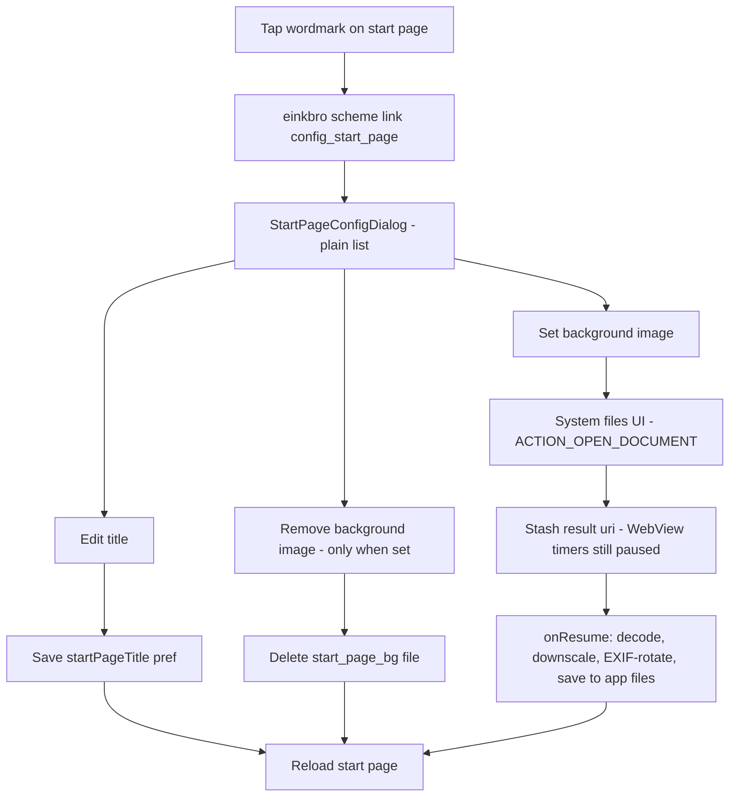
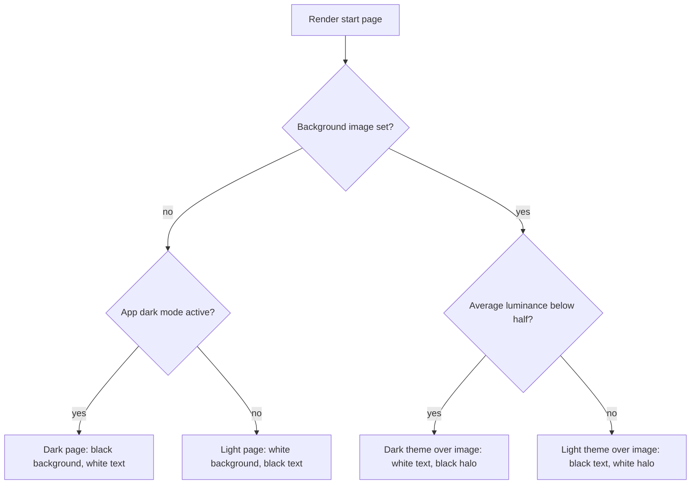

2026-08-08

# Start page customization: tap the title to rename it or set a background image

The built-in start page always showed a fixed "EinkBro" wordmark on plain
white. The wordmark is now tappable: it opens a small config dialog where the
user can rename the heading (e.g. "My Books") or set a background image picked
from the device, and remove it again. The custom title also becomes the tab
title, and everything persists across restarts. The page is also
theme-aware now: without a background it follows the app's dark mode, and with
one the image's own brightness decides between a light and dark treatment.

## Flow

## How it works

- The wordmark in `start_page.html` is an anchor to an `einkbro://` scheme URL,
  handled in `NinjaWebViewClient` like the existing add-item tile. The new
  `StartPageConfigDialog` reuses the same plain-list dialog style as
  `StartPageItemDialog` (the helper was extracted and shared).
- The title lives in `ConfigManager.startPageTitle`; blank means the default
  app name, and typing the default back clears the customization. The renderer
  substitutes it (HTML-escaped) into the page title and wordmark, and sets the
  tab's album title.
- The picked image is decoded with a sample size capping the longest side at
  1600 px, rotated per EXIF, and stored as `files/start_page_bg`. PNG sources
  are re-encoded as PNG (keeps transparency and crisp flat graphics); anything
  else becomes JPEG at quality 80. The renderer inlines the file as a base64
  data URI and picks the mime type by sniffing the PNG magic bytes.

## Theme decision

"App dark mode active" mirrors the logic the WebView darkening already uses:
FORCE_ON, or SYSTEM plus the system night mode; DISABLED never darkens. Image
brightness is the average perceived luminance (Rec. 601 weights) of a tiny
sampled decode, with transparent pixels counted as white; the same small
bitmap also supplies the letterbox edge colors, so the image is decoded for
analysis only once. The page declares `color-scheme` so WebView's algorithmic
darkening leaves the self-themed page alone. Tile icon boxes stay white in
both themes so favicons remain legible; their inline SVG content and fallback
letters are forced dark for that reason.

## Rendering choices

- `background-size: contain`, not `cover`: a wide image on a tall phone screen
  would otherwise show only a zoomed center crop. Contain shows the whole
  image, like its thumbnail.
- The image is anchored to the bottom of the screen (`center bottom`): the
  search bar and tiles live near the top, so the artwork stays clear of them.
  The area above the image continues the image's own top-edge color — the
  average of its top pixel row, computed from a tiny decoded copy — as a solid
  backing. For images with a uniform paper-like background this makes the
  whole screen read as one continuous sheet.
- Labels stay readable over the image with a stacked white text-shadow halo on
  the wordmark and tile names, not solid white pills — no boxes over the
  artwork. Tile icon squares keep a white fill so favicons stay legible.

## Constraints discovered along the way

- **Photo picker vs files UI.** The first implementation used the modern
  `PickVisualMedia` photo picker, but it only lists MediaStore-indexed images —
  a PNG sitting in Downloads that was never media-scanned simply doesn't
  appear. The flow now launches `ACTION_OPEN_DOCUMENT` (the system files UI),
  which browses real folders including Downloads and cloud providers, matching
  the app's other pickers.
- **Paused WebView timers.** The ActivityResult callback fires between onStart
  and onResume while the WebView timers are still paused, so the picked uri is
  only stashed there; the decode/save/reload runs after `onResume`, following
  the same deferral pattern the site-settings launcher already uses.
- **`decodeStream` bounds trap.** With `inJustDecodeBounds = true`,
  `BitmapFactory.decodeStream` always returns null by design. An elvis on the
  `use { decodeStream(...) }` result misread every successful bounds probe as
  "stream was null" and failed the save — masquerading as an Android 16
  permission bug (the system logs an unrelated-looking "assuming permission
  denied" error during the picker's close transition). Only the stream itself
  can be null-checked.
