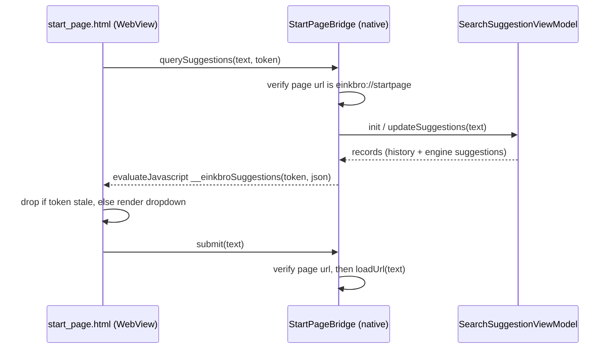

2026-08-07

# EinkBro: built-in start page with in-page search and user-curated tiles

EinkBro now has a native start page — an e-ink-styled speed dial that replaces
google.com as the default homepage and is available as a fourth "New tab
behavior" option. The page shows an EinkBro wordmark, a Google-style search box
with live autosuggestions rendered inside the page, and a grid of tiles the
user curates themselves via a "+" tile (pick from bookmarks, enter manually, or
delete). It is plain HTML/CSS/JS in `assets/start_page.html`, rendered into the
tab's WebView, so it participates in the normal tab model with no new activity
or fragment.

## The sentinel URL

The page is addressed by a sentinel, `einkbro://startpage`, which
`Constants.DEFAULT_HOME_URL` now points at. `EBWebView.loadUrl()` intercepts the
sentinel and renders the page via `loadDataWithBaseURL`, passing the sentinel as
both base and history URL. That one decision makes everything else fall out for
free: every code path that loads the homepage (first launch, the Home menu
action, closing the last tab, `SHOW_HOME` new tabs) lands on the start page, and
saved-tab persistence works because the tab's URL is a real, restorable string
rather than `about:blank` (which the album saver deliberately drops). Users who
set a custom homepage keep it — the sentinel is only the default.

## Search with native suggestions, inside the page

The search box is a real HTML input backed by a JavaScript bridge
(`StartPageBridge`, exposed as `window.einkbroStartPage`). The page asks the
native side for suggestions; the native side runs the exact
`SearchSuggestionViewModel` used by the toolbar input bar — blending
search-engine suggestions with matching history and bookmarks — and pushes the
result back into the page, which renders a Google-style dropdown under the box.
Submitting goes through `EBWebView.loadUrl`, so URL-vs-search-query detection
behaves identically to the address bar.

Because `addJavascriptInterface` exposes the bridge to every page the WebView
ever loads, each bridge entry point re-checks that the current page really is
the start page before serving suggestions or navigating — arbitrary sites must
not be able to read history-derived data or steer the tab.

## E-ink constraints shaped the page design

Three constraints discovered on real hardware (a 6.7" e-ink phone) drove the
page's behavior:

- **The soft keyboard halves the viewport.** With `body { height: 100% }` the
  flex layout squeezed into overlap — a tap on the search box could land on a
  tile that slid under the finger mid-tap. The body now uses `min-height`, and
  focusing the search box adds a `searching` class that hides everything except
  the box and its dropdown, giving suggestions the whole remaining screen.
  Pressing back closes the keyboard without blurring the input, so a
  `visualViewport` resize listener detects the viewport growing back and exits
  search mode.
- **A blinking caret is poison on e-ink** (constant partial refreshes).
  Chromium has no setting to stop it, so the page hides the native caret and
  draws a static 2px bar positioned by measuring the text before the caret in a
  hidden mirror span. Engines that support `caret-animation: manual` get the
  real caret, static, via feature detection.
- **Tiles are user-curated, not derived.** An earlier iteration auto-filled the
  grid from recently-used bookmarks plus Bookmarks/History shortcuts; it was
  replaced by an explicit model (`startPageItems` in preferences) with a "+"
  tile opening a native dialog: choose from bookmarks, enter title/URL
  manually, or delete an item. The page re-renders after each mutation.

## A newline-stripping asset loader broke the inline script

The first build rendered no suggestions at all. Debugging through Chrome
DevTools Protocol showed the page's inline script arriving as a single line and
failing with "Unexpected end of input": `HelperUnit.loadAssetFileToString`
reads assets line-by-line and drops the newlines, so the script's first `//`
comment commented out the remainder of the script. The JS-asset loader
`loadAssetFile` (which preserves newlines via `readText`) is used instead. The
older HTML templates never hit this because none of them contained inline
scripts with line comments.

## Small fixes that fell out

- `focusOnInput` prefilled `about:blank` when opened from in-app pages loaded
  via `loadDataWithBaseURL`; such URLs (data:, about:blank, einkbro://) now
  start with an empty input.
- `einkbro://` URLs are excluded from browsing-history recording.
- `ListSettingWithNameDialog` resumes its suspended caller with null when the
  dialog is cancelled; previously the coroutine hung forever.
