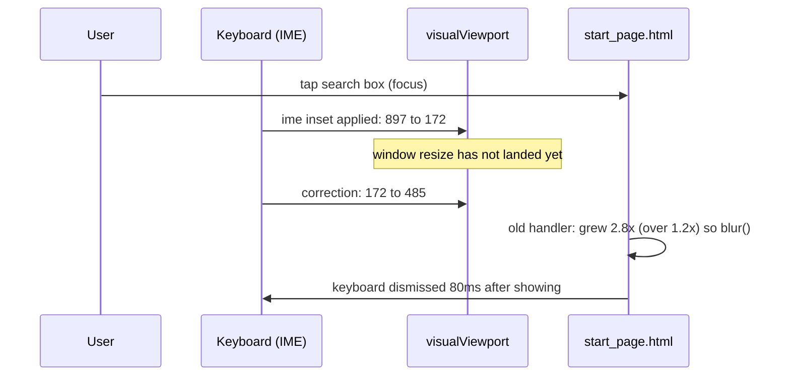

2026-08-08

# EinkBro: Android 17 viewport bounce killed the start-page keyboard; toolbar now yields to the IME

Two related changes shipped in v16.1.1: a fix for the start page's search
keyboard being dismissed the instant it appeared on Android 17 (`17d6d9f03`),
and a browser-wide behavior where the toolbar and tab bar hide while the
keyboard is up for web content (`6ab158045`).

## What was broken

On a Pixel running Android 17, tapping the start page's search box showed the
soft keyboard for ~80ms and then dismissed it — the search box was unusable.
On the Android 16 emulator it did not reproduce.

## Root cause

The start page (`assets/start_page.html`) keeps a heuristic for the back key:
pressing back closes the keyboard *without* blurring the input, which would
leave the page stuck in its focused "searching" layout, so the page watched
`visualViewport` and blurred the input whenever the viewport *grew* more than
20% while focused.

Android 17 changed the event sequence during keyboard **appearance**: the IME
inset is applied to the visual viewport before the window resize lands, then
corrected. Captured live from the device via remote debugging:

Android 16 delivers the shrink in one step, so the growth never happens
mid-show — which is why the emulator stayed green while the phone failed.

## The fix

Relative growth is no longer a signal. The handler tracks the keyboard-less
full height (updated while the input is unfocused, so rotation is tolerated)
and blurs only when all three hold:

1. a real keyboard shrink was seen first (below 0.7x full height),
2. the viewport is back to at least 0.9x full height,
3. it stays there for 100ms (timer canceled by any qualifying resize).

The show-time bounce peaks far below the 0.9x threshold, so it can never
blur; the genuine back-key restore still does.

## Toolbar yields to the keyboard

With the keyboard up, half the screen is gone; the toolbar and tab bar eat
another slice. A new hook in `ChromeSetupDelegate.listenKeyboardShowHide()`
(the existing global-layout keyboard listener) hides `appBar` and the content
separator while the keyboard is up **for web content**, and restores them when
it closes. This replaced an earlier start-page-only bridge call — the start
page's search box is itself a WebView input, so one mechanism covers every
page.

Deliberate exclusions:

- **URL input bar / search-on-site panel** — their text fields live in the
  same toolbar area; hiding would remove the field being typed into. Guarded
  by `activity.currentFocus is EBWebView` (those are Compose fields).
- **Dialogs** — they size their own window; guarded by `hasWindowFocus()`.
- **Fullscreen mode** — if the toolbar is already hidden the mechanism does
  not claim it, so a keyboard dismissal cannot force the toolbar back on.

The toolbar hide itself grows the viewport mid-session — condition (1) above
is what keeps that growth from re-triggering the original bug.
