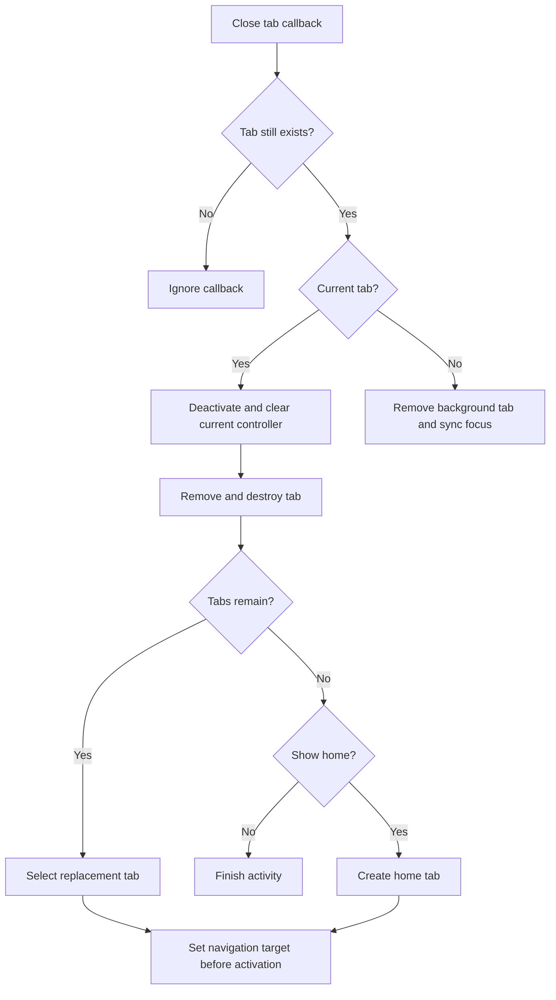

2026-09-20

# Keep navigation attached to a live tab after removal

Closing a tab could leave navigation using a destroyed WebView. Inspection found that the last-tab home path destroyed the tab and then called loadUrl on the same instance. Closing an active tab also left its controller referenced until showAlbum tried to deactivate it after destruction. During lazy restoration, activation could start a load before the shared navigation target had been updated.

TabManager now deactivates the current tab and clears its controller before removal. When closing the last tab should show home, it creates and registers a fresh tab. Switching tabs publishes the WebView and keyboard navigation target before activation, so callbacks from a restored page see the incoming tab. Show and close callbacks for tabs no longer in the container are ignored, including delayed close confirmations.

The debug APK built successfully and all 289 existing unit tests passed. Android emulator verification with sim-use covered active-tab removal into a lazily restored tab, background-tab removal with the focused index updated, and URL navigation on the final remaining tab. The latter entered example.com by tapping the actual software keyboard and submitted with its search key; Example Domain loaded with the tab count still at one. The intermittent original report was not reproduced before the fix, and the last-tab show-home branch was verified by code inspection rather than a dedicated UI scenario.

Implementation commit: b5e176e87 (fix(tabs): avoid stale WebViews after tab removal).
