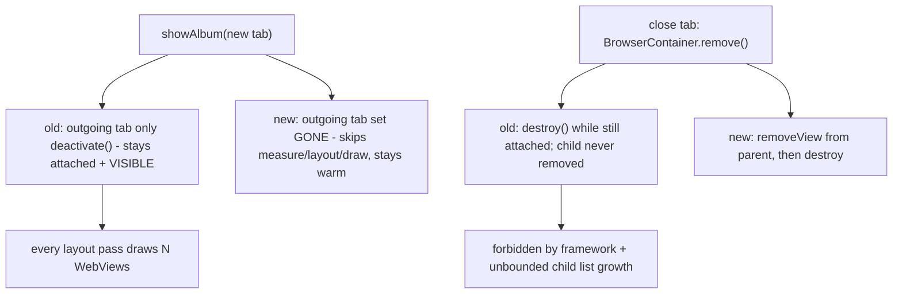

2026-07-07

# EinkBro: detach tab WebViews before destroy; hide background tabs

## What was broken

A UI audit traced two related defects to commit `c59b6dab` (2022), which
replaced `mainContentLayout.removeAllViews()` in `showAlbum()` with a loop
that removes only the *incoming* view:

1. **Destroy-while-attached.** `BrowserContainer.remove()` (tab close) and
   `clear()` (activity destroy) called `WebView.destroy()` while the view
   was still a child of `mainContentLayout`. The framework documents that
   destroy must happen *after* the view is removed from the view system;
   some OEM WebView builds crash on it. Worse, nothing ever removed the
   child, so the layout's child list grew without bound across open/close
   cycles — every destroyed WebView's Java object stayed pinned by its
   parent.

2. **N-way overdraw.** Switching tabs only `deactivate()`d the outgoing
   WebView (clearFocus + onPause) but left it attached and VISIBLE.
   FrameLayout does no occlusion culling, so with N open tabs every layout
   pass measured, laid out, and drew N full-screen WebViews. On e-ink this
   means every toolbar toggle or keyboard appearance relayouts and redraws
   every tab, not just the visible one.

## The fix

- `TabManager.showAlbum()` sets the outgoing controller view to `GONE`
  before bringing in the new one, and explicitly restores `VISIBLE` on the
  incoming view (it may have been hidden by a previous switch). GONE was
  chosen over detaching so the WebView stays warm — tab switching stays
  instant and flash-free on e-ink.
- `BrowserContainer` gained a private `destroyWebView()` used by both
  `remove()` and `clear()`: detach from the parent via
  `(webView.parent as? ViewGroup)?.removeView(webView)`, then `destroy()`.

## Verification

On the emulator (debug build), using the view-hierarchy dump scoped to the
app's activity: after switching tabs — including a lazily-restored tab that
creates its WebView on first click — `main_content` shows exactly one
`EBWebView` with the `V` (visible) flag and the rest `G` (gone), with focus
on the visible one. Closing a tab from the overview panel drops the attached
`EBWebView` count (3 → 2), proving the detach, and the app keeps running.

A note for future verification sessions: the emulator had two EinkBro
installs side by side — `info.plateaukao.einkbro` (debug) and
`info.plateaukao.einkbro.a` (an older releaseAlt). Early checks accidentally
drove the `.a` app; the giveaway was obfuscated class names (`v9.j`) in the
view dump where the debug build prints `EBWebView`. All verifications above
were re-run against the debug package.
