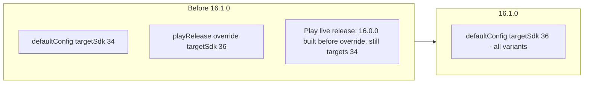

2026-08-08

# EinkBro: target API 36 for all variants

Commit `61c568008` (v16.1.0) promotes `targetSdk 36` from a playRelease-only
override to `defaultConfig`, so every variant — sideloaded GitHub builds,
F-Droid, and Google Play — now targets Android 16.

## Why

Google Play requires targeting API 36 by Aug 31, 2026. An earlier commit
(`c1248172f`) had raised the Play build type to 36 via an
`androidComponents.beforeVariants` override, keeping sideloaded builds on the
tested targetSdk 34. But checking the Play Console's bundle explorer revealed a
gap: the 16.0.0 AAB actually live on Play had been uploaded a few hours
*before* that override landed, so the production release still reported target
API 34 — with the deadline three weeks out.

Rather than ship another split-target release, 16.1.0 unifies on 36:

One target means one runtime behavior to test instead of two, and F-Droid/
sideload users get the same behavior Play users do.

## Behavior changes absorbed

- **Predictive back** (defaults on at targetSdk 33+ opt-in, enforced flows at
  36): would stop `KEYCODE_BACK` reaching `BrowserActivity.onKeyDown` →
  `KeyHandler` (go back / close tab). Already opted out globally via
  `android:enableOnBackInvokedCallback="false"` in the main manifest, so no
  variant regresses.
- **Edge-to-edge enforcement** (targetSdk 35+ on Android 15+): EinkBro manages
  system bars explicitly (`ViewUnit.updateStatusBar`, fullscreen and input-bar
  delegates, `MainActivityLayout` with `fitsSystemWindows = false`), and the
  primary install base is E-ink devices on older Android versions, so exposure
  is limited. The Play build type has carried target 36 since `c1248172f` under
  the same reasoning.

The now-redundant `beforeVariants` block was removed. The `adblock-client`
library module's `targetSdkVersion 34` is a deprecated no-op for libraries and
doesn't affect the app's Play target.
