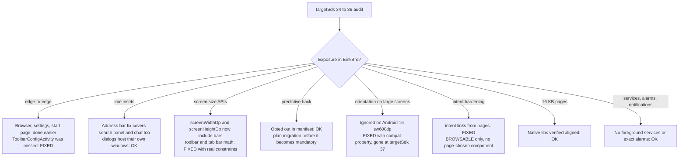

2026-08-09

# EinkBro: Full targetSdk 36 behavior audit — remaining gaps closed

After the edge-to-edge (#628) and keyboard-inset fixes, the question was: what *else* does the targetSdk 34 → 36 bump change, before more user reports arrive? This audit crossed the official Android 15/16 behavior-change lists against the whole codebase (every activity, every input, back handling, fullscreen, orientation, services, intents, native libs), fixed what was actionable, and produced a watchlist for targetSdk 37.

## What was fixed

- **`Configuration.screenWidthDp`/`screenHeightDp` now include the system bars** (targetSdk 35+). The horizontal toolbar's spacer/title math, the vertical toolbar-config preview, and the horizontal tab bar all treated those values as "the bar's usable size" — now overshooting by the bar heights, so spacers overflow and icons get pushed out. All four sites now measure their real layout constraints with `BoxWithConstraints`, which is correct on every SDK.
- **`ToolbarConfigActivity`** was the one self-drawing screen the edge-to-edge commit missed (it builds its own `TopAppBar` instead of `ListScaffold`): on Android 15+ with 3-button navigation, the bottom of the icon panel sat under the opaque navbar. It now applies the shared `scaffoldEdgeToEdgePadding()`, and its status-bar hide gained the same transient-bars-by-swipe behavior as the other hide paths.
- **Orientation lock on large screens**: Android 16 ignores `setRequestedOrientation` on sw ≥ 600dp displays for apps targeting 36 — silently breaking the rotation-lock feature and fullscreen-video orientation on tablets (the Onyx broadcast path is exempt). Added the documented opt-out property (`android.window.PROPERTY_COMPAT_ALLOW_RESTRICTED_RESIZABILITY`) at application level. It is temporary: removed at targetSdk 37, so the feature needs a real large-screen answer eventually.
- **`intent://` links from web content** were launched exactly as parsed. Now sanitized the way Android 16's intent-redirection hardening (and browser security practice) expects: `CATEGORY_BROWSABLE` added, page-chosen component/selector cleared, `package=` hints preserved. Verified on the API 36 emulator: an intent link for an uninstalled app still falls back to its `browser_fallback_url`, no "Access blocked" in logcat.
- **`adblock-client`** still declared `targetSdkVersion 34` — inert for a library module, but aligned to 36 for consistency.

## Verified already fine

- **16 KB page sizes**: both shipped libs (`libadblock-client.so`, Compose's `libandroidx.graphics.path.so`) have `0x4000`-aligned LOAD segments and pass `zipalign -c -P 16` on debug and release APKs. AGP 8.13.2 handles APK alignment; NDK r27 gets ELF alignment from `-DANDROID_SUPPORT_FLEXIBLE_PAGE_SIZES=ON` already in the CMake args. (Optional cleanup: NDK r28+ makes the flag redundant.)
- **Predictive back**: `enableOnBackInvokedCallback="false"` at application level keeps all `KEYCODE_BACK` handling working on Android 16; no removal announced for targetSdk 37.
- **Keyboard insets**: the browser-root ime padding also covers the search-on-site panel (verified on emulator) and the AI chat page; every text-input dialog is dialog-window-hosted and resizes on its own.
- **Fullscreen paths** all use `WindowInsetsController` on R+ (no dead `systemUiVisibility` code); services/receivers/PendingIntents/notifications/DownloadManager all already follow the current rules; no foreground services or exact alarms exist; the WebView file chooser wraps `ACTION_GET_CONTENT` in an explicit chooser.

## Watchlist

- **targetSdk 37 (Android 17)**: background TTS read-aloud will need a `mediaPlayback` foreground service; the orientation compat opt-out disappears; `usesCleartextTraffic` should move fully into `network_security_config`; LAN AI endpoints (self-hosted provider) will need the new `ACCESS_LOCAL_NETWORK` runtime permission; plan the predictive-back migration at leisure.
- **Behavior on 15/16 regardless of targetSdk**: the OS kills background network access (long translation batches / Drive sync can fail if the user backgrounds the app mid-run) and applies JobScheduler quotas that can stall very large `DownloadManager` jobs. Nothing to change proactively; worth remembering when such reports arrive.
- `elegantTextHeight` becomes unconditional (affects Thai/Myanmar/Tamil-script locales' native UI line heights slightly, not CJK, not WebView content) — cosmetic; a one-time look at the Thai locale would settle it.
