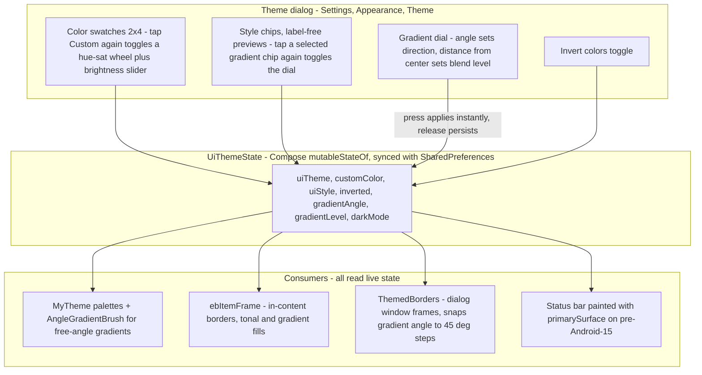

2026-08-28

# EinkBro: shape styles, gradient dial, and an invertible theme system

The color-theme system shipped earlier gave EinkBro selectable accent palettes.
This iteration makes themes into full "looks": a **Style** dimension independent
of color, gradient fills with a tunable direction and strength, an **Invert
colors** mode, and a redesigned picker where everything is adjusted by direct
manipulation — swatches, a color wheel, and a dial — with every change applied
to the whole app instantly while the dialog stays open.

## What was built

- **Style, separated from color.** A `UiStyle` preference with label-free
  preview chips: Classic (the original 1dp look), Round (pill), Sharp (bold
  0dp), Paper (double frame), Dashed, No border (tonal fill), and three
  gradient variants. Any color pairs with any style. Styles carry border
  width, frame/item corner radius, and a border type in a `ThemeStyle` value.
- **Gradient fills with a dial.** Gradient styles fill dialogs, panels, tab
  chips, and settings tiles with an accent gradient. Tapping the selected
  gradient chip again opens a dial: the drag direction sets the gradient angle
  (free 0-360 in Compose via a custom `AngleGradientBrush`; window drawables
  snap to GradientDrawable's eight orientations) and the distance from the
  center sets the blend level. The dial's own fill previews the result.
- **Custom color wheel.** The custom color's three HSB bars became a
  hue/saturation wheel plus one brightness slider; the derived palette keeps
  any pick readable. The wheel hides until the Custom swatch is tapped and
  toggles on re-tap, and the same toggle pattern applies to the gradient dial.
- **Invert colors.** A toggle renders any theme with its dark text shade as
  the background and the light tint as text — Classic inverted is pure
  black-and-white, a higher-contrast night mode than gray-on-black.
- **Status bar joins the header.** Settings screens paint the status bar with
  the top bar's color on pre-Android-15 windows (edge-to-edge already covers
  15+), so the header reads as one block.

## Design decisions

- **Live state as the single source of truth.** `ThemedBorders` originally read
  persisted preferences, so window frames lagged behind drag previews until the
  finger lifted. It now reads `UiThemeState` (kept in sync by config setters,
  app start, and the browser's preference listener), and preview callbacks also
  retint the open dialog's window frame — drags apply instantly everywhere,
  persistence still happens on release.
- **Gestures that beat the scroll container.** The dialog scrolls (capped at
  78% of screen height so its border frame is never pushed out of view), which
  initially stole vertical drags from the wheel and dial. Both now consume the
  pointer from the first down with a slop-free handler: a plain press applies
  the value at that point, no precise thumb-grabbing needed.
- **Dialogs grow instead of cropping.** Window frame drawables report border
  width, double-frame inset, and a corner allowance as drawable padding, so a
  thicker or rounder frame expands the dialog around its content.
- **Translation-free variants.** Gradient 2/3 use a label suffix on the
  existing Gradient string, and style names were dropped from the UI entirely
  (kept as accessibility labels), so the style system added only a handful of
  new strings across the 29 maintained locales.

## Cost

The arm64 release APK grew about 23 KiB over the color-theme build — roughly
51 KiB (1.2 percent) for the entire theming system relative to v16.4.1.
