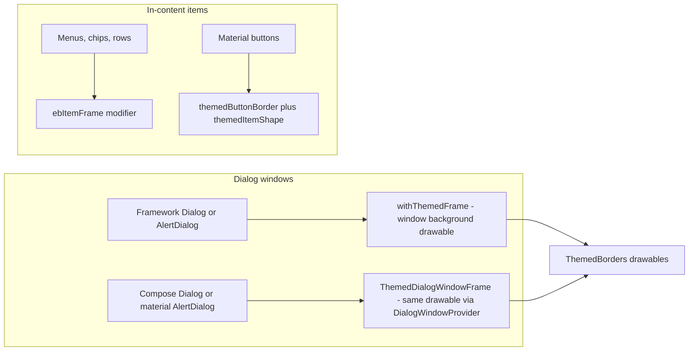

2026-09-03

# Themed Borders Everywhere: Dialog and Button Sweep

## What it does and why

EinkBro's border/fill theme system (`ThemedBorders` for window drawables,
`ebItemFrame` for Compose in-content items) already covered most framework
dialogs, but a full audit found a second population of UI that still showed
default chrome when a border style like STAMP or SKETCH is selected:
Compose-created dialog windows with hand-rolled 1dp rounded borders, popup
menus on the default Material surface, and dialog buttons pinned
black-and-white by a static XML style. This pass closes all of them so the
selected theme reads consistently across every dialog and button.

(The originally reported case — the download-complete dialog keeping its
default border — turned out to be already fixed by an earlier unreleased
commit; the audit found the rest.)

## The three theming layers

The app now has one theming entry point per kind of surface, and every
dialog or button goes through exactly one of them:

`ThemedDialogWindowFrame()` is the new piece: a composable called first
inside a Compose dialog's content that reaches the real window through
`DialogWindowProvider`, sets the `ThemedBorders.windowPanel` drawable as the
window background, and drops the dim scrim (matching the app's e-ink dialog
style). The dialog's own surface is made transparent so the frame shows
through. It reads the `UiThemeState` fields so live theme previews retint
the frame without reopening the dialog.

## What was converted

- **ProgressDialog** (saving epub): the last `TouchAreaDialog`-styled dialog
  still on the static black-border XML window background; now
  `withThemedFrame()`.
- **Five Compose dialog windows** replaced hand-rolled borders or default
  Material surfaces with `ThemedDialogWindowFrame()`: GPT action editor,
  toolbar-position dialog, e-ink image-adjustment dialog, userscript editor,
  and the form-resubmission dialog.
- **Five DropdownMenu popups** (bookmark folder picker, three site-settings
  option menus, translation mode) draw the themed frame via
  `ebItemFrame(paintBackground = true)` — a popup window renders outside the
  parent dialog's frame, so it needs its own.
- **Framework AlertDialog buttons**: `MyButtonStyle` hardcodes black text on
  white. New `withThemedButtons()` tints the positive/negative/neutral
  buttons with the theme accent. It runs from a decor attach listener rather
  than `setOnShowListener`, because the buttons only exist once the dialog's
  content installs and some call sites already use the show listener for
  their own logic.
- **Material buttons in Compose dialogs**: new `themedButtonBorder()` and
  `themedItemShape()` helpers give `OutlinedButton`/`Button` the accent
  stroke at the theme border's weight and the theme's item outline (stamp
  scallops and sketch wobble included). Applied in site settings, the CSS/JS
  editor, and the userscript dialog; the e-ink image chips switched from a
  hardcoded rounded border to `ebItemFrame`.
- **Full-screen CSS/JS editor**: its dialog theme pins a white window
  background, wrong in dark/inverted/tinted themes; the window now gets the
  themed base color at show time (full-screen, so no frame).

## Deliberately left alone

In-content decorations flagged by the audit but out of scope for a dialogs
and buttons pass: toolbar drag-reorder highlights, config-screen preview
bars, count badges, gesture-picker cards, and the split-pane drag handle.
