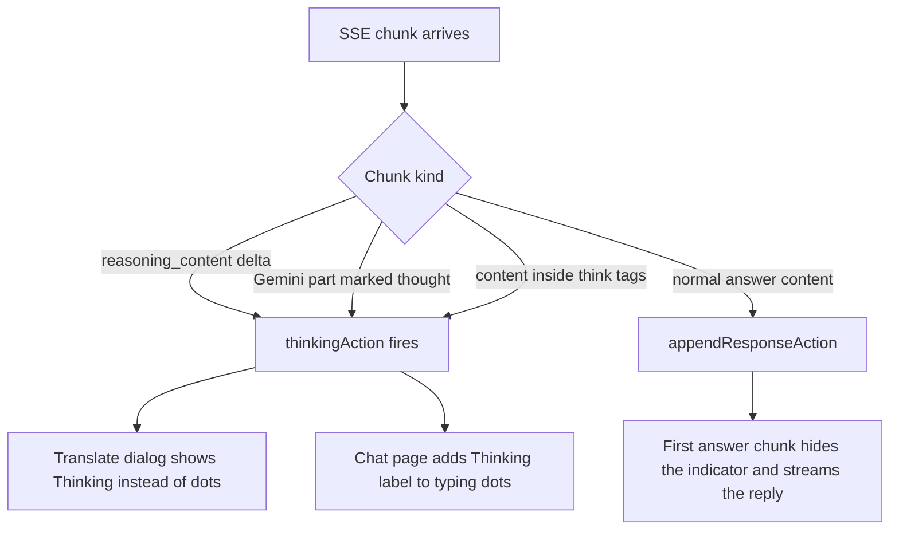

2026-08-04

# EinkBro: Thinking Status Indicator for AI Streams (and a Stray-Bubble Fix)

With reasoning models, the wait before the first visible token can stretch to many seconds. Both AI surfaces showed the same idle placeholder the whole time — "..." in the translate dialog, bouncing dots in chat-with-web — so a user couldn't tell "still connecting" from "the model is thinking". Now both surfaces show an explicit thinking state, and reasoning text no longer leaks into answers.

## How thinking is detected

`OpenAiRepository.chatStream` gained a `thinkingAction` callback. Different backends expose reasoning differently, so three signals feed it:

- **Gemini**: streamed parts marked `thought: true`. When a reasoning budget is set, the request now also asks for `includeThoughts`, so the summaries actually arrive to serve as the signal (they were already filtered out of the visible answer).
- **Dedicated reasoning channel**: `reasoning_content` deltas used by DeepSeek/Qwen-style OpenAI-compatible servers (llama.cpp, vLLM with a reasoning parser), plus the `reasoning` alias some proxies use.
- **Inline think tags**: servers without a reasoning parser stream Qwen3's thinking as plain content between think tags. A new `ThinkTagFilter` recognizes a think block at response start, reports it as thinking, and suppresses it from the visible answer — previously that entire reasoning transcript streamed straight into the dialog. The tags arrive as whole tokens in practice, so the filter deliberately skips cross-chunk tag reassembly. The non-stream path got the equivalent cleanup (the old code only stripped an *empty* think block).

In the translate dialog the "..." placeholder becomes "Thinking…" (guarded so a late thinking chunk can never overwrite answer text). In chat-with-web, a new `showThinkingIndicator()` in chat.html adds a "Thinking…" label beside the typing dots; the Kotlin side fires it at most once per request, and the first content chunk hides the whole indicator as before. Thinking content also stays out of the persisted chat history.

## The stray empty bubble

Verifying this against a mock SSE server exposed a separate, pre-existing bug: after every completed chat stream, an extra *empty* assistant bubble appeared.

Root cause: on `[DONE]`, `openAiStream` runs `doneAction` and cancels the connection from inside `onEvent`. OkHttp then additionally reports `onFailure(canceled)` carrying the original 200 response, which matched the `code == 200 -> doneAction()` branch — so the "final empty update" reached chat.html twice. The second time, no stream element existed anymore, and the update handler created a fresh empty bubble for it.

The Gemini stream listener already guarded against exactly this with a `finished` flag (its comment documents the OkHttp cancel behavior); `openAiStream` now uses the same guard. As a second layer, chat.html ignores a final empty update when no stream is in progress, so no duplicate completion signal of any kind can mint a bubble.

## Verification

Unit tests cover the tag filter state machine and the delta parsing (including the `reasoning` alias). End-to-end, a local mock server streaming several seconds of `reasoning_content` before the answer confirmed on the emulator: dots + "Thinking…" during reasoning, a clean answer afterward, and no trailing empty bubble.
