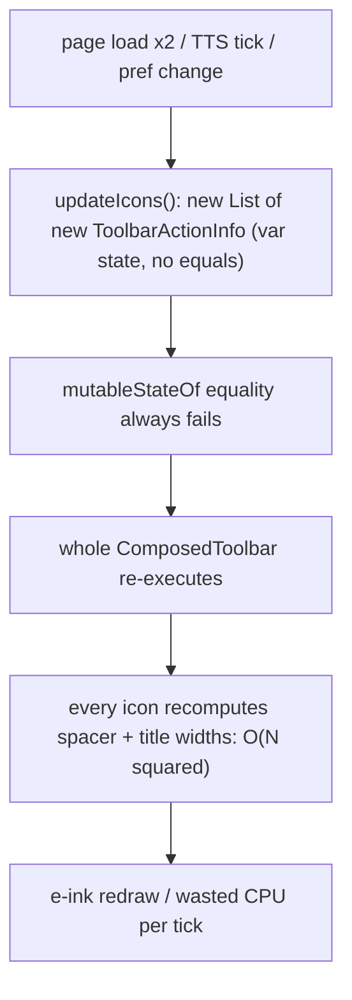

2026-07-07

# EinkBro: stable ToolbarActionInfo and hoisted toolbar width math

## What was broken

The toolbar is EinkBro's hottest Compose path: `updateIcons()` in
`ComposeToolbarViewController` runs twice per page load (loading start/end),
on every TTS state transition, on ~10 preference changes, and on locale or
orientation changes. Each call re-parsed the toolbar config from
SharedPreferences and built a brand-new `List` of brand-new
`ToolbarActionInfo` objects.

`ToolbarActionInfo` was a plain class with a mutable `var state` — no
`equals`. That single fact defeated both layers of Compose's change
detection:

- `mutableStateOf`'s structural-equality policy could never recognize a
  rebuild as a no-op, so every `updateIcons()` invalidated the toolbar even
  when nothing changed.
- Strong skipping compares unstable parameters by instance, so every icon
  in the bar re-executed on every rebuild.

On top of that, `CreateToolbarIcon` computed `calculateSpacerWidth` and
`calculateTitleWidth` — each about five full list traversals with
intermediate allocations — **per icon, per recomposition**: O(N²) work per
toolbar pass with ~10 icons. And `updatePageInfo`, called from the WebView
scroll listener on every scroll event, allocated two lists just to check
whether the PageInfo icon is configured.

## The fix

- `ToolbarActionInfo` became a `data class` with `val state`. Lists of it
  now compare structurally, so the `mutableStateOf` boundary silently drops
  no-op rebuilds, and individual icons skip when their entry is unchanged.
  A grep confirmed no code ever mutated `state` after construction, so the
  `val` conversion was free.
- The width calculators became pure functions taking the screen dimension
  as a parameter. `ComposedIconBar` computes both once per bar composition
  under `remember(toolbarActionInfos, screenWidth)`, and `CreateToolbarIcon`
  now receives two `Dp` values instead of the whole list (which also removes
  an unstable-list parameter from every icon call). The reorderable config
  variants hoist the same computation out of their per-item lambdas.
- `updatePageInfo` checks a boolean cached at `updateIcons()` time instead
  of allocating `map`+`contains` lists per scroll event.
- Smaller cleanups in the same paths: `ToolbarAction.fromOrdinal` uses
  `entries[value]` instead of allocating `values()` per lookup; spacer
  membership checks share one `setOf(Spacer1, Spacer2)` instead of building
  `listOf` per pass.

## Verification

Debug build on the emulator: toolbar renders with all icons; toggling the
activable Touch icon twice and loading a page (exercising the
`updateRefresh` → `updateIcons` transition) work normally; the "Toolbar
setting" screen renders the full available-actions grid, and adding Title
plus a spacer to the preview bar shows both sized correctly by the hoisted
width math (Title pill wide, dashed spacer filling leftover width).
Cancelled without saving; browser toolbar unchanged.
