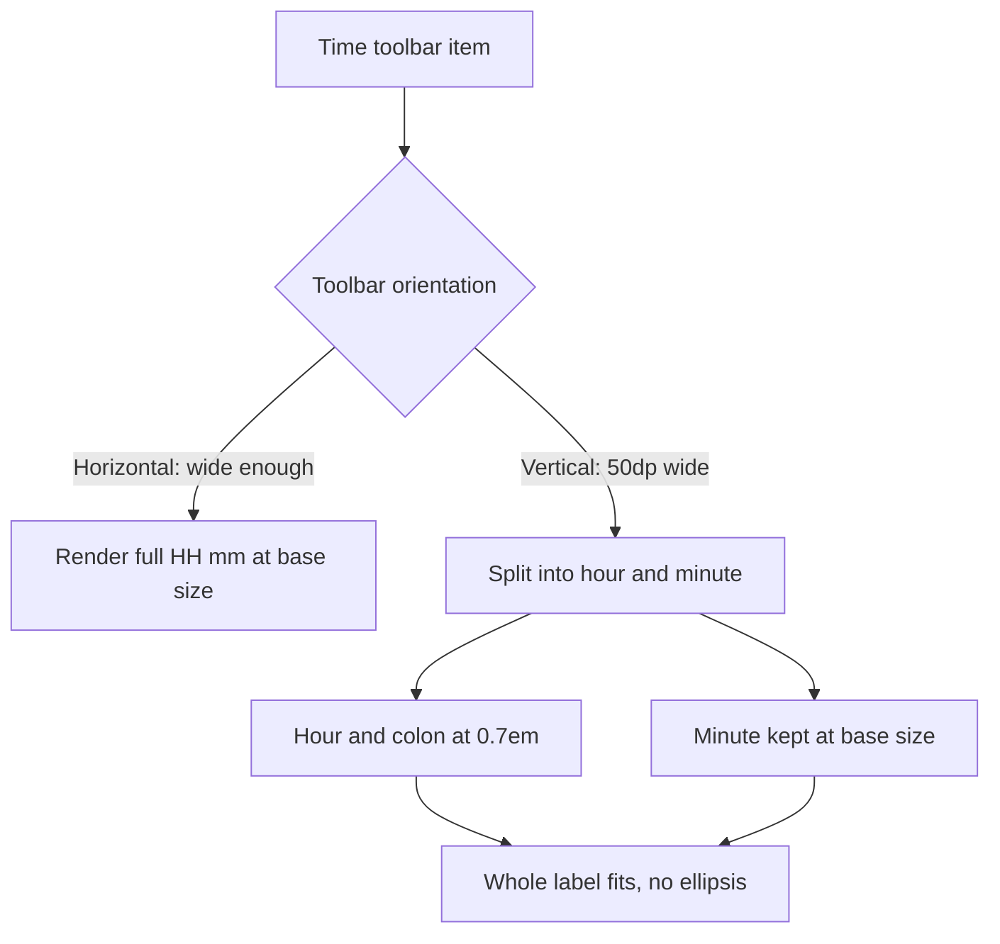

2026-06-21

# EinkBro — Toolbar clock ellipsized into uselessness in vertical mode

## Problem

The toolbar has an optional "Time" item that shows the current time as `HH:mm`.
In the **vertical** toolbar layout the clock was truncated to an ellipsis — the
user would see something like `14…` or just `…` instead of the actual time,
making the item pointless. The horizontal layout was unaffected.

## Root Cause

The vertical toolbar is a fixed **50dp-wide** strip (`width(50.dp)` in
`ComposedToolbar`, minus a 1dp separator). The clock is rendered by a single
`CurrentTimeText` composable that drew the full `HH:mm` string at the inherited
base font size with `6.dp` horizontal padding on each side. At that size the
five glyphs plus padding exceed the ~45dp of usable width, so the `Text`'s
`overflow = TextOverflow.Ellipsis` kicked in and clipped the string. The same
composable looks fine horizontally because that bar is full-width.

## Solution

Make `CurrentTimeText` orientation-aware via a new `isVertical` flag (passed as
`true` only from the vertical `CreateToolbarIcon` branch):

- Split `HH:mm` and render the **hour + colon at `0.7.em`** (70% of the minute's
  size) while keeping the **minute at the base size**, using a
  `buildAnnotatedString` with a `SpanStyle(fontSize = 0.7.em)` span. Using `em`
  (relative) rather than an absolute `sp` means the hour shrinks proportionally
  to whatever the inherited base size is, regardless of theme.
- Reduce horizontal padding from `6.dp` to `2.dp` in vertical mode to reclaim
  width.

Horizontal mode is untouched — it still renders the plain full-size `HH:mm`.
The minute stays fully legible (the part you glance at most), and the smaller
hour lets the whole label fit without ellipsis.

## Key Files

- `app/src/main/java/info/plateaukao/einkbro/view/compose/Toolbar.kt`
  - `CurrentTimeText` — added the `isVertical` parameter; builds the mixed-size
    annotated string and switches the horizontal padding.
  - `CreateToolbarIcon` (vertical branch) — calls `CurrentTimeText(isVertical = true)`.

## Lessons Learned

- A fixed-width container plus `TextOverflow.Ellipsis` silently degrades to
  garbage rather than failing loudly; for a clock, an unreadable result is worse
  than a slightly smaller one. When width is the hard constraint, scale the text
  to fit instead of clipping it.
- Relative `em` sizing inside an `AnnotatedString` span is a clean way to shrink
  one run "relative to" its neighbour without hardcoding (and having to guess)
  the theme's base font size.
