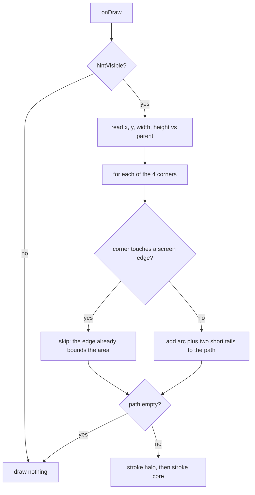

2026-08-28

# EinkBro: touch-area hints as rounded corners instead of a dashed box

## What it does

Touch page-turning overlays two invisible tap areas on the page. When the
hint is on, each area used to be outlined by a full dashed rectangle drawn
from `touch_area_border.xml` (a black dashed stroke with a white dashed stroke
inset by a pixel, so it shows on any page). On a reading device that is a lot
of ink permanently on top of the text.

The hint is now a set of small rounded-corner marks: a 10dp quarter-circle
with 4dp tails at each corner of the area, drawn as a dark core over a light
halo so it reads on both light and dark pages. Only corners that lie inside
the screen are drawn. For the default bottom-left/right layout that is two
marks on screen; for the middle layout four; a dragged-up area shows its
bottom corners as well.

## Why corners are chosen at draw time

The first cut assigned each of the eight touch-area views a fixed corner mask
(bottom-left area: top-right corner only, and so on). That broke as soon as the
user dragged an area up with the customize handle: its bottom edge no longer
sat on the screen edge, but the mask still hid the bottom corners.

So the mask is gone. `TouchAreaHintView` decides in `onDraw` from the view's
current position relative to its parent:

A corner "touches a screen edge" when `x <= 0`, `y <= 0`, `x + width >=
parent.width` or `y + height >= parent.height`. The areas are placed with
small negative margins (-1dp to -5dp), so their off-screen edges satisfy this
without a tolerance.

Two consequences of the rule, both accepted:

- The full-height "Long" layout never has a corner on screen, so those two
  views keep the old dashed-line drawable; the only visible part of it is the
  vertical inner edge anyway.
- The stacked Left/Right layouts share a horizontal edge between their two
  areas. Both areas draw their corner there, which meets as a small "<" shape.
  At the reduced radius it is subtle; an earlier 16dp radius with 10dp tails
  was judged too obvious, which is also why the curl shrank.

## Invalidation on drag

The customize handle moves the areas with `view.y = ...`. On a hardware-
accelerated view that only updates render-node properties; `onDraw` is not
re-run, so the corner set would stay stale after a drag. `TouchAreaHintView`
overrides `setTranslationX/Y` to call `invalidate()` after `super`, which is
the only place the hint needs to recompute outside layout.

## Show/hide

`TouchAreaViewController` used to hide the hint by replacing the background
with a transparent color and show it by `setBackgroundResource(touch_area_border)`.
That would have thrown away the corner view's own drawing, so show/hide is now
a small `setHintVisible(view, visible)` helper: it flips `hintVisible` on a
`TouchAreaHintView` and toggles the background alpha on the Long views (whose
drawable is `mutate()`d so the alpha does not leak between them).

## Verification

Checked on API 34, 36 and 28 emulators, light and dark pages, all four
rectangle layouts, and the drag-up case. One gotcha worth recording: another
session's `./gradlew installDebug` installs onto every adb-connected device,
and twice replaced this build mid-test with one that still drew the dashed
box. Comparing the on-device APK's md5 with the local file before trusting a
screenshot caught it both times.
