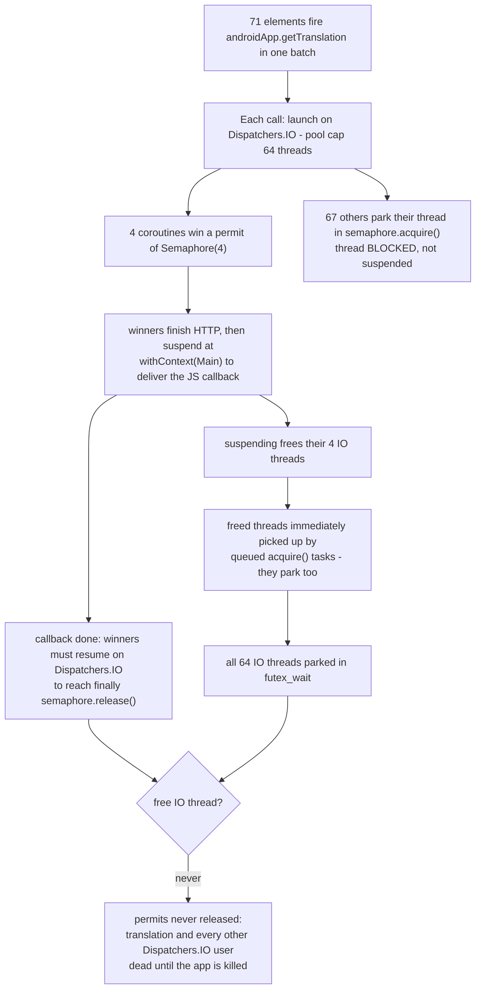

2026-07-18

# EinkBro: Translate-by-Paragraph Deadlocked on Overlay-Heavy Pages

## What was broken

On pages that show an article in a fixed overlay above a busy background (a
calendar-style SPA was the trigger), translate-by-paragraph appeared completely
dead: the article never translated, and after triggering it once, translation
stopped working everywhere in the app until it was killed. Reader mode also
failed on the same site, but that turned out to be the site's own bug
(see the companion adr-site ADR); the translation failure was EinkBro's.

## Root cause: a thread-blocking semaphore starving Dispatchers.IO

`JsWebInterface.getTranslation` throttled requests with a
`java.util.concurrent.Semaphore(4)` acquired inside
`coroutineScope.launch(Dispatchers.IO)`. That semaphore blocks the *thread*,
and `Dispatchers.IO` caps at 64 threads.

The trigger page marks 138 translatable elements, and 71 of them count as
"visible" at once — `IntersectionObserver` knows nothing about stacking, so
the entire page behind the overlay intersects the viewport too. All 71 fire
`getTranslation` in one burst:

The diagnosis was confirmed live: exactly four native `getTranslation` log
lines ever appeared (the four permits), a manually injected fifth request
never reached native code, and a thread dump showed all 64
`DefaultDispatcher` workers in `futex_wait`. Normal article pages never hit
this because their visible-element burst stays far below 64 — which is why
the feature "worked everywhere else".

## Fix

Swap in `kotlinx.coroutines.sync.Semaphore` with `withPermit`
(commit `1b4b4152c`). Waiting requests now suspend without occupying a
thread, so a burst of any size just queues. Rate limits are unchanged
(4 concurrent for Google/Papago, 1 with a 1.5 s delay for DeepL/Gemini —
the latter is a hard requirement of those APIs).

## Two marker-script issues found along the way

Fixed in commit `475067afa`, both in the by-paragraph marker JS:

- **Form-control corruption.** The marker recursed into `SELECT` subtrees,
  wrapping option text in spans and inserting paragraph placeholders inside
  the control, which corrupts the dropdown. `SELECT`, `TEXTAREA`, and
  `DATALIST` subtrees are now skipped — their text is control state, not
  flow content.
- **Junk-first request order.** Because occluded background content still
  "intersects", its requests queued ahead of the overlay's own text in
  document order, so the text the reader was looking at translated last.
  Targets are now stably sorted with an `elementFromPoint` probe: unoccluded
  elements first, occluded ones after. Occluded content still translates —
  the sort only decides who gets the limited translation slots first.

## Verification

On the trigger page: the same 71-request burst that froze the old build at 4
requests drained 64 requests in 15 seconds with a healthy thread pool, filled
every article paragraph, left the project `select` intact, and the request
log led with the article title instead of background junk. A plain-page
control run plus a toolbar/menu UI regression sweep (reader mode, vertical
mode, invert, split screen, search, settings, tabs) and the unit test suite
all passed.
