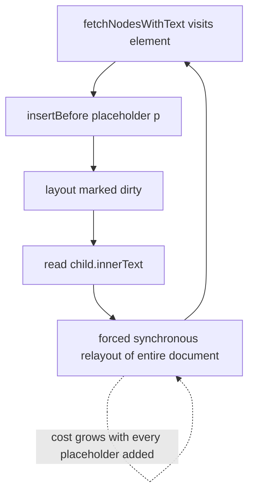

2026-08-16

# Paragraph translation took 2-3 seconds to show anything

Turning on by-paragraph translation on a long article left the reader staring at
untranslated text for two to three seconds. The natural assumption was network
latency — four concurrent translation requests, each a round trip. It wasn't. Not a
single request had been sent yet.

## What was actually happening

`translateByParagraphInPlace` injects `translate_by_paragraph.js`, and only in its
completion callback injects `text_node_monitor.js`, which binds the
`IntersectionObserver` that fires the requests. So the entire document had to be
walked and marked before the first paragraph could even be asked for.

That marking pass was quadratic.

The scan filters out site-specific junk labels, and did it like this:

```js
child.innerText === "link" || child.innerText === "original link"
```

`innerText` is defined in terms of *rendered* text, so reading it forces the engine
to flush any pending layout. The same pass dirties layout constantly — every block it
marks gets a placeholder `<p>` inserted next to it. So the sequence per element was:
insert a node (layout now dirty) → read `innerText` (forced synchronous relayout of
the whole document) → repeat, on a document that keeps growing.



Measured in EinkBro's own WebView over CDP, on the Wikipedia "World War II" article
(~19.7k DOM nodes):

| | before | after |
|---|---|---|
| marking pass | 8314 ms | 241 ms |
| first translation request | 8766 ms | 398 ms |
| markers produced | 2562 | 2562 |

Desktop Chrome on the same saved DOM went 2638 ms to 60 ms — that figure is almost
exactly the delay being reported, which is what confirmed the diagnosis before any
fix was written.

## The fix

`isJunkLabel()` replaces the two `innerText` reads with `textContent`, whitespace-
normalized so it still collapses the way `innerText` did for labels this short:

```js
function isJunkLabel(element) {
  if (element.children.length > 2) return false;
  var text = element.textContent;
  if (text.length > 32) return false;
  text = text.replace(/\s+/g, ' ').trim();
  return text === "link" || text === "original link";
}
```

The two guards matter. `textContent` on a container materializes its whole subtree's
text, and this runs for *every* element child including large `<div>`s and
`<section>`s — so rejecting on child count and length first keeps a cheap check
cheap. Verdicts were checked against the old behaviour on leading/trailing
whitespace, nested inline markup (`<span><b>original</b> link</span>`), `"linked"`
and `"a link here"`: identical on all of them.

## The second half of the wait

With marking down to 241 ms, roughly 380 ms of dead time remained. In by-paragraph
mode nothing was requested at bind time at all — `maybeRequestTranslation` began with
`if (!window._translateInPlace) return;`, so the first batch waited on the
`IntersectionObserver`'s first asynchronous delivery. In-place mode had a synchronous
initial scan; by-paragraph mode didn't.

Both request paths now go through `maybeRequestTranslation`, with an
`isTranslationApplied()` helper that knows how each mode records "already translated"
(in-place stamps `data-original-html` on the element; by-paragraph fills the sibling
placeholder, which starts empty). Visible paragraphs are now requested the instant
they're marked. It fires for exactly the markers in the viewport band — 89 of 2562 on
the test article — with zero duplicates, and the observer still handles everything
that scrolls in later.

One ordering detail is load-bearing: the viewport check moved *ahead* of the text
cache lookup. Applying a cached translation writes to the DOM, so with the check last,
a page whose text was already cached would have applied translations to all 2562
markers while reading each one's `getBoundingClientRect` — recreating the exact
read/write layout thrash that caused the original bug, just in a different function.

## Worth remembering

Any layout-reading DOM property (`innerText`, `offsetHeight`, `getBoundingClientRect`,
`getComputedStyle`) interleaved with DOM writes in a loop is quadratic. It stays
invisible in code review because the expensive part is a property read that looks free.
Two other candidates were profiled and cleared first — `getComputedStyle(parent).display`
(only 131 calls, stubbing it changed nothing) and the placeholder insertion itself
(2.6 ms for all 2563 nodes when not interleaved with a layout read). The cost was never
in the writing; it was in reading layout back between the writes.
