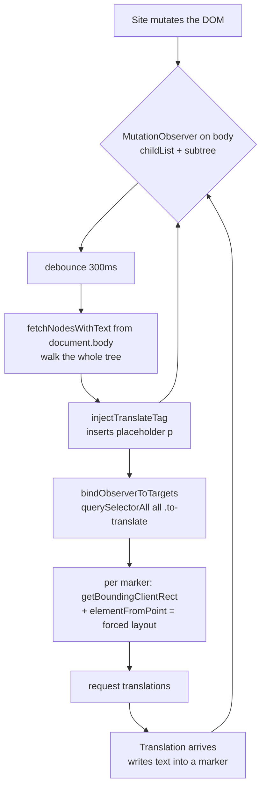
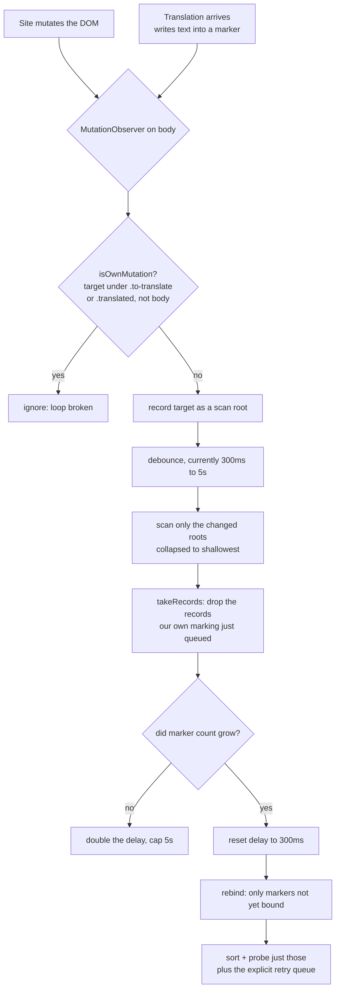

2026-08-16

# Translate-by-paragraph pinned the CPU on any page that kept mutating

## What was broken

A battery audit of the browser turned up one genuinely severe hot spot, and it
lived in translate-by-paragraph mode. Once translation was on, the page kept
burning main-thread CPU for as long as it stayed open — not while scrolling, not
while loading, but continuously. The worse the page (ad rotation, infinite
scroll, live tickers, anything re-rendering a region), the worse the drain, and
it scaled with the length of the article rather than with how much had actually
changed.

Nothing about it was visible in the default configuration, which is why it had
gone unnoticed: turn translation off and the machinery never runs.

## Root cause

`translate_by_paragraph.js` installs a `MutationObserver` on `document.body`
with `{childList: true, subtree: true}` and never disconnects it. It was
debounced to 300 ms, so the intent was clearly to keep marking content as a page
lazily renders it. Three costs compounded on every fire.

**It fed itself.** This is the one that turned an expensive scan into a
perpetual one. Every arriving translation writes into the DOM — in-place mode
rewrites text nodes inside the marker, by-paragraph mode fills the sibling
placeholder — and both are `childList` mutations under `document.body`. So each
translation scheduled another scan, which marked more content, which requested
more translations. A page-full of paragraphs kept the loop fed without the site
doing anything at all.

**Every scan restarted from `document.body`** and re-walked the whole tree.
Already-marked subtrees short-circuit, but every unmarked container — nav,
sidebar, ad slots, footer, comment widgets — was re-walked from scratch each
time, allocating a child array per element on the way.

**Every rebind re-probed every marker.** `bindObserverToTargets` did
`querySelectorAll('.to-translate')` over all markers, then `sortOnTopFirst` ran
`isTranslateTargetOccluded` on each, which calls `document.elementFromPoint` —
forcing a synchronous layout and hit-test *per paragraph*. On a thousand-marker
article that is a thousand forced layouts, several times a second. The existing
code comment already noted that `elementFromPoint` forces layout; the mitigation
there only avoided an `O(n log n)` comparator, not the `O(n)` scan itself.

A fourth cost turned up while reading the code. `getTextExcludingImages` did
`element.cloneNode(true)`, removed every `` from the clone, then read
`textContent`. But `` is a void element: it cannot hold child nodes, so it
contributes nothing to `textContent`, and `alt` never appears there either.
Stripping images was a no-op on the result, and the deep clone was paid once per
block candidate on every scan and once per element on every rebind.

## The fix

The guiding idea is that the observer exists to catch *newly added* content, so
every step should cost what the change costs — not what the page costs.

**Ignore our own mutations.** A record is ours when it lands under a marker we
already own; site content appearing inside an existing marker is covered by that
marker anyway. This is what breaks the self-feeding loop. One subtlety made the
first attempt worse than useless: `document.body` carries its own `translated`
class meaning "this page is set up for translation", unrelated to the
per-placeholder one, so `closest('.to-translate, .translated')` matched every
node on the page and silenced the observer entirely. A match on `body` therefore
has to be read as "no real marker ancestor".

**Scope scans to what changed.** Mutation targets are collected, collapsed to
the shallowest still-attached roots, and scanned individually. Past 32 distinct
roots the dedup costs more than it saves and a single pass from `body` is
cheaper, so that is the fallback.

**Drop the records our own marking queues.** `isOwnMutation` cannot catch these:
`injectTranslateTag` inserts its placeholder next to a brand-new marker, so the
mutation's target is the still-unmarked parent. A `takeRecords()` at the end of
each scan discards them.

**Back off when nothing is found.** If a scan does not grow the marker count the
delay doubles, capped at 5 s, and resets to 300 ms the moment new content
appears. A page that churns without adding text stops being interesting quickly.

**Rebind only what is new.** Markers already bound are the IntersectionObserver's
job from then on, so only unbound ones get sorted and probed. That removes the
per-paragraph forced layout entirely. The one case this would have regressed is
a translation that came back empty — the full re-probe used to be what retried
it — so those elements now go into an explicit `_translateRetryQueue` that the
rebind drains.

## What it bought

Measured in the actual Android WebView over an 11-second window, with the page
mutating every 50 ms and every translation arriving:

| page size | main-thread JS before | after |
| --- | --- | --- |
| 300 paragraphs | 128–227 ms | 13–16 ms |
| 1000 paragraphs | 394 ms | 11 ms |

The second row is the real result. The old cost scaled with the size of the
page; the new one is flat, because it tracks the size of the mutation. Forced
layout-inducing rect reads in that same window fell from 5234 to 41, and deep
clones from 601 on load plus 2525 in steady state to zero.

Initial injection cost is unchanged — about 5–7 ms of marking plus 2–4 ms of
binding for a 300-paragraph page. Removing the deep clone does not measurably
help there; it only mattered in the path that ran over and over.

## Confidence

Behaviour had to be provably identical, since this rewrites the marking loop of
a feature with a lot of accumulated site-specific special cases.

A jsdom equivalence harness ran 18 DOM shapes — flex and grid parents, ` `
splits, form controls, images, nested blocks, script/style, the skip-classes —
across in-place and by-paragraph modes, and across both a first injection and a
late-content-plus-reinjection pass. All 72 combinations produce byte-identical
markup, run under the same `(function(){…})()` wrapper that `evaluateJsFile`
applies in production. That harness is also what caught the `body.translated`
mistake, which had silently stopped new content from being marked at all while
looking like a spectacular performance win.

End-to-end on the emulator, driving the app's own translate flow against a live
translation backend: all 15 markers bound, all 15 translated as the page
scrolled — confirming the IntersectionObserver path still drives lazy
translation after the rebind change — and no JS errors in logcat.

## Still open

Two smaller findings from the same audit were left alone. `fix_scrolling.js` is
injected on every page load unconditionally and crosses the JS/Java bridge once
per scroll event for any inner scrollable element, with no throttle and no check
for whether the page-info indicator that consumes it is even enabled. And
`handleWebRequest` re-asserts `CookieManager.setAcceptCookie` on every
subresource request. Both are modest next to what was fixed here, but they are
always on rather than opt-in.
