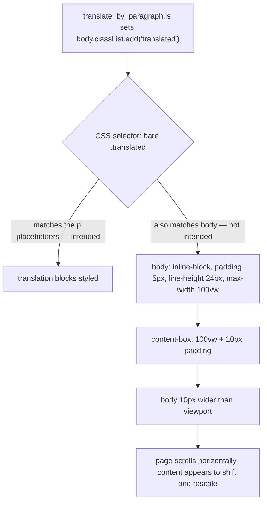

2026-08-16

# Starting translation shifted the whole page sideways

Switching on by-paragraph translation nudged the page: content moved slightly and the
text looked as though it had been rescaled a touch. Small enough to be easy to
dismiss, consistent enough to be irritating.

## Root cause: a state flag that was also a style selector

Two unrelated things were wearing the same class name.

`translate_by_paragraph.js` marks the document as set up for translation:

```js
document.body.classList.add("translated");
```

Separately, `text_node_monitor.js` tags each *filled* translation placeholder
`.translated` so the style slot can style it. The slot did that with a bare selector:

```css
.translated { padding: 5px; display: inline-block; line-height: 1.5; max-width: 100vw; }
```

Nothing stops that selector from matching `<body>`. So the moment translation started,
the page body itself picked up every one of those declarations. Measured in the WebView
before and after the single `classList.add` call:

| body property | before | after |
|---|---|---|
| `display` | `block` | `inline-block` |
| `padding` | `0px` | `5px` |
| `line-height` | `normal` | `24px` |
| `max-width` | `none` | `361.5px` |
| document `scrollWidth` vs `clientWidth` | 361 = 361 | 371 vs 361 |

The body turned into a shrink-to-fit inline-block with a forced line-height inherited
by every element on the page. And because these blocks are `content-box`, the
`max-width: 100vw` and the 5px of horizontal padding *add*: the body came out 10px wider
than the viewport, making the document horizontally scrollable. That was the shift.



The collision was half-known: a comment in the observer code already notes that body's
`translated` class means something different from the per-placeholder one, and
`isOwnMutation` explicitly guards against `closest()` matching body. The CSS never got
the same treatment.

## Fix

Every rule is now scoped to `p.translated`. Translation placeholders are always `<p>`
elements — `injectTranslateTag` creates them with `document.createElement("p")` — so the
prefix costs nothing and the body flag, never being a `<p>`, can no longer be styled.

Padding became vertical-only (`padding: 5px 0`) for the second half of the problem.
Even with body excluded, any horizontal padding adds to `max-width: 100vw` and pushes a
genuinely full-width translation past the viewport edge. Two styles needed more than a
blanket rule:

- **dashed border** keeps its horizontal inset, since the border *is* the style, but
  gains `box-sizing: border-box` so border and padding fit inside `max-width` instead
  of adding to it.
- **vertical line** uses `max-width: calc(100vw - 7px)`, leaving room for the
  `margin-left` that its `::before` bar needs — otherwise a full-width translation
  overflows by exactly that margin.

Verified in the WebView: body stays `block` / `padding: 0` / `line-height: normal` /
`max-width: none` with the flag set, and `scrollWidth` stays equal to `clientWidth` in
all three states — baseline, flag set, and with a deliberately full-width translated
block added.

## Worth remembering

A class used as machine-readable state and a class used as a style hook should not
share a name, even when the elements seem disjoint. The bug needed no unusual page to
reproduce — every translated page had it — yet it presented as a vague "things shifted a
little", which is exactly the kind of symptom that gets lived with rather than reported.
`getComputedStyle` on `<body>` before and after the triggering call was what turned it
from a guess into a measurement.
