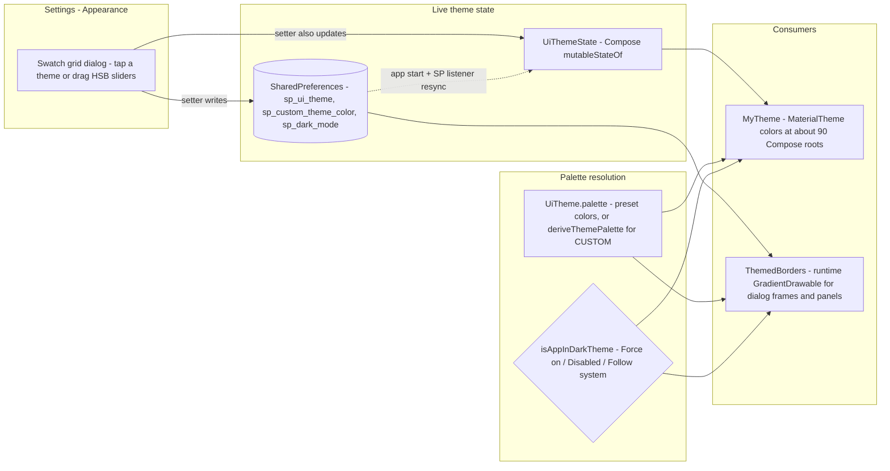

2026-08-28

# EinkBro: user-selectable UI color themes with a custom color picker

EinkBro's entire UI was hardcoded black-and-white — appropriate as the default
for e-ink, but with the app now fully on Jetpack Compose there was no reason
users on color e-ink or LCD devices couldn't choose an accent. This change adds
a theme system: eight preset themes (Classic, Light blue, Dark blue, Teal,
Green, Sepia, Purple, Red) plus a Custom entry where the user picks any color
with HSB sliders and the app derives a full, readable palette from it. Themes
apply live — tap a swatch and every screen, dialog, and toolbar retints
instantly, no restart.

## Why it was cheap

A study of the codebase showed theming was already 95% centralized:

- No XML layouts remain; every screen and dialog is Compose wrapped in a single
  `MyTheme` composable (about 90 call sites), and 400+ color reads already go
  through `MaterialTheme.colors.*`.
- The only holdouts were the XML border drawables (`background_with_border`
  and friends) used as dialog window backgrounds, whose stroke resolves from
  static theme attributes, plus a handful of hardcoded `Color.Black`/`Gray`
  literals.

So the work was: parameterize `MyTheme`, re-map which color roles the custom
widgets read, and replace the static drawables with runtime ones.

## Design

Each `UiTheme` enum entry defines five colors: `accent` and `accentDark`
(light/dark mode accents), a tinted `background`, and `onBackground` /
`onBackgroundDark` text colors. The accent lands on Material's
`primary`/`secondary` slots, so standard components (Button, Switch, Checkbox,
TextField cursor, ProgressIndicator, TopAppBar) pick it up for free; custom
borders, dividers, and toolbar icons were swept from `onBackground` to
`primary`. Classic's values reproduce the original black-and-white palette
exactly, so the default user sees zero change.

Key decisions made along the way:

- **Live state instead of activity recreation.** `UiThemeState` holds the
  selected theme, dark-mode choice, and custom color as Compose
  `mutableStateOf`. Config setters update it directly; the browser's existing
  SharedPreferences listener resyncs it for writes that bypass the setters
  (backup restore). Every `MyTheme` root recomposes on change, which is what
  makes the picker's live preview possible — and avoids full-screen e-ink
  refreshes from activity restarts.
- **Runtime drawables instead of theme overlays.** Dialog window frames came
  from XML drawables reading `?android:colorControlNormal`, which is frozen at
  activity-theme resolution. Per-palette XML theme overlays would have required
  activity recreation and 8+ style definitions; instead `ThemedBorders` builds
  the same rounded-border drawable in code from the current palette. All 17
  framework `AlertDialog` sites got a one-line `withThemedFrame()` extension.
- **Derived palettes for Custom.** An arbitrary picked color is not directly
  usable everywhere: `deriveThemePalette` clamps the accent so it stays visible
  on white, brightens it for black backgrounds, and produces a near-white
  hue-tinted background plus dark-shade body text from the same hue.
  Grayscale picks stay gray instead of acquiring a phantom hue.
- **Dark mode became a real app-UI setting.** The existing Dark mode
  preference (Follow system / Force on / Disabled) previously affected only web
  content; `isAppInDarkTheme()` now lets it override the system for the app UI,
  giving every theme an on-demand dark variant.

## Pitfall found during testing

The dark palette sets `onPrimary` to black (correct for text on the bright
dark-mode accent used by filled buttons), but the settings screens' TopAppBar
content was hardcoded `onPrimary` — and M2's TopAppBar background is
`primarySurface`, which is the accent in light mode but black `surface` in dark
mode. Result: black-on-black title and icons. Fixed with a `Colors.onTopBar`
extension (light: `onPrimary`, dark: `onSurface`) used by all top bars.

## Scope notes

Theme name strings were translated in 29 locales directly in the resource
files; `values-sat` (Santali) was left to fall back to English. The status bar
and start-page WebView keep their system-bound colors for now, and framework
AlertDialog list text stays black — only their frames are themed.
