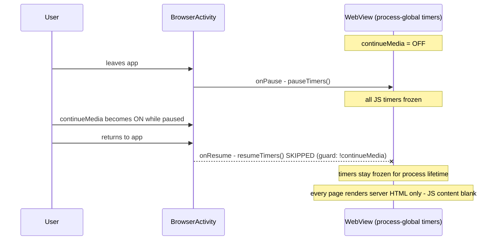

2026-07-22

# EinkBro: Unbalanced pauseTimers() left JS frozen process-wide, showing header-only blank pages

## What was broken

On a Hisense A7, JS-heavy sites (Facebook was the reported case) showed only their
server-rendered header while the whole content area stayed blank — across reloads
and tabs — until the app was killed and restarted.

The state was not reproducible with a fresh install: fresh loads, cold-start session
restore, scrolling, and tab switching all rendered correctly. That was the first
clue that the bug was a *stuck process state*, not a rendering or adblock problem.

## Root cause

`WebView.pauseTimers()` / `resumeTimers()` are **process-global**: pausing once
freezes JS timers in every WebView in the app. `BrowserActivity` guarded both
calls behind the "Background play" (`continueMedia`) preference:

```kotlin
// onPause
if (!config.browser.continueMedia && !isMeetPipCriteria() && ...) ebWebView.pauseTimers()
// onResume
if (!config.browser.continueMedia && ...) ebWebView.resumeTimers()
```

The pairing silently assumes the preference has the same value at pause time and
resume time. If timers are paused while the setting is OFF, and the setting flips
ON before the next resume (settings import/sync, or any change made while the
activity is paused), the resume is skipped — and because the guard also blocks
every *future* resume, the timers stay frozen for the rest of the process
lifetime. Server-rendered HTML still paints (hence the visible header), but any
content built by JavaScript never appears.



The affected device had the non-default `continueMedia = ON`, which is what made
the freeze permanent: with the setting ON, the resume path could never run again.
The same paused-timers trap had bitten before in a different form (a `reload()`
issued from an ActivityResult callback was dropped because timers were still
paused), so this is the second incident caused by treating these global calls as
if they were safely pairable.

## Fix

Make the resume unconditional — resuming timers that were never paused is a
no-op, and only the *pause* side needs the `continueMedia` guard (that is what
keeps background media playing):

```kotlin
if (browserState.isWebViewInitialized) ebWebView.resumeTimers()
```

Any unbalanced pause — including the `isMeetPipCriteria()` asymmetry on the
pause side — now self-heals on the next resume.

Verified on-device via Chrome DevTools Protocol over adb: after a background/
foreground cycle, `setTimeout` fires in every tab (including hidden background
tabs), and the feed populates normally. A related but benign observation from
the same session: a session tab restored in the background legitimately shows
header-only until activated, because the page defers its content while
`document.hidden` is true — that state fills in on tab activation and needed no
fix.
