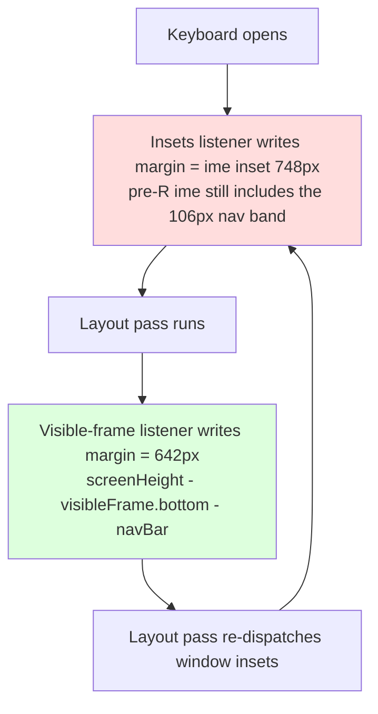

2026-08-19

# EinkBro: URL input bar bounced over the keyboard on pre-Android-11

## What was broken

On Android 10 and older devices with the "hide status bar" setting on, opening the URL input bar made the whole bar — input field, suggestion list and all — visibly jump up and down above the keyboard, about 15 times per second, for as long as the keyboard stayed open. An earlier fix attempt (subtracting the navigation-bar inset from the keyboard inset) changed nothing at all, which was the clue that led to the real cause.

## Root cause

Two listeners were both writing the root view's bottom margin while the keyboard was up, computing it from different sources:

- the window-insets listener in `handleWindowInsets()` set `ime()` = **748px**
- the pre-R visible-frame fallback in `listenKeyboardShowHide()` set `screenHeight − visibleFrame.bottom − navBar` = **642px**

The two values disagree by exactly the navigation-bar height (106px), and each write triggers a layout pass that re-dispatches window insets, so the two listeners overwrote each other every frame:



Instrumented logging on the device showed why the earlier attempt was a no-op, and why the insets value can never be corrected locally on pre-R:

```
insets: ime=748 nav=0  hideStatusbar=true margin=642   <- nav already consumed by the decor
layout: rootH=1800 rectBottom=1052 nav=106 keypad=642  <- visible-frame math is correct
```

By the time insets reach the app's root view on Android 10, the decor has already consumed `navigationBars()` (it reads **0**) — yet `ime()` still includes the nav band. So `ime − nav` evaluated to `748 − 0 = 748`, identical to the unfixed value. The dispatched insets simply don't carry the information needed to compute the right margin on pre-R; the visible display frame does (642px puts the bar exactly on the keyboard top, since the decor already insets the root above the nav bar).

## Fix

Give each platform generation a single owner of the root bottom margin:

- **Pre-Android-11**: the visible-frame listener in `listenKeyboardShowHide()` alone manages the margin. It now also clears the margin when the window is not fullscreen — the state `focusOnInput()` creates when opening the input bar from fullscreen browsing, previously covered by the insets listener — because a non-fullscreen window resizes itself for the keyboard and needs no compensation.
- **Android 11+**: the insets listener keeps its original logic, byte-for-byte the same values as before (verified stable on a Pixel 9 before the change).

Verified on the affected Android 10 device: the input bar sits flush on the keyboard with no gap and no movement across repeated captures, and typing through the soft keyboard works with a visible caret and live suggestions.
