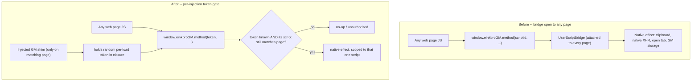

2026-08-21

# Gating the einkbroGM native bridge behind a per-injection token

## What was broken

EinkBro's userscript support exposes a native GM API to page JavaScript as
`window.einkbroGM` (the `UserScriptBridge` class). That interface was attached
to the WebView once and stayed on **every** page. A WebView JavaScript
interface cannot be scoped to a single origin, so any web page — not just an
installed userscript — could reach it and call its methods. The only thing a
method needed was a script id, passed as a plain argument, and script ids are
small sequential integers.

The result: ordinary, untrusted page JavaScript could drive native side
effects it was never meant to touch — write the system clipboard, make native
HTTP requests within a script's `@connect` scope, open new tabs, and read,
enumerate, or overwrite any installed userscript's stored values. Because the
caller chose the script id, a page could also borrow a *different* script's
`@connect` allow-list by naming its id (a confused-deputy).

A security report (GHSA-24mr-vq4f-xpc9, CWE-749) demonstrated the clipboard
case concretely: an attacker page calling `window.einkbroGM.gmSetClipboard(...)`
changed the Android clipboard.

## Root cause

The bridge conflated *being present on the page* with *being authorized to act*.
The GM shim (the `GM_*` wrappers) was injected only on pages a userscript
matched, but the underlying native interface was global, and no method checked
that its caller was actually a matched userscript. A sibling bridge in the same
codebase (`StartPageBridge`) already guarded every method by re-checking the
current page; `UserScriptBridge` simply never got the equivalent gate.

## The fix

Authorization now rides on a secret the injected shim holds and an arbitrary
page cannot obtain: a random per-injection token.

- When a userscript's shim is injected (only on a page it matches), the client
  mints a fresh `UUID` token, registers a `token -> scriptId` mapping on the
  bridge, and templates the token into the shim. The token lives inside the
  shim's IIFE closure, so the page's own scripts never see it.
- Every `@JavascriptInterface` method now takes that token as its first
  argument, resolves it to a single script id, and additionally re-checks the
  script still matches the currently loaded page before doing anything. An
  unknown or stale token yields a no-op.
- The token map is cleared on each navigation and repopulated as the new
  document's shims inject.

Because the token identifies exactly one script, the confused-deputy path is
closed too: a caller can only act as the script its token was minted for, with
that script's `@connect` list and its own stored values.

## Verification

On a debug build driven over the DevTools protocol:

- An untrusted page reproducing the report's exact clipboard proof-of-concept
  left the clipboard unchanged. The published one-argument call now fails method
  resolution outright (the signature gained the token parameter), and an adapted
  call with a guessed token is a silent no-op.
- The same untrusted page could not enumerate or write GM storage, and could not
  open a tab through the bridge.
- A genuinely installed userscript continued to work end to end — value storage
  round-trips, the promise-style `GM.*` API, `GM_info`, and a `@connect`-allowed
  `GM_xmlhttpRequest` all succeeded through its valid token.

## Residual, deliberately left

The userscript body still runs in the page's main world (Android System WebView
offers no isolated content-script world), so on a page a userscript *does* match,
that page's own inline scripts can call the `window.GM_*` wrappers, which carry
the token. This is inherent to every WebView-based userscript manager and is
strictly narrower than the reported defect — it is confined to pages the user
deliberately runs a script on, and to that script's own capabilities. Closing it
fully would require an isolated execution context, a much larger change that is
out of scope here.
