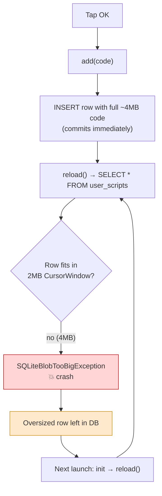

2026-05-30

# EinkBro — Installing a large userscript crashes on OK (CursorWindow overflow)

## Problem

Installing a userscript by URL crashed the app. The user pasted a `.user.js`
URL, tapped **Fetch** (the script loaded into the editor), then tapped **OK** —
and the app died. Worse, once it had happened the app crashed again on every
subsequent launch.

The trigger was a *large* script: the Immersive Translate userscript is about
4 MB. Small userscripts installed fine.

## Root Cause

It was never a parse error. The crash was a `SQLiteBlobTooBigException`:

```
SQLiteQuery: Row too big to fit into CursorWindow requiredPos=0, totalRows=1;
  query: SELECT * FROM user_scripts ORDER BY `order` ASC, id ASC
FATAL EXCEPTION: DefaultDispatcher-worker-2
android.database.sqlite.SQLiteBlobTooBigException
```

The whole script text (including its metadata block) was stored verbatim in the
`code` column of the `user_scripts` Room table. Tapping OK runs:

```
add(code) → userScriptDao.insert(row with full code) → reload() → getAll()
          → SELECT * FROM user_scripts
```

Android reads query results through a **`CursorWindow`**, a shared-memory region
with a hard **2 MB** cap. A single row must fit inside it. A 4 MB `code` value
can be *written* by SQLite but can never be *read back* through a cursor — so
`getAll()` throws.

Because the `INSERT` is its own transaction, it had already committed before
`reload()` ran. The oversized, unreadable row was now permanently in the DB, and
`UserScriptManager`'s init also calls `reload()`, so the app crashed on every
launch thereafter.



## Solution

Keep multi-MB script bodies out of the database row entirely. The body now lives
in a file keyed by the script id; the DB row holds only metadata.

- Script bodies are written to `files/userscripts/<id>.user.js`. `add`/`update`
  write the file and persist `code = ""` in the row; `delete` removes the file.
- `getAll()` therefore only ever streams tiny rows through the cursor — the 2 MB
  limit is irrelevant.
- `reload()` reads each body back from its file. For any small, pre-existing
  inline row it falls back to the row's own `code`, so legacy data still works.
- `reload()` also catches `SQLiteBlobTooBigException` and recovers a
  poisoned database by deleting the unreadable rows — `DELETE` does not stream
  rows through a `CursorWindow`, so it succeeds where `SELECT` could not. This
  un-bricks devices that had already crashed.

Verified on a Hisense A7: on first launch after the fix, the log showed
`Dropping oversized inline userscript rows…` and the app started cleanly; the
4 MB Immersive Translate script then installed without crashing, appeared
enabled in the list, and its body was written to `files/userscripts/2.user.js`
(4,037,187 bytes) while the DB row stayed tiny.

## Key Files

- `app/src/main/java/info/plateaukao/einkbro/userscript/UserScriptManager.kt` —
  file-based body storage helpers; `reload()` reads from file + catches and
  recovers from `SQLiteBlobTooBigException`; `add`/`update`/`delete` updated.
- `app/src/main/java/info/plateaukao/einkbro/EinkBroApplication.kt` —
  `UserScriptManager` now constructed with `androidContext()`.

## Lessons Learned

- Any user-supplied text persisted in SQLite/Room can exceed the 2 MB
  `CursorWindow` limit. A row that `INSERT`s fine can still be impossible to
  `SELECT` — store large blobs as files and keep only metadata (and a key) in
  the row.
- A commit that happens *before* the read that crashes can brick the app on
  every launch. Recovery logic (catch + drop the bad row) matters as much as the
  forward fix, otherwise existing installs stay broken after the update.
- `DELETE` doesn't use a `CursorWindow`, so it's a viable escape hatch for
  rows that can no longer be read.
