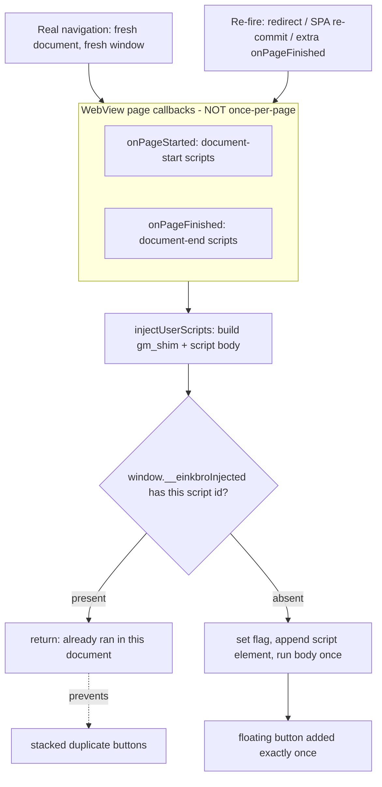

2026-06-17

# EinkBro — Userscript UI injected multiple times per page

## Problem

A userscript's injected UI — most visibly a floating action button — sometimes
appeared **two or more times** on the same page. It was intermittent: the same
site could show one button on one visit and several on the next. Single-page
documentation sites (hash-routed SPAs that fetch and render content client-side)
were a reliable place to reproduce it.

## Root Cause

EinkBro injects each matching userscript by building a payload (the GM API shim +
any `@require` content + the script body), wrapping it in a tiny loader, and
running it via `evaluateJavascript` from the `WebViewClient` page callbacks:
`onPageStarted` for `@run-at document-start`, `onPageFinished` for
`document-end`. The loader had **no idempotency guard** — it ran the script body
in full every time it fired.

The wrong assumption was that those callbacks fire once per page. They do not.
Android's `onPageStarted` / `onPageFinished` re-fire for server/client redirects,
progressive in-page commits, back/forward to a cached document, and the boot
sequence of client-rendered SPAs. Each extra `onPageFinished` re-ran the
document-end script, and a script that simply does `body.appendChild(button)`
with no "already added?" check stacked a fresh button each time. N callbacks → N
buttons. Because the number of callbacks depended on redirects and SPA timing,
the duplication looked random.

Injection happens through `WebView.evaluateJavascript`, which targets the **top
frame only**, so iframes were never a factor (and the parsed-but-unused
`@noframes` flag was a red herring). A second, deterministic path also existed:
legacy duplicate script rows from re-installs predating the de-dup-on-reinstall
fix would each match and inject independently.

## Solution

Make injection idempotent per document, the same guarantee a real userscript
manager gives:

1. **Per-document, per-script guard.** The loader now records each script id on
   `window.__einkbroInjected` and returns early if it is already present. `window`
   is a fresh object on every genuine navigation, so real page loads still run the
   script exactly once, and distinct scripts stay independent of one another.
2. **Gate the menu-command reset on document change.** `onPageStarted` previously
   cleared the GM menu-command registry on every call. With scripts now running
   once per document, a re-fired same-document `onPageStarted` would have wiped
   commands the script already registered without re-registering them. The clear
   now happens only when the URL actually changes.
3. **De-dupe matching scripts by `@name`.** `getMatchingScripts` collapses legacy
   duplicate rows so they can no longer double-inject (metadata-less scripts are
   kept distinct by id).

Verified two ways against a live SPA in the actual WebView via the Chrome
DevTools protocol: replaying the exact loader three times yielded **1** button
with the guard versus **3** without it, and the real app path (a userscript
installed and injected by `onPageFinished`) produced a single button with the
guard registry populated.

## Key Files

- `app/src/main/java/info/plateaukao/einkbro/browser/NinjaWebViewClient.kt` —
  `injectUserScripts` loader gains the `window.__einkbroInjected` guard;
  `onPageStarted` clears the menu registry only on URL change.
- `app/src/main/java/info/plateaukao/einkbro/userscript/UserScriptManager.kt` —
  `getMatchingScripts` de-dupes by `@name`.

## Lessons Learned

- `WebViewClient.onPageStarted` / `onPageFinished` are **not** once-per-page.
  Anything that runs from them and mutates the DOM needs its own idempotency
  guard; the callback is a signal, not a guarantee of a fresh document.
- Anchor "run once per document" state on `window`. It is exactly as long-lived
  as the document — reset for free on real navigation, persistent across spurious
  re-fires — which is precisely the lifetime userscript injection wants.
- When one change makes another path run "once" where it used to run "every
  time," re-check anything that relied on the old every-time behavior (here, the
  per-call menu-registry clear).
