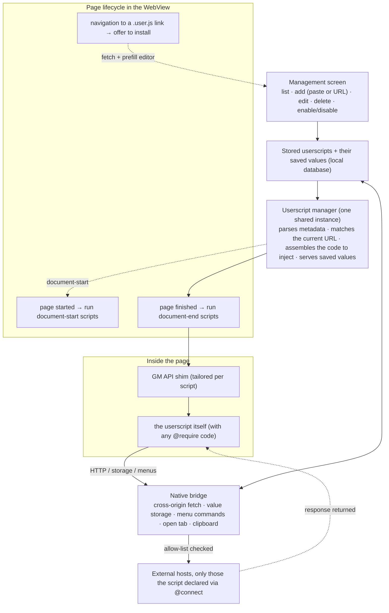

<!-- added: 2026-05-30 -->

# EinkBro Tampermonkey-style Userscript Engine

## Summary

EinkBro now runs Tampermonkey/Greasemonkey-style userscripts: small pieces of user-installed
JavaScript that are injected into the web pages they declare an interest in, and that can reach the
familiar `GM_*` / `GM.*` capabilities — cross-origin HTTP requests, persistent key/value storage,
menu commands, style and element injection, and opening tabs. There is no browser-extension runtime
behind this; everything happens inside the WebView the browser already uses, and each script runs in
the page's own world, switched on or off per script and matched per URL.

The benchmark we held the work to was Immersive Translate — a large, heavily minified bilingual
translation script that funnels all of its network traffic through the userscript HTTP API. The goal
was not a toy demo but that this real, demanding script would install, inject, fetch its translations
from public translation services, and render bilingual text directly onto the page. It does. During
development a small hand-written paragraph translator served as a clean-room control to prove the
engine independently of any one third-party script.

This ADR covers the architecture and the decisions behind it. The separate investigation into why
translations initially fetched successfully but never appeared on screen is written up in
`einkbro-userscript-translation-not-shown`.

## Approach

The guiding decision was to build *with* EinkBro rather than bolt something on. The browser already
contained, in single-purpose form, almost everything a userscript engine needs, so the work was
mostly a matter of generalizing mechanisms that already existed and were already trusted.

The browser already injected a per-site snippet of custom JavaScript at the moment a page finished
loading, wrapped defensively so a script error could not take the page down. That same lifecycle
moment — plus the earlier "page started" moment for scripts that ask to run before the document is
ready — became the injection point for userscripts, leaving the existing per-site snippet feature
untouched alongside it. The browser also already had a pattern for letting page JavaScript call into
native code through a named bridge object; userscripts get their own such bridge, kept entirely
separate from the existing one. Local persistence, an HTTP client, the dependency-injection
container, and the Compose-based settings screens with their list-management sub-screens were all
reused as-is. Very little here is genuinely new plumbing; most of it is a second, parameterized
instance of a pattern the codebase already relied on.

### How a userscript flows through the system

### What it does at each stage

**Storage.** Each installed userscript is kept with its complete source text intact, rather than
shredded into one column per metadata directive. The metadata block is re-parsed from that text when
scripts load. This keeps the storage shape trivial and means editing a script round-trips losslessly.
A second, separate store holds the key/value data that scripts persist, scoped to the owning script.
Introducing these required a routine database version bump and migration of the kind the project does
regularly.

**The manager.** A single shared object owns the userscript lifecycle in memory. At startup it loads
and parses every installed script into a cache, fetches and caches any external code a script pulls
in via `@require`, and from then on can answer, for any given page URL and run-timing, which scripts
should run. When asked to inject a script it assembles the actual code: the GM API shim tailored with
that script's identity and metadata, then any required external code, then the script body. It also
brokers the persistent-value reads and writes that the native bridge needs to perform synchronously.

**The GM API.** Userscripts expect a specific global vocabulary — value storage, styling and element
helpers, cross-origin requests, menu registration, tab opening, logging, notifications, script
metadata, and the promisified variants of these. That vocabulary is provided as a JavaScript shim
injected ahead of each script, backed where necessary by a native bridge. The HTTP capability is the
substantial one: it runs the request off the UI thread, but only after checking the destination host
against the allow-list the script declared, and then hands the result back into the page
asynchronously. Cross-origin access that a userscript manager grants but an ordinary page cannot have
is exactly what makes scripts like translators possible.

**Injection technique.** Rather than handing the engine's JavaScript to the WebView as a bare string
to evaluate, it is inserted as a script element belonging to the page itself. This matters for
debuggability: code evaluated as a bare string reports its exceptions as opaque, stack-less "Script
error." messages, whereas a real script element with a source annotation yields proper file, line,
and stack information — which proved essential when chasing the rendering bug documented separately.

**Management and installation.** A dedicated settings screen, reached under the browser's start
controls next to the existing JavaScript and JavaScript-whitelist options, lists installed scripts
with per-script enable switches, editing, and deletion. New scripts can be added by pasting source
directly or by giving a URL the browser fetches for you. As a third path, navigating to any link
ending in `.user.js` is intercepted, fetched, and offered for installation with its code pre-filled,
matching how desktop userscript managers behave.

### The security posture

A userscript is arbitrary code running with the page's privileges on every page it matches, so the
design is deliberately conservative about reach and consent. Cross-origin requests are gated: a
script may only contact hosts it explicitly declared (plus the page's own host), and anything else is
refused. Scripts are off until the user turns them on, and every way of installing one is an explicit
user action — pasting, fetching a URL, or confirming a `.user.js` link. There is no silent or
automatic installation.

## Trade-offs

**Scripts run in the page's own world, not an isolated one.** A WebView offers no separate
content-script world, so there is no true sandbox and the "unsafe window" a userscript expects is
simply the page window. For trusted, user-installed scripts this is acceptable, and the combination
of per-script enabling, the cross-origin allow-list, and explicit installation are the mitigations. A
real isolated world would have meant a second WebView or a message-channel proxy, which was judged
disproportionate to the benefit.

**Source is stored whole and parsed on demand.** The alternative — denormalizing every metadata
directive into its own database column — would save a little parsing but complicate the schema and
risk losing the exact original text on edit. Parsing is inexpensive next to the size of the scripts
themselves and happens once per launch, so keeping the source canonical was the clear choice.

**Required external code is fetched and cached when scripts load.** This keeps injection
straightforward and synchronous, at the cost that a slow or missing dependency host delays that one
script. Results are cached in memory to avoid repeated fetches. There is, as yet, no integrity
checking of those dependencies.

**The GM vocabulary is a deliberate subset.** The capabilities implemented are the ones real
translation and utility scripts actually use, checked against what the benchmark script declares it
needs. Downloads, cookie access, request interception, value-change listeners, and the tab-data APIs
are intentionally absent for now. One subtlety was forced by reality rather than chosen: the
promise-style HTTP entry point also had to support the older callback style, because the fetch
polyfills that serious scripts ship drive it through the callback form — the companion ADR explains
how skipping that nearly sank the whole feature.

**Timing is pinned to the existing page-load callbacks.** Userscript run-timing rides on the
browser's existing "page started" and "page finished" hooks rather than a bespoke content-script
lifecycle. This is simpler and consistent with the existing per-site snippet feature, but it means
the "run when idle" timing is approximated by "run at page finished" rather than honored precisely.

**Heavy scripts cost on e-ink hardware.** A large script like the translation benchmark is not free
on a low-power reader. The per-script enable requirement, already part of the design, is what keeps
that cost opt-in.
