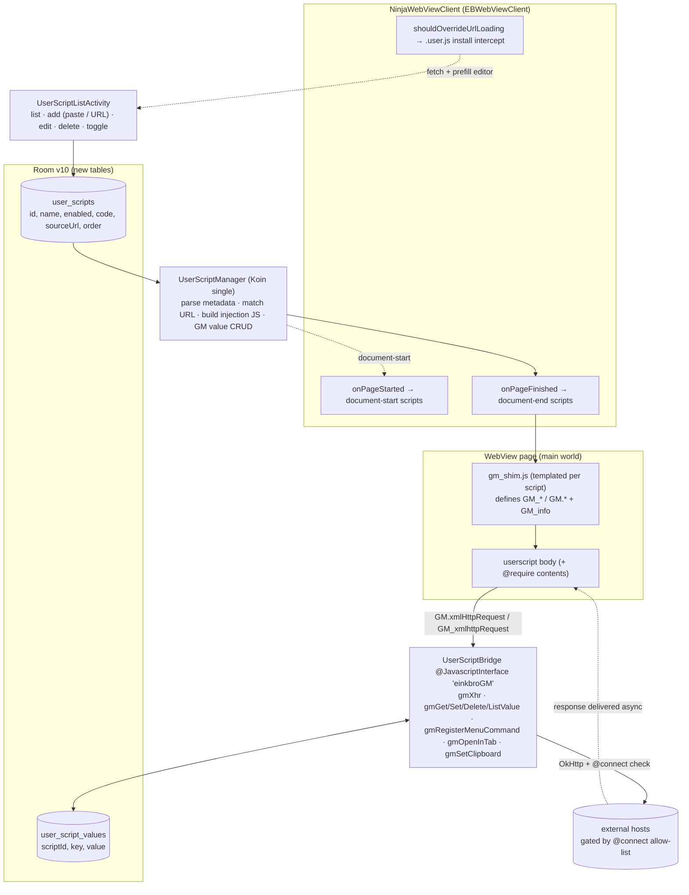

<!-- added: 2026-05-30 -->

# EinkBro Tampermonkey-style Userscript Engine

## Summary

EinkBro now supports Tampermonkey/Greasemonkey-style userscripts: user-installed JavaScript
that is injected into matching web pages and can call the standard `GM_*` / `GM.*` API surface
(cross-origin HTTP, persistent storage, menu commands, styling, DOM helpers). The implementation
is self-contained in the app — there is no extension runtime; userscripts run in the page's own
main world via the existing `WebView`, gated per-script by URL match patterns.

The headline validation target was **Immersive Translate** (a ~995 KB minified bundle that routes
all network through `GM_xmlhttpRequest`): it installs, injects, fetches translations from public
translation APIs, and renders bilingual text on the page. A hand-written paragraph-translation
userscript was also used as a clean-room control during development.

This ADR covers the architecture and design decisions. The debugging of why translations initially
did not render (and the four root causes fixed) is documented separately in
`einkbro-userscript-translation-not-shown.md`.

## Approach

### Where the design hooks into existing EinkBro

EinkBro already had every structural piece a userscript engine needs, so the work was mostly
*generalizing* existing single-purpose mechanisms rather than inventing new ones:

- **Per-page JS injection at the right lifecycle moment.** `DomainConfiguration.postLoadJavascript`
  was already injected in `NinjaWebViewClient.onPageFinished` wrapped in an IIFE + try/catch. The
  userscript engine reuses that exact injection point (plus `onPageStarted` for `@run-at
  document-start`).
- **JS↔native bridge pattern.** The app already exposes `JsWebInterface` as `window.androidApp`
  via `addJavascriptInterface`. The GM bridge is a second interface, `window.einkbroGM`, registered
  the same way.
- **Room + migrations**, **OkHttp** (used by translation/AI repos), **Koin singletons**, and a
  **Compose settings system** with list-management sub-activities (`GptActionsActivity`,
  `DataListActivity`) — all reused verbatim as patterns.

### Data flow

### Components built

**Data layer (Room v9 → v10).** Two entities in `database/UserScript.kt`:
- `user_scripts` — the full script text is stored verbatim in `code` (metadata is parsed on demand,
  not denormalized into columns), plus `name`, `enabled`, `sourceUrl`, `order`.
- `user_script_values` — `(scriptId, key)` primary key backing `GM_setValue`/`GM_getValue`.

`UserScriptDao` / `UserScriptValueDao` follow the existing `DomainConfigurationDao` shape. The
`@Database` annotation in `BookmarkDao.kt` gains both entities, version bumps 9→10, and
`migration9To10` issues the two `CREATE TABLE` statements (mirroring `migration8To9`). The DAOs are
exposed off `BookmarkManager` so other singletons can reach them without re-resolving the database.

**Engine (`userscript/` package).**
- `UserScriptMetadata.kt` — parses the `// ==UserScript== … // ==/UserScript==` block (`@match`,
  `@include`, `@exclude`, `@grant`, `@require`, `@connect`, `@run-at`, `@name`, `@namespace`,
  `@version`, `@noframes`).
- `UrlMatcher.kt` — converts Chrome match patterns and `@include` globs (and `/regex/` form) to
  regexes; tolerates an explicit `:port` in the URL.
- `UserScriptManager.kt` — Koin `single`. Loads + parses scripts into an in-memory cache at startup
  (same pattern as `config.domainConfigurationMap`), resolves and caches `@require` contents over
  OkHttp, answers `getMatchingScripts(url, runAt)`, builds the per-script injection blob
  (templated `gm_shim.js` + `@require` + body + `//# sourceURL`), and provides synchronous GM value
  CRUD for the bridge thread. CRUD methods (`add`/`update`/`setEnabled`/`delete`) keep the cache and
  DB in sync.

**GM API surface.**
- `assets/gm_shim.js` — pure JS, templated per script with `__SCRIPT_ID__` and `__GM_INFO__`.
  Defines `GM_getValue/setValue/deleteValue/listValues`, `GM_addStyle`, `GM_addElement`,
  `GM_xmlhttpRequest`, `GM_registerMenuCommand`, `GM_openInTab`, `GM_setClipboard`, `GM_log`,
  `GM_notification`, `GM_info`, `unsafeWindow`, plus the promisified `GM.*` namespace. A shared
  per-page hub on `window.__einkbroGM` keys XHR callbacks and menu callbacks by request/fn id.
- `browser/UserScriptBridge.kt` — `@JavascriptInterface` class registered as `window.einkbroGM`.
  All methods run on the WebView's private JS-bridge thread, so synchronous Room access is safe.
  `gmXhr` runs OkHttp off-thread on a coroutine, enforces the script's `@connect` allow-list before
  firing (page's own host always allowed), and delivers `load`/`error`/`timeout` events back via
  `evaluateJavascript("…handleXhr(reqId,…)")`.

**Injection.** `NinjaWebViewClient` injects matching scripts in `onPageStarted` (document-start) and
`onPageFinished` (document-end). The existing `postLoadJavascript` injection is left untouched as the
per-site quick-JS feature. Scripts are injected as a same-origin `<script>` element (base64-decoded
in page) rather than bare `evaluateJavascript()`, so Chromium attributes their exceptions a real
source instead of opaque `"Script error."`.

**Management UI.** `UserScriptListActivity` (Compose, modeled on `GptActionsActivity`) lists scripts
with enable/disable toggles, edit, delete, and an add dialog that accepts pasted code **or** an
"Install from URL" field that fetches a `.user.js` over OkHttp. Reached from **Settings → Start
control → "Userscripts"** (next to the JavaScript / JS-whitelist controls). `.user.js` URLs are
intercepted in `shouldOverrideUrlLoading`, fetched, and handed to the activity with the code
pre-filled.

### `@connect` security model

Userscripts are arbitrary code running in the page's main world on every matched page. Cross-origin
requests are gated: `gmXhr` rejects any URL whose host is not in the script's `@connect` list (with
`*` wildcard and `*.domain` suffix support), except the page's own host. Scripts are disabled by
default until the user enables them, and the install path is explicit (paste / URL / link tap).

## Trade-offs

- **Main-world injection only.** WebView has no isolated content-script world, so there is no true
  sandbox and `unsafeWindow === window`. Acceptable for trusted, user-installed scripts; mitigated
  by per-script enable + the `@connect` allow-list + explicit install. A sandboxed world would
  require a second WebView or message-channel proxy and was judged not worth the complexity.

- **Full script text stored, metadata parsed on demand.** Keeps the schema trivial and edits
  lossless (the exact source round-trips), at the cost of re-parsing on load. Parsing is cheap
  relative to script size and happens once per app start, so this is the right call over
  denormalizing every `@`-directive into columns.

- **`@require` fetched and cached at parse time over OkHttp.** Simple and keeps injection
  synchronous, but a missing/slow CDN delays that script's readiness. Cached in-process to avoid
  refetching. No Subresource-Integrity checking yet.

- **GM API is a pragmatic subset.** The implemented surface covers what real translation/utility
  scripts use (verified against Immersive Translate's full `@grant` list). Notably *not* implemented:
  `GM_download`, `GM_cookie`, `GM_webRequest`, value-change listeners, tab APIs. `GM.xmlHttpRequest`
  is deliberately **dual-mode** (callback-style *and* promise-returning) to match real Tampermonkey,
  because fetch-polyfill clients depend on the callback form (see the companion bug ADR).

- **E-ink performance.** Heavy scripts (Immersive Translate is heavy) can stress low-power readers.
  Gated behind explicit per-script enable, which the design already requires.

- **Reused the document-end injection point rather than a dedicated content-script lifecycle.** This
  ties userscript timing to EinkBro's existing page callbacks, which is simpler and consistent with
  `postLoadJavascript`, but means `document-idle` is approximated by `document-end`.

## Key Files

New:
- `app/src/main/java/info/plateaukao/einkbro/database/UserScript.kt` — `user_scripts` +
  `user_script_values` entities
- `app/src/main/java/info/plateaukao/einkbro/database/UserScriptDao.kt` — both DAOs
- `app/src/main/java/info/plateaukao/einkbro/userscript/UserScriptMetadata.kt` — metadata parser
- `app/src/main/java/info/plateaukao/einkbro/userscript/UrlMatcher.kt` — `@match`/`@include` → regex
- `app/src/main/java/info/plateaukao/einkbro/userscript/UserScriptManager.kt` — Koin single: cache,
  matching, injection-blob builder, GM value CRUD
- `app/src/main/assets/gm_shim.js` — GM_* / GM.* JS API shim
- `app/src/main/java/info/plateaukao/einkbro/browser/UserScriptBridge.kt` — `window.einkbroGM`
  `@JavascriptInterface`
- `app/src/main/java/info/plateaukao/einkbro/activity/UserScriptListActivity.kt` — management UI
- `app/schemas/info.plateaukao.einkbro.database.AppDatabase/10.json` — Room schema v10

Modified:
- `app/src/main/java/info/plateaukao/einkbro/database/BookmarkDao.kt` — register entities + DAOs,
  version 9→10, `migration9To10`, expose DAOs on `BookmarkManager`
- `app/src/main/java/info/plateaukao/einkbro/browser/NinjaWebViewClient.kt` — inject matching scripts
  in `onPageStarted`/`onPageFinished`; `.user.js` install interception in `shouldOverrideUrlLoading`
- `app/src/main/java/info/plateaukao/einkbro/view/EBWebView.kt` — register `einkbroGM` interface;
  per-page menu-command registry; `currentPageUrl` cache; `openInNewTab`
- `app/src/main/java/info/plateaukao/einkbro/EinkBroApplication.kt` — register `UserScriptManager`
  Koin single
- `app/src/main/java/info/plateaukao/einkbro/activity/SettingActivity.kt` — "Userscripts" entry in
  Start-control settings
- `app/src/main/res/values/strings.xml` — userscript UI strings
