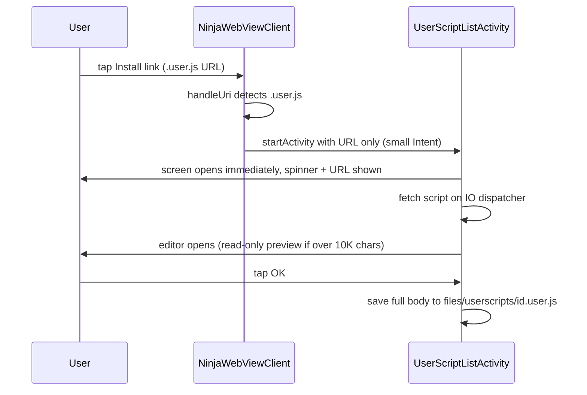

2026-06-11

# EinkBro — Userscript install links did nothing; GM menu commands unreachable

## Problem

Two halves of the Tampermonkey-style userscript engine were built but not
reachable from the browser UI:

1. Tapping **Install this script** on a Greasy Fork script page did nothing —
   the WebView just navigated to the raw `.user.js` content. The only working
   install path was manual (Settings → Userscripts → paste or fetch by URL).
2. Commands that userscripts register via `GM_registerMenuCommand` (the
   entries Tampermonkey shows under its toolbar icon) were collected but never
   displayed anywhere, so features like KISS Translator's "Translate Switch"
   were unusable.

While fixing the first issue, a third surfaced on-device: installing a real
~2.3MB script killed the app with `TransactionTooLargeException`, and even
with that fixed, the editor froze indefinitely opening the fetched script.

## Root Cause

- `isUserScriptUrl()` and `offerUserScriptInstall()` existed in
  `NinjaWebViewClient` but had **no call site** — the original commit message
  claimed the wiring existed, but it was never committed. `handleUri()` hit
  the `url.startsWith("http") -> return false` branch and let the WebView
  load the script as a page.
- `EBWebView.userScriptMenuCommands` was populated through the JS bridge, and
  `invokeUserScriptMenuCommand()` existed, but **no UI consumer** read the
  map — a half-finished feature.
- The crash: the install path downloaded the script in the browser and passed
  the entire body as an Intent extra. Intent extras cross a Binder
  transaction capped at ~1MB; multi-MB scripts (Immersive Translate, KISS
  Translator) exceed it and the exception is fatal. Same large-script class
  of problem the DB layer had already solved by moving bodies out of Room
  rows into files.
- The freeze: binding a multi-MB string into a Compose `TextField` stalls
  composition for minutes on e-ink hardware — the frame that builds the
  editor dialog never completes.

## Solution

Install flow (now gives immediate feedback and handles any script size):

- `handleUri()` intercepts `.user.js` URLs before the http pass-through and
  launches `UserScriptListActivity` with **only the URL** as an extra; the
  activity fetches the script itself behind a progress row (spinner + URL),
  then opens the editor. Fetch failure shows the existing load-error toast.
- The editor caps its `TextField` at 10K characters: larger scripts display a
  truncated read-only preview (metadata header still visible for review)
  while the full body is kept in state and saved intact — verified
  byte-for-byte with a 2.5MB script. This also fixes editing an already
  installed large script, which froze the same way.

Menu commands:

- New `ToolbarAction.Userscript` (puzzle-piece icon, appended last because
  toolbar configs persist enum ordinals). Tap lists the current page's
  registered commands in a single-choice dialog (reusing
  `getSelectedOptionWithString`) and invokes the selection; with no commands
  registered it opens the userscript manager, as does long-press.
- Also exposed as `BrowserAction.ShowUserScriptCommands` in the catalog so it
  can be bound to gestures/keys. No new strings were needed, so no locale
  churn.
- Commands from multiple scripts on one page merge into one flat list,
  ordered by registration; each entry routes to its own script's callback
  (callback ids are script-id-prefixed).

## Key Files

- `app/src/main/java/info/plateaukao/einkbro/browser/NinjaWebViewClient.kt` —
  `.user.js` interception in `handleUri()`; `offerUserScriptInstall()` now
  just launches the activity with the URL
- `app/src/main/java/info/plateaukao/einkbro/activity/UserScriptListActivity.kt` —
  `createInstallIntent(url)`, fetch-with-indicator, editor preview cap
- `app/src/main/java/info/plateaukao/einkbro/view/toolbaricons/ToolbarAction.kt` —
  `Userscript` action (appended; ordinals persisted)
- `app/src/main/java/info/plateaukao/einkbro/view/handlers/ToolbarActionHandler.kt` —
  click → show commands, long-press → manager
- `app/src/main/java/info/plateaukao/einkbro/activity/BrowserActivity.kt` —
  `showUserScriptCommands()` dialog
- `app/src/main/java/info/plateaukao/einkbro/browser/BrowserAction.kt`,
  `BrowserActionCatalog.kt` — `ShowUserScriptCommands` action entry
- `test_server/userscript_install_test.html`, `test_server/menu_test.user.js` —
  regression fixtures (simulated install link; script registering two menu
  commands)

## Lessons Learned

- A commit message describing wiring is not the wiring: the original engine
  commit claimed `.user.js` interception that never existed in any revision.
  Grep for call sites, not just definitions, when verifying a feature exists.
- Real userscripts are routinely multi-megabyte, which breaks three separate
  Android limits in one feature: Room's 2MB CursorWindow (already fixed),
  the ~1MB Binder transaction cap for Intent extras, and Compose `TextField`
  composition cost. Pass references (URLs, file paths), never bodies, across
  process/component boundaries.
- Doing slow work before showing any UI reads as "the button is broken" —
  on a several-second fetch the user tapped repeatedly. Navigate first, then
  load behind an indicator.
