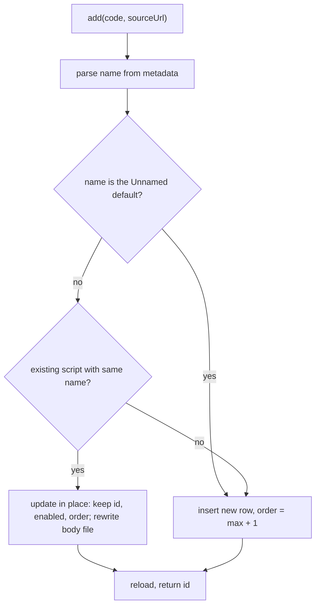

2026-06-13

# EinkBro — Reinstalling a userscript updates it in place instead of duplicating

## Summary

Installing or fetching a userscript whose `@name` matches one already
installed now **edits the existing script** rather than appending a duplicate.
Previously every Fetch → OK (or `.user.js` install link) produced a brand-new
entry, so pulling a newer version of a script left two copies in the list — the
stale one still enabled and still running.

The match is by script name, mirroring how Tampermonkey treats `@name` as a
script's identity: re-running the install of "Immersive Translate" replaces the
body you already have instead of stacking another "Immersive Translate" beside
it.

## Approach

The dedupe lives in `UserScriptManager.add()` so it covers both entry points —
the in-app editor's OK button and the install-from-URL intent — without
touching either caller.

`add()` parses the incoming code's `@name`, then looks for an existing script
with that name in the in-memory `scripts` list:

- **Match found** → update that row in place. The body file is rewritten and
  `sourceUrl` refreshed, but the existing `id`, `enabled` flag, and list
  `order` are preserved via `copy()`. So a reinstall keeps the script in the
  same spot and keeps it on if it was on — only the code changes.
- **No match** → insert a new row at `order = max + 1`, as before.

The `"Unnamed script"` fallback (used when a script declares no `@name`) is
explicitly excluded from matching, so several metadata-less scripts don't all
collapse into a single entry. That literal was previously hardcoded in two
places; it now lives in `UserScriptMetadata.DEFAULT_NAME` and both the parser
and the dedupe check reference it.

## Trade-offs

- **Match on `@name` only, not `@name` + `@namespace`.** Tampermonkey keys on
  both, so two distinct scripts that happen to share a name across different
  namespaces would be treated as the same here and one would overwrite the
  other. In practice name collisions across namespaces are rare, and matching
  on the visible name is what a user means by "the same script." Namespace can
  be folded into the key later if it ever bites.
- **Silent overwrite, no prompt.** Reinstalling just replaces the body without
  asking. This matches the expectation for "fetch the latest version," and the
  preserved enabled/order state makes it unsurprising, but there is no undo for
  a body that gets replaced.
- **Matches against the in-memory list, not a fresh DB query.** `scripts` is
  kept current by `reload()` after every mutation, so this is consistent in
  normal use; it would miss a row written by some other process mid-session,
  which doesn't happen in a single-app context.

## Key Files

- `app/src/main/java/info/plateaukao/einkbro/userscript/UserScriptManager.kt` —
  `add()` now looks up an existing script by name and updates it in place
  (preserving id/enabled/order) instead of always inserting.
- `app/src/main/java/info/plateaukao/einkbro/userscript/UserScriptMetadata.kt` —
  hoisted the no-`@name` fallback into `DEFAULT_NAME` so the dedupe check and
  the parser share one constant.
