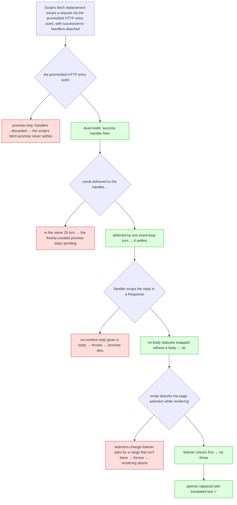

<!-- added: 2026-05-30 -->

# Immersive Translate ran but showed no translations in EinkBro's userscript engine

## Problem

With the userscript engine working (see `einkbro-userscript-engine`), Immersive Translate would
install, inject, show its floating control, and successfully fetch translations — the network
requests completed and the correct translated text came back over the wire — yet nothing translated
ever appeared on the page. Every paragraph sat under a loading spinner that span forever. Inspecting
the page afterwards showed that the script had built each translation's container and its spinner,
but the spinner was never replaced with the translated text.

The important early observation was that this was not a networking or engine-plumbing failure. The
requests were reaching the translation service and returning good data. The breakage lay downstream,
in how the script consumed that data once it arrived. A telling control experiment reinforced this: a
small hand-written paragraph translator, running under the very same engine and calling the same
cross-origin HTTP capability directly, rendered its translations correctly. So the engine's basic
path was sound, and the failure was specific to how Immersive Translate is built.

## Root Cause

There were four independent defects on the road from "response has arrived" to "text is on screen,"
and all four had to be cleared before anything rendered. They are described below roughly in order of
how decisive each turned out to be.

### The decisive one: the promise-style HTTP entry point ignored callback-style callers

Immersive Translate does not call the cross-origin HTTP capability directly. It ships its own `fetch`
replacement — it even removes the page's native `fetch` to force everything through the userscript
channel and thereby sidestep cross-origin restrictions. That replacement chooses its transport with a
strong preference for the promisified HTTP entry point in the `GM.` namespace, ahead of the older
underscore-named one. Having chosen it, the script then drives it in the *callback* style: it passes
in success and error handlers and resolves its own internal promise from inside the success handler.

In a real userscript manager that promisified entry point is dual-natured: called with handlers it
behaves like the callback form and fires them; called without, it returns a promise. Our version only
ever returned a promise. So when Immersive Translate invoked it with handlers attached, those handlers
were quietly discarded, a promise nobody was waiting on was returned, and the success handler never
ran. Its internal fetch-promise therefore never settled, the translated text was never read out of
the response, and the spinners spun indefinitely.

This single mismatch explains the whole confusing picture: requests plainly succeeded yet nothing
rendered, and the hand-written control script worked because it used the underscore-named entry point
directly and never touched the broken promisified one.

### Resolving a promise synchronously from inside its own executor left it pending

The native side delivers an HTTP result by asking the WebView to run a small piece of JavaScript
immediately. "Immediately" turned out to mean *within the same JavaScript turn* as the script's own
code that had just issued the request and wrapped it in a freshly created promise. In this WebView's
JavaScript engine, resolving a brand-new promise synchronously from inside the very executor that
created it leaves the promise stuck in a pending state. Even after the first fix made the success
handler fire, the promise would not settle until delivery was deferred by a single turn of the event
loop.

### Wrapping a no-content response in a Response object threw

The script's fetch replacement wraps every reply in a standard `Response` object. Some replies carry
no body by definition — for instance the empty acknowledgement returned by an analytics beacon.
Constructing a `Response` with a body for one of those no-body status codes throws an error. Because
that construction happened inside the success handler, the throw was one more way the fetch-promise
died before the translation could be used.

### A long-standing selection bug in the browser itself

The browser installs, on every page, a listener that reacts whenever the text selection changes by
asking for the current selection range. It did so without first checking that a range actually
existed. Immersive Translate disturbs the document and selection as it inserts its bilingual text,
which fires that change listener at a moment when nothing is selected, so the request for a
non-existent range threw — and that exception, raised in the middle of the script's rendering work,
aborted it. This was a genuine latent defect in the browser unrelated to userscripts: any page that
programmatically changes the selection could have tripped it.

### Why it took so long to find

Two layers of noise hid the real failures. First, a different error about setting an attribute on
something undefined kept surfacing and looked like the culprit; it was in fact the browser's own
"enable zoom" adjustment failing on a test page that lacked the element it expected, compounded by
identical-looking errors arriving from a completely separate background tab — pure distraction.
Second, code handed to the WebView as a bare string to evaluate reports its exceptions as opaque,
stack-less messages, so the genuine errors were effectively invisible until the injection method was
changed to a real, attributable script element. Only then did the actual selection error and the
unsettled-promise behavior become diagnosable.

## Solution

Each defect was addressed in turn. The promisified HTTP entry point was made dual-natured: given
success or error handlers it now behaves as the callback form and returns a control handle; given
none, it returns a promise as before — matching how real userscript managers expose it. Delivery of
HTTP results to script handlers was deferred by one turn of the event loop, so resolution never
happens inside the issuing promise's own executor. Response wrapping was taught to omit the body for
no-content status codes, so constructing those replies no longer throws. And the browser's
selection-change listener was made to confirm a range exists before asking for one, which both
unblocks the translation script and fixes the underlying crash for any page.

Alongside these, several smaller alignments with real userscript-manager behavior were made and
helped diagnosis: notifying readiness before the success handler in the expected order, honoring a
per-request timeout with a proper timeout notification, pre-parsing JSON responses when the script
asked for that response type, providing the global object some WebView scopes omit, and annotating
injected code with a source reference so its exceptions carry real stack traces.

With all four fixes in place, a Japanese page renders Traditional-Chinese translations inline beneath
each paragraph, and every translation container that previously held only a spinner now holds
translated text.

## Lessons Learned

A succeeding network request is not a succeeding feature. The fact that requests returned good data
steered attention away from the real bug, which lived entirely in the promise-and-callback plumbing
that ran *after* the response arrived. When the data is right but the screen is wrong, the place to
instrument is the consumption path, not the transport.

Re-implementing a well-known interface means honoring its whole contract, not the part that passes a
quick test. The promise-only HTTP entry point looked fine for simple callers and for our control
script, but a serious third-party script drove it through its other, callback-shaped contract — and
the missing half is what stalled everything.

A clean-room reimplementation is a fast oracle. Writing a minimal translator that rendered correctly
under the same engine immediately partitioned the problem into "engine: good, this script's
expectations: not met," which saved a great deal of blind guessing.

Make third-party errors observable before forming theories. As long as injected code produced opaque,
stack-less errors, every theory was a guess. Switching to attributable injection and attaching a real
debugger to the WebView turned invisible failures into concrete stack traces, and only then did the
true causes surface.

Finally, be suspicious of look-alike noise from other contexts. The errors that dominated the early
logs came partly from an unrelated browser feature and partly from a second background tab; confirming
which document and which script an error actually belonged to, before chasing it, would have saved
time.
