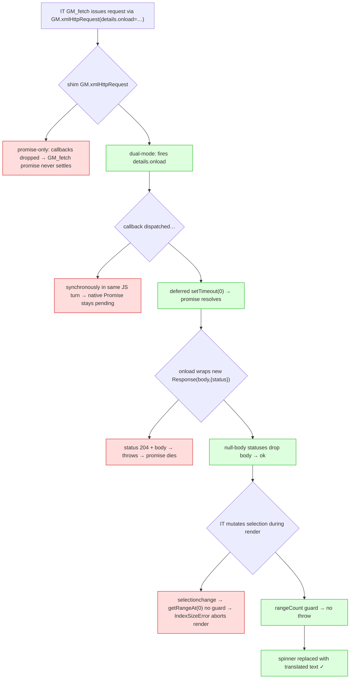

<!-- added: 2026-05-30 -->

# Immersive Translate ran but showed no translations in EinkBro's userscript engine

## Problem

After the userscript engine (see `einkbro-userscript-engine.md`) was working, Immersive Translate
would inject, render its floating control, fetch translations successfully (HTTP 200 with correct
translated text observed on the wire), yet **no translated text appeared on the page** — every
paragraph showed a loading spinner that animated forever. The page DOM ended up full of:

```html
<font class="immersive-translate-target-wrapper" lang="zh-TW">
  &nbsp;<font class="immersive-translate-loading-spinner"></font>
</font>
```

i.e. the translation *wrapper* and *spinner* were created, but the spinner was never replaced with
text. Crucially this was not a network or engine-plumbing failure: the requests completed and the
data came back. The breakage was downstream, inside how the script consumed the response.

A hand-written paragraph-translation userscript (using `GM_xmlhttpRequest` directly) rendered fine
under the same engine, which proved the engine's basic path was sound and the failure was specific
to how Immersive Translate is built.

## Root Cause

There were **four** independent defects on the path from "response arrives" to "text rendered." All
four had to be fixed for translations to appear. They are ordered below by how decisive each was.

### 1. `GM.xmlHttpRequest` was promise-only, not dual-mode (the decisive one)

Immersive Translate does not call `GM_xmlhttpRequest` directly. It ships a `fetch` polyfill
(`GM_fetch`) — it deletes `window.fetch` to bypass CORS and routes everything through GM. That
polyfill selects its transport in this priority order:

```js
let httpRequest;
if (typeof GM < "u" && GM.xmlHttpRequest)      httpRequest = GM.xmlHttpRequest;   // ← picked first
else if (typeof GM < "u" && GM_xmlhttpRequest) httpRequest = GM_xmlhttpRequest;
else if (typeof GM_xmlhttpRequest < "u")       httpRequest = GM_xmlhttpRequest;
```

It then drives that transport **callback-style**, passing `xhr_details.onload`/`onerror` and
resolving its own wrapping `Promise` from inside `onload`.

In real Tampermonkey, `GM.xmlHttpRequest` is **dual-mode**: callback-style (fires `details.onload`,
returns a control object) *and* promise-returning. Our shim implemented only the promise form. So
when Immersive Translate called `GM.xmlHttpRequest(details_with_onload)`, the shim ignored the
callbacks, returned a Promise nobody awaited, and `details.onload` never fired → `GM_fetch`'s
wrapping promise never settled → the translated text was never consumed → spinners forever.

This is why the requests visibly succeeded but nothing rendered, and why a script calling
`GM_xmlhttpRequest` directly worked: it bypassed the broken `GM.xmlHttpRequest` path entirely.

### 2. Synchronous callback dispatch leaves a native Promise pending

The native bridge delivers a response by calling
`webView.evaluateJavascript("…handleXhr(reqId,…)")`. That executes **synchronously**, often within
the same JS turn as the script's `new Promise(executor)` that issued the request. Resolving a native
Promise synchronously from inside its own executor, in this WebView's V8, leaves the promise
permanently pending. Even after fix #1 made the callback fire, the promise still would not settle
until dispatch was deferred one macrotask (`setTimeout(fn, 0)`).

### 3. `new Response('', {status: 204})` throws

The fetch polyfill wraps *every* response in `new Response(body, {status})`. Some responses are
null-body statuses (e.g. a `204` from an analytics beacon). `new Response('non-empty', {status:204})`
throws *"Response with null body status cannot have body"*. That throw happens inside `onload`, which
again kills the wrapping promise.

### 4. `getRangeAt(0)` IndexSizeError from EinkBro's own selection JS

EinkBro injects `text_selection_change.js` as a **global `selectionchange` listener on every page**,
and it called `selection.getRangeAt(0)` with no `rangeCount` guard (same in
`text_selection_highlight.js`). Immersive Translate mutates the document/selection while inserting
its bilingual nodes, which fires `selectionchange` when no range is active → `getRangeAt(0)` throws
*IndexSizeError* → the exception propagates out of the event dispatch and aborts the render
microtask. This is a genuine latent EinkBro bug, independent of userscripts: any page that
programmatically changes the selection could trigger it.

### Why this took so long to find

Two layers of noise masked the real errors:
- A `setAttribute on undefined` exception kept appearing and looked relevant. It turned out to be
  EinkBro's own "enable zoom" one-liner
  (`document.getElementsByName('viewport')[0].setAttribute(...)`) failing on a test page that had no
  `<meta viewport>`, plus identical-looking errors coming from a *different background tab*. Pure
  red herring.
- Eval-injected code reports exceptions as opaque `"Script error."` with no stack, so the real
  failures were invisible until the injector was changed to a same-origin `<script>` element with a
  `//# sourceURL`.



## Solution

All GM-side fixes are in `app/src/main/assets/gm_shim.js`; the selection fix is in the two asset JS
files; the bridge gained timeout handling.

1. **Dual-mode `GM.xmlHttpRequest`.** New `GM_xmlhttpRequestDual(details)`: if `details` has
   `onload`/`onerror`/`onreadystatechange`, run callback-style and return the control object;
   otherwise return a Promise resolving to the response. Assigned to both `GM.xmlHttpRequest` and
   `GM.xmlhttpRequest`.

2. **Async callback dispatch.** `handleXhr` wraps its entire callback dispatch in `setTimeout(fn, 0)`
   so resolution never happens inside the issuing promise's executor turn.

3. **`Response` subclass for null-body statuses.** `window.Response` is replaced with
   `class extends Response` whose constructor passes `null` body for `204`/`205`/`304`. It must be a
   real `class extends` (genuine `Response` instances); a plain wrapper function returning
   `new Orig(...)` produced an object that itself left `GM_fetch`'s promise pending.

4. **`rangeCount` guards.** `text_selection_change.js` and `text_selection_highlight.js` now check
   `selection && selection.rangeCount > 0` before `getRangeAt(0)`.

Supporting changes that align the shim with Tampermonkey semantics and aided diagnosis:
`onreadystatechange(readyState 4)` fired before `onload`; per-request `timeout` honored in the bridge
with a distinct `timeout` event → `ontimeout`; `responseType: 'json'` pre-parses `response`;
`globalThis` polyfill for WebView scopes that omit it; `//# sourceURL` appended to injected code so
exceptions carry a real file/line/stack.

Result on the arm64 emulator: a Japanese page renders Traditional-Chinese translations inline
(e.g. 人工知能の歴史 → 人工智慧的歷史); CDP confirms all target wrappers filled.

## Key Files

- `app/src/main/assets/gm_shim.js` — `GM_xmlhttpRequestDual`; async `handleXhr` dispatch; `Response`
  204/205/304 subclass; `ontimeout`/`onreadystatechange`/`responseType`/`globalThis` handling
- `app/src/main/assets/text_selection_change.js` — `rangeCount` guard
- `app/src/main/assets/text_selection_highlight.js` — `rangeCount` guard
- `app/src/main/java/info/plateaukao/einkbro/browser/UserScriptBridge.kt` — per-request timeout →
  `timeout` event; off-thread OkHttp + `@connect` enforcement; async delivery back to JS
- `app/src/main/java/info/plateaukao/einkbro/userscript/UserScriptManager.kt` — `//# sourceURL`
  appended in the injection-blob builder

## Lessons Learned

- **A succeeding network request is not a succeeding feature.** The 200s and correct response bodies
  pointed everyone away from the bug, which lived entirely in JS callback/promise plumbing *after*
  the response arrived. When the data is right but the UI is wrong, instrument the consumption path,
  not the transport.

- **Match the platform contract exactly, not just the common case.** `GM.xmlHttpRequest` being
  promise-only "worked" for naive callers and for a hand-written control script, but a real
  fetch-polyfill client drove it callback-style. Re-implementing a well-known API means honoring its
  full dual contract, not the subset that happens to pass a smoke test.

- **A clean-room reimplementation is a fast oracle.** Writing a minimal paragraph-translation
  userscript that rendered correctly instantly partitioned the problem: engine = good, target script
  interaction = bad. That single experiment saved a lot of blind guessing.

- **Make third-party errors observable before theorizing.** Eval-injected code yields opaque
  `"Script error."`. Switching to a same-origin `<script>` tag + `//# sourceURL`, and using Chrome
  DevTools over the WebView, turned invisible failures into real stack traces — only then did the
  actual `IndexSizeError` and the unsettled-promise behavior become diagnosable.

- **Beware look-alike noise from other contexts.** The `setAttribute`/`getRangeAt` errors that
  dominated early logs included EinkBro's own viewport one-liner and a second background tab. Confirm
  *which* document and *which* script an error belongs to before chasing it.

- **DevTools access:** the WebView debug socket rejected websocket handshakes whose `Host` header was
  a raw IP (HTTP 403); connecting with `Host: localhost` and a suppressed Origin header worked.
  Beautifying the minified bundle and bisecting the failure with DevTools `Runtime.evaluate`
  (`awaitPromise`) is what isolated each of the four causes.
